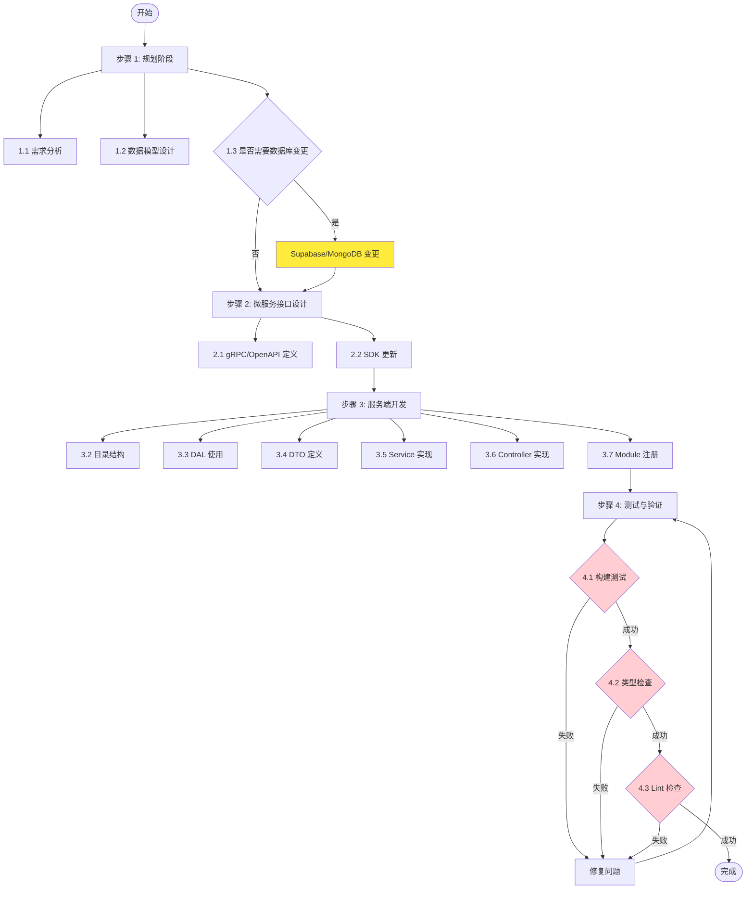

# CSISP 后端微服务开发 SOP

---

## 前言

> **按需使用小节：** 本 SOP 的所有小节都是可选的，根据实际需求决定是否执行。
>
> 示例场景：
>
> - 新功能完整开发 → 执行所有小节
> - 只是修复现有 Bug → 可能只需要执行"服务端开发"中的部分内容
> - 只是新增一个接口 → 可能只需要执行"微服务接口设计"和"服务端开发"

> **SOP 变更确认：** 如果用户的需求与本文档 SOP 不一致，先与用户确认差异。如果用户坚持更改，总结该变更对 SOP 的影响，以及 SOP 需要如何调整，再次确认后才更新 SOP。

---

## 术语表

| 术语            | 全称                       | 解释                                          |
| --------------- | -------------------------- | --------------------------------------------- |
| DAL             | Data Access Layer          | 数据访问层，统一管理数据库访问                |
| Repository      | Repository                 | 仓储模式，封装数据操作                        |
| Typegoose       | Typegoose                  | TypeScript 版 Mongoose，用于 MongoDB 模型定义 |
| gRPC            | gRPC Remote Procedure Call | 高性能 RPC 框架，用于微服务通信               |
| Module          | Module                     | NestJS 模块系统，组织代码结构                 |
| Service         | Service                    | 业务逻辑层                                    |
| Controller      | Controller                 | 请求处理层（gRPC 版本）                       |
| DTO             | Data Transfer Object       | 数据传输对象，用于参数验证                    |
| Supabase        | Supabase                   | PostgreSQL 数据库服务                         |
| MongoDB         | MongoDB                    | NoSQL 文档型数据库                            |
| class-validator | class-validator            | TypeScript 装饰器参数验证库                   |
| 单一职责原则    | SRP                        | 每个类只有一个职责                            |
| 依赖注入        | DI                         | NestJS 依赖注入机制                           |
| 聚合导出        | Barrel Export              | 通过 index.ts 统一导出                        |
| 类型生成        | Type Generation            | 从数据库结构自动生成 TypeScript 类型          |
| 迁移            | Migration                  | 数据库结构变更记录                            |

---

## 整体流程图



---

## 1. 规划阶段

### 1.1 需求分析

明确功能需求和业务域划分：

1. **业务域识别**：确定功能属于哪个业务域（如 demo、example、user 等）
2. **功能列表**：列出需要实现的具体功能点
3. **数据流向**：明确数据的输入、处理、输出流程

**检查清单**：

- [ ] 已明确业务域
- [ ] 已列出功能点
- [ ] 已确认数据流向

### 1.2 数据模型设计

根据数据类型选择合适的存储方案：

| 数据类型                    | 存储方案 | 说明                     |
| --------------------------- | -------- | ------------------------ |
| 用户相关、权限、配置        | Supabase | 关系型数据，需要事务支持 |
| 内容相关（Demo、Example等） | MongoDB  | 文档型数据，灵活扩展     |

> **DAL 现状：** Supabase 和 MongoDB 的数据访问层（DAL）在 `packages/dal` 中，采用 Repository 模式。

**数据模型选择原则**：

- 用户相关、权限、配置 → Supabase（关系型，事务支持）
- 内容相关（帖子、公告、评论） → MongoDB（文档型，灵活扩展）

**MongoDB 模型示例**：

```
packages/dal/src/types/
├── mongo/
│   ├── index.ts
│   ├── demo.model.ts
│   └── ...
```

模型文件示例（`demo.model.ts`）：

```typescript
import { prop, modelOptions } from '@typegoose/typegoose';

@modelOptions({
  schemaOptions: {
    collection: 'demos',
    timestamps: true,
  },
})
export class Demo {
  @prop({ required: true, type: String })
  public title!: string;

  @prop({ required: true, type: String })
  public content!: string;

  @prop({ required: true, type: String })
  public authorId!: string;
}
```

在 `mongo/index.ts` 中聚合导出所有模型：

```typescript
export * from './demo.model';
```

**检查清单**：

- [ ] 已选择合适的存储方案
- [ ] 已定义模型字段
- [ ] 已在 index.ts 中正确导出
- [ ] 已考虑 Repository 是否需要新增

### 1.3 接口设计原则

- **微服务接口**：通过外部 SDK 工厂仓库定义 gRPC / OpenAPI 接口
- **接口命名**：使用大驼峰命名法（PascalCase），如 `CreateDemo`、`GetDemoDetail`
- **参数验证**：使用 zod 进行参数校验

**检查清单**：

- [ ] 已确认接口类型（gRPC / OpenAPI）
- [ ] 已使用大驼峰命名法
- [ ] 已确认参数验证方式

---

## 2. 微服务接口设计

### 2.1 gRPC 服务定义

**说明**：gRPC 接口定义在外部 SDK 工厂仓库中，不在本项目直接定义。

**引用方式**：

```typescript
// 在服务端项目中使用 SDK
import { DemoServiceController } from '@csisp-api/{service}';
```

**检查清单**：

- [ ] 已在 SDK 工厂仓库更新接口定义
- [ ] 已运行 SDK 生成
- [ ] 已确认版本号

### 2.2 SDK 管理

| SDK 包                     | 用途            | 定义位置     |
| -------------------------- | --------------- | ------------ |
| `@csisp-api/{service}`     | gRPC 服务端接口 | SDK 工厂仓库 |
| `@csisp-api/bff-{service}` | gRPC 客户端接口 | SDK 工厂仓库 |

---

## 3. 服务端开发

### 3.1 Supabase 数据库开发流程（如果需要调整数据库结构）

如果需要调整数据库结构，请按以下步骤操作：

1. **本地环境准备**：在本地启动 Docker Supabase，执行 `db:pull` 将预发布环境数据库同步到本地（详细步骤参考 `supabase-dev-workflow`）
2. **结构变更与迁移**：在本地调整数据库结构后，使用 `supabase db diff` 生成迁移文件
3. **类型更新**：调整完成后，运行 `pnpm gen:types:local` 脚本生成新的类型文件（`packages/supabase-sdk/src/types/type.ts`）
4. **重新构建与测试**：更新类型后，在对应项目执行 `build` 并进行测试

> **详细步骤**：完整的 Supabase 数据库开发流程请参考 `supabase-dev-workflow`

**检查清单**：

- [ ] 已同步预发布环境数据库到本地
- [ ] 已生成迁移文件
- [ ] 已更新类型文件
- [ ] 已测试数据库操作

### 3.2 目录结构

```
apps/backend/{service}/src/
├── modules/
│   └── demo/
│       ├── dto/
│       ├── service/
│       ├── demo.grpc.controller.ts
│       └── demo.module.ts
└── app.module.ts
```

**目录说明**：

- `dto/`：数据传输对象
- `service/`：业务逻辑（支持服务拆分）
- `*.grpc.controller.ts`：gRPC 控制器
- `*.module.ts`：NestJS 模块

**服务拆分原则**：

1. 每个服务类职责单一，遵循单一职责原则
2. 服务类之间通过依赖注入协作
3. 通过 `service/index.ts` 进行聚合导出
4. 模块中使用 `import * as DomainServices from './service'` 统一导入

### 3.3 数据访问层 (DAL) 使用

#### 3.3.1 Supabase DAL

对于 Supabase 存储的数据，使用 `@csisp/dal` 包中的 Repository。

**示例**：

```typescript
// 1. 在 app.module.ts 中全局导入
import { SupabaseDalModule } from '@csisp/dal';

@Module({
  imports: [SupabaseDalModule],
})
export class AppModule {}

// 2. 在 Service 中注入使用
import { SupabaseUserRepository } from '@csisp/dal';

@Injectable()
export class DemoService {
  constructor(private readonly userRepository: SupabaseUserRepository) {}

  async getDemo(id: string) {
    return this.userRepository.findById(id);
  }
}
```

#### 3.3.2 MongoDB DAL 使用

MongoDB 的模型和 Repository 都在 `@csisp/dal` 包中统一管理，使用 Typegoose 实现。

**MongoDB DAL 使用流程**：

1. **定义模型**：在 `packages/dal/src/types/mongo/{name}.model.ts` 中添加模型
2. **创建 Repository**（如需要）：在 `packages/dal/src/repositories/mongo/` 中
3. **注册到 Module**：在 `mongo-dal.module.ts` 中注册
4. **在服务中使用**：导入 `MongoDalModule` 和 Repository

**核心示例**：

```typescript
// 模型定义示例
@modelOptions({
  schemaOptions: { collection: 'demos', timestamps: true },
})
export class Demo {
  @prop({ required: true, type: String })
  public title!: string;
}

// 服务中使用
import { MongoDemoRepository } from '@csisp/dal';

@Injectable()
export class DemoService {
  constructor(private readonly demoRepository: MongoDemoRepository) {}

  async create(data: DemoInsert) {
    return this.demoRepository.create(data);
  }
}
```

**检查清单**：

- [ ] 模型已正确定义
- [ ] 模型已在 mongo/index.ts 中导出
- [ ] Repository 已创建（如需要）
- [ ] Repository 已注册到 MongoDalModule

### 3.4 DTO 定义

**文件**：`apps/backend/{service}/src/modules/{domain}/dto/{action}.dto.ts`

```typescript
import { CreateDemoRequest } from '@csisp-api/{service}';
import { IsString, IsOptional } from 'class-validator';

export class CreateDemoDto implements CreateDemoRequest {
  @IsString()
  title!: string;

  @IsString()
  content!: string;

  @IsString()
  authorId!: string;

  @IsString()
  @IsOptional()
  demoType?: string;
}
```

**class-validator 常用装饰器参考**（表格）：

| 装饰器          | 说明         |
| --------------- | ------------ |
| `@IsString()`   | 验证是字符串 |
| `@IsInt()`      | 验证是整数   |
| `@IsOptional()` | 字段可选     |
| `@Min()`        | 最小值验证   |

**文件**：`apps/backend/{service}/src/modules/{domain}/dto/index.ts`

```typescript
export * from './create-demo.dto';
```

**检查清单**：

- [ ] 已实现 Request 接口
- [ ] 已添加合适的验证装饰器
- [ ] 已在 index.ts 中正确导出

### 3.5 Service 实现

**文件**：`apps/backend/{service}/src/modules/{domain}/{domain}.service.ts`

使用 `@csisp/dal` 中的 Repository（推荐方式）：

```typescript
import { Injectable, Logger } from '@nestjs/common';
import { MongoDemoRepository } from '@csisp/dal';
import { CreateDemoDto } from './dto/create-demo.dto';

@Injectable()
export class DemoService {
  private readonly logger = new Logger(DemoService.name);

  constructor(private readonly demoRepository: MongoDemoRepository) {}

  async create(createDto: CreateDemoDto) {
    return this.demoRepository.create(createDto);
  }

  async findAll() {
    return this.demoRepository.findAll();
  }
}
```

**Service 实现要点**：

- 使用 `@Injectable()` 装饰器
- 注入 Repository 而非直接操作数据库
- 使用 Logger 记录关键操作
- 遵循单一职责原则

**检查清单**：

- [ ] 已注入必要的 Repository
- [ ] 已使用 Logger
- [ ] 已实现主要业务逻辑
- [ ] 已在 service/index.ts 中正确导出

### 3.6 Controller 实现

**文件**：`apps/backend/{service}/src/modules/{domain}/{domain}.grpc.controller.ts`

```typescript
import { Controller, Logger } from '@nestjs/common';
import { GrpcMethod } from '@nestjs/microservices';
import { DemoService } from './demo.service';

@Controller()
export class DemoGrpcController {
  private readonly logger = new Logger(DemoGrpcController.name);

  constructor(private readonly demoService: DemoService) {}

  @GrpcMethod('DemoService', 'CreateDemo')
  async createDemo(data: CreateDemoDto) {
    this.logger.log('Creating demo', data);
    return this.demoService.create(data);
  }
}
```

**检查清单**：

- [ ] 已使用 `@GrpcMethod()` 装饰器
- [ ] 已正确绑定 Service
- [ ] 已使用 Logger 记录请求

### 3.7 Module 注册

**文件**：`apps/backend/{service}/src/modules/{domain}/{domain}.module.ts`

```typescript
import { Module } from '@nestjs/common';
import { MongoDalModule } from '@csisp/dal';
import { DemoService } from './demo.service';
import { DemoGrpcController } from './demo.grpc.controller';

@Module({
  imports: [MongoDalModule],
  controllers: [DemoGrpcController],
  providers: [DemoService],
  exports: [DemoService],
})
export class DemoModule {}
```

**检查清单**：

- [ ] 已导入必要的 DAL 模块
- [ ] 已注册 Controller
- [ ] 已注册 Provider
- [ ] 已在 AppModule 中正确导入

---

## 4. 测试与验证

**验证命令**：

```bash
# 构建测试
pnpm -F {service} build

# 类型检查
pnpm -F {service} tsc --noEmit

# Lint 检查
pnpm -F {service} lint
```

**验证检查清单**：

| 检查项    | 通过标准         |
| --------- | ---------------- |
| 构建测试  | 无错误，输出成功 |
| 类型检查  | 无类型错误       |
| Lint 检查 | 无警告和错误     |

---

## 常见场景快速参考

| 场景             | 执行步骤                                             | 关键检查点           |
| ---------------- | ---------------------------------------------------- | -------------------- |
| 新增微服务       | 规划 → 接口设计 → 服务端开发 → 验证                  | 数据库变更（如需要） |
| 现有服务新增接口 | SDK 更新 → 新增 DTO → 更新 Service → 更新 Controller | SDK 版本更新         |
| 修复 Bug         | 定位问题 → 修复代码 → 验证                           | 回归测试             |
