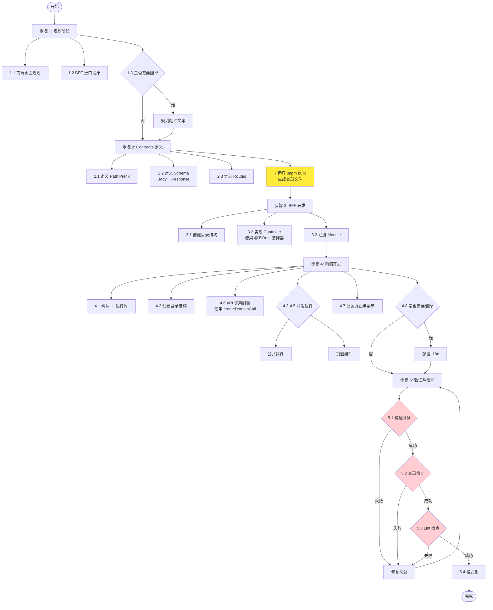

# CSISP 前端 + BFF 开发 SOP

---

## 前言

> **按需使用小节：** 本 SOP 的所有小节都是可选的，根据实际需求决定是否执行。
>
> 示例场景：
>
> - 新功能完整开发 → 执行所有小节
> - 只是修复现有页面 Bug → 可能只需要执行"前端开发"中的部分内容
> - 只是新增一个 BFF 接口 → 可能只需要执行"规划阶段（BFF 接口设计）"、"Contracts 定义"、"BFF 开发"

> **SOP 变更确认：** 如果用户的需求与本文档 SOP 不一致，先与用户确认差异。如果用户坚持更改，总结该变更对 SOP 的影响，以及 SOP 需要如何调整，再次确认后才更新 SOP。

---

## 术语表

| 术语             | 全称                       | 解释                                                     |
| ---------------- | -------------------------- | -------------------------------------------------------- |
| BFF              | Backend-for-Frontend       | 前端代理层，负责协议转换、会话透传、统一 API 出口        |
| Contracts        | API 契约定义               | 前端与 BFF 之间的类型安全接口定义层，单一数据源          |
| Domain           | 业务域                     | 按功能划分的业务模块（如 `auth`、`demo`、`example`）     |
| Action           | 操作                       | RPC 风格的接口动作，使用 snake-case 命名                 |
| Path Prefix      | 路径前缀                   | 接口路径的统一前缀常量                                   |
| Schema           | 数据模式                   | Zod 定义的数据验证规则，用于运行时校验和类型推导         |
| Frontend-app     | 前端应用                   | 指代具体的前端项目（如 `portal`、`idp-client`、`admin`） |
| Controller       | 控制器                     | BFF 层处理 HTTP 请求的 NestJS 组件                       |
| Module           | 模块                       | NestJS 的模块系统，用于组织代码结构                      |
| createDomainCall | 域名调用工厂函数           | 用于创建类型安全的 API 调用函数的工厂函数                |
| RPC 风格         | Remote Procedure Call 风格 | 使用 `POST /domain/action` 格式的 REST 接口设计          |
| 页面级组件       | Page-level Component       | 仅单个页面使用的组件，位于 `pages/{Domain}/components/`  |
| 公共组件         | Shared Component           | 项目内复用的组件，位于 `src/components/{Domain}/`        |
| 消息插值         | Message Interpolation      | 翻译文案中使用 `{variable}` 语法动态替换变量             |
| 类型生成         | Type Generation            | 通过 `pnpm build` 从 Schema 自动生成 TypeScript 类型     |
| \*Params         | Params 类型                | 从 Body Schema 生成的请求参数类型                        |
| \*Result         | Result 类型                | 从 Response Schema 生成的响应结果类型                    |
| \*Action         | Action 类型                | 从 Routes 生成的 Action 常量类型                         |

---

## 整体流程



---

## 1. 规划阶段

### 1.1 前端页面规划

明确页面结构、路由设计和组件划分。

**页面树示例**：

```
/Demo              # Demo 列表页
/Demo/:id          # Demo 详情页
/Example           # Example 列表页
/Example/:id       # Example 详情页
```

**组件划分原则**：

| 分类       | 位置                         | 说明         |
| ---------- | ---------------------------- | ------------ |
| 页面级组件 | `pages/{Domain}/components/` | 仅该页面使用 |
| 公共组件   | `src/components/{Domain}/`   | 项目内复用   |

**检查清单**：

- [ ] 已明确所有页面路由路径
- [ ] 已识别页面级组件和公共组件
- [ ] 已确认组件复用范围

### 1.2 BFF 接口设计

设计 BFF HTTP API 契约。

**路径格式**：`POST /api/{frontend-app}/{domain}/{action}`

**示例**：

```
POST /api/portal/demo/createDemo
POST /api/portal/demo/getDemoDetail
POST /api/portal/example/getExampleList
```

**设计原则**：

- 遵循 RPC 风格，使用 `domain/action` 格式
- Action 命名使用 snake-case
- 一个 Action 对应一个明确的业务操作

### 1.3 翻译文案规划

如果需求涉及新增或修改用户可见文案，需要提前规划翻译工作。

**判断标准**：页面中任何对用户展示的中英文文字都需要翻译，包括但不限于：

- 表单标签、占位符
- 按钮文字
- 提示信息、错误信息
- 标题、副标题

**翻译规划步骤**：

1. **识别翻译 key**：根据现有命名空间确定使用哪个翻译文件
   - `@csisp/idp-client` 相关 → `idp-client.json`
   - `@csisp/portal` 相关 → `portal.json`
   - 通用文案 → `common.json`
2. **命名规范**：遵循 `页面.功能.具体描述` 格式
   ```
   demo.title.label        → Demo 页-标题-标签
   example.submit          → Example 页-提交按钮
   example.detail.title    → Example 详情-标题
   ```
3. **生成翻译模板**：运行以下命令生成本地翻译文件

   ```bash
   # 为 idp-client 生成翻译模板
   pnpm -F @csisp/i18n generate idp-client

   # 为 portal 生成翻译模板
   pnpm -F @csisp/i18n generate portal
   ```

4. **上传翻译平台**：将生成的 JSON 文件上传到 SimpleLocalize
5. **拉取翻译**：翻译完成后执行
   ```bash
   pnpm -F @csisp/i18n pull:idp-client
   pnpm -F @csisp/i18n pull:portal
   ```

---

## 2. Contracts 定义

### 2.1 目录结构

```
packages/contracts/src/
├── {domain}/
│   └── {domain}.contract.ts
├── constants/
│   └── path-prefix.ts
└── index.ts
```

### 2.2 Path Prefix

**文件**：`packages/contracts/src/constants/path-prefix.ts`

```typescript
export const PATH_PREFIX = {
  PORTAL_DEMO: '/api/portal/demo',
  PORTAL_EXAMPLE: '/api/portal/example',
} as const;
```

**关键点**：使用 `as const` 确保类型推导。

### 2.3 Contract 定义

**文件**：`packages/contracts/src/{domain}/{domain}.contract.ts`

```typescript
import { initContract } from '@ts-rest/core';
import { z } from 'zod';
import { buildActionMapFromRoutes } from '../constants/action';
import { HTTP_METHOD } from '../constants/http';
import {
  PORTAL_PATH_PREFIX,
  PORTAL_DEMO_PATH_PREFIX,
} from '../constants/path-prefix';

const c = initContract();

export const createDemoBodySchema = z.object({
  title: z.string().min(1).max(100),
  content: z.string().min(1),
});

export const createDemoResponseSchema = z.object({
  demo: z
    .object({
      id: z.string(),
      title: z.string(),
      content: z.string(),
      authorId: z.string(),
      createdAt: z.string(),
      updatedAt: z.string(),
    })
    .optional(),
  code: z.number(),
  message: z.string(),
});

const portalDemoRoutes = {
  createDemo: {
    method: HTTP_METHOD.POST,
    path: PORTAL_DEMO_PATH_PREFIX + '/createDemo',
    body: createDemoBodySchema,
    responses: {
      200: createDemoResponseSchema,
    },
    summary: '创建 Demo',
  },
  getDemoDetail: {
    method: HTTP_METHOD.POST,
    path: PORTAL_DEMO_PATH_PREFIX + '/getDemoDetail',
    body: z.object({ demoId: z.string() }),
    responses: {
      200: createDemoResponseSchema,
    },
    summary: '获取 Demo 详情',
  },
} as const satisfies Parameters<typeof c.router>[0];

export const portalDemoContract = c.router(portalDemoRoutes, {
  pathPrefix: PORTAL_PATH_PREFIX,
  strictStatusCodes: true,
});

export const PORTAL_DEMO_ACTION = buildActionMapFromRoutes(portalDemoRoutes);
```

**导出**：`packages/contracts/src/index.ts`

```typescript
export * from './demo/demo.contract';
export * from './example/example.contract';
export * from './constants/path-prefix';
```

**类型生成说明**：
类型文件会通过 `pnpm build` 自动生成，不需要手动写类型。

| Schema 类型     | 生成的类型 | 使用场景                |
| --------------- | ---------- | ----------------------- |
| Body Schema     | `*Params`  | BFF Controller 参数类型 |
| Response Schema | `*Result`  | 前端接收的响应类型      |
| Routes          | `*Action`  | Action 常量类型         |

---

## 3. BFF 开发

### 3.1 目录结构

```
apps/bff/src/
├── modules/
│   └── {frontend-app}/
│       └── {domain}/
│           ├── {domain}.controller.ts
│           ├── {domain}.module.ts
│           └── index.ts
├── app.module.ts
└── main.ts
```

### 3.2 Controller 实现

**文件**：`apps/bff/src/modules/{frontend-app}/{domain}/{domain}.controller.ts`

```typescript
import { Controller, Post, Body, Logger } from '@nestjs/common';
import { ApiTags } from '@nestjs/swagger';
import { demoContract } from '@csisp/contracts';
import { TsRest } from '@ts-rest/nest';

@Controller('api/portal/demo')
@ApiTags('Portal - Demo')
export class DemoController {
  private readonly logger = new Logger(DemoController.name);

  @Post('createDemo')
  @TsRest(demoContract.createDemo)
  async createDemo(@Body() body: z.infer<typeof createDemoBodySchema>) {
    this.logger.log('Creating demo', body);

    const result = await this.demoClient.createDemo(body).toPromise();

    return { status: 200, body: result };
  }
}
```

**Controller 实现要点**：

- 使用 `@TsRest()` 装饰器绑定 Contract
- 参数类型从 Contract 推导，不需要手动定义
- 返回值必须匹配 Contract 定义的 Response Schema
- 使用 Logger 记录关键操作

### 3.3 Module 注册

**文件**：`apps/bff/src/modules/{frontend-app}/{domain}/{domain}.module.ts`

```typescript
import { Module } from '@nestjs/common';
import { DemoController } from './demo.controller';

@Module({
  controllers: [DemoController],
  exports: [],
})
export class DemoModule {}
```

**注册到主模块**：`apps/bff/src/app.module.ts`

```typescript
import { Module } from '@nestjs/common';
import { PortalModule } from './modules/portal/portal.module';

@Module({
  imports: [PortalModule],
})
export class AppModule {}
```

**检查清单**：

- [ ] 已创建 `{Domain}Module`
- [ ] 已将 Controller 添加到 `controllers` 数组
- [ ] 已在 `AppModule` 中导入模块

---

## 4. 前端开发

### 4.1 组件库确认

在开始开发前，先确认当前项目使用的 UI 组件库。

| 前端应用   | UI 组件库           |
| ---------- | ------------------- |
| portal     | Naive UI (naive-ui) |
| idp-client | Ant Design (antd)   |

**组件使用原则**：

- 优先使用组件库提供的组件
- 避免重复造轮子
- 自定义组件需要封装到 `src/components/{Domain}/`

### 4.2 目录结构

```
apps/frontend/{frontend-app}/src/
├── api/
│   ├── caller.ts
│   ├── index.ts
│   ├── demo.ts
│   └── example.ts
├── components/
│   └── {Domain}/
│       └── {Component}.vue
├── pages/
│   └── {Domain}/
│       ├── index.vue
│       └── components/
│           └── {PageComponent}.vue
├── layouts/
│   └── {App}Layout.vue
└── router/
    └── index.ts
```

**目录用途说明**：

| 目录          | 用途         |
| ------------- | ------------ |
| `api/`        | API 调用封装 |
| `components/` | 公共组件     |
| `pages/`      | 页面级组件   |
| `layouts/`    | 布局组件     |
| `router/`     | 路由配置     |

### 4.3 Layout 组件

**要点说明**：

- 使用 `<router-view />` 渲染子路由
- 通过 props 传递菜单配置
- 响应式布局使用 flex 或 grid

### 4.4 公共组件

**要点说明**：

- 使用 `defineProps` 定义输入
- 使用 `defineEmits` 定义事件
- 避免在组件内直接调用 API
- 样式使用 scoped 避免污染

### 4.5 页面开发

**检查清单**：

- [ ] 已导入 API 调用函数
- [ ] 已定义响应式状态
- [ ] 已在 `onMounted` 中加载数据
- [ ] 已处理加载状态和错误状态
- [ ] 已配置路由跳转逻辑

**关键代码片段**：

```typescript
// 数据加载
const demos = ref<Demo[]>([]);
onMounted(async () => {
  demos.value = await demoApi.getDemoList({ page: 1 });
});

// 路由跳转
const router = useRouter();
router.push(`/Demo/${demoId}`);
```

### 4.6 API 调用封装

**API 封装方式**：推荐使用对象封装方式，而非简单的 call 方式。

**注意**：不要手动拼接 action 字符串，请使用 contracts 包中提供的常量。

**文件**：`apps/frontend/{frontend-app}/src/api/portal/demo.ts`

```typescript
import {
  PORTAL_PATH_PREFIX,
  type PortalDemoAction,
  type CreateDemoParams,
  type CreateDemoResult,
  type GetDemoListParams,
  type GetDemoListResult,
  type GetDemoDetailParams,
  type GetDemoDetailResult,
} from '@csisp/contracts';

import { createDomainCall } from '../caller';

const demoCall = createDomainCall<PortalDemoAction>(PORTAL_PATH_PREFIX, 'demo');

export const demoApi = {
  async createDemo(params: CreateDemoParams): Promise<CreateDemoResult> {
    return await demoCall<CreateDemoResult>('createDemo', params);
  },

  async getDemoList(params: GetDemoListParams): Promise<GetDemoListResult> {
    return await demoCall<GetDemoListResult>('getDemoList', params);
  },

  async getDemoDetail(
    params: GetDemoDetailParams
  ): Promise<GetDemoDetailResult> {
    return await demoCall<GetDemoDetailResult>('getDemoDetail', params);
  },
};
```

### 4.7 菜单与路由

**路由配置**：`apps/frontend/{frontend-app}/src/router/index.ts`

```typescript
import { createRouter, createWebHistory } from 'vue-router';
import AppLayout from '@/layouts/AppLayout.vue';

const routes = [
  {
    path: '/',
    component: AppLayout,
    children: [
      {
        path: '',
        redirect: '/Demo',
      },
      {
        path: 'Demo',
        name: 'Demo',
        component: () => import('@/pages/Demo/index.vue'),
      },
      {
        path: 'Demo/:id',
        name: 'DemoDetail',
        component: () => import('@/pages/DemoDetail/index.vue'),
      },
    ],
  },
];

export const router = createRouter({
  history: createWebHistory(),
  routes,
});
```

**检查清单**：

- [ ] 已定义路由路径和组件映射
- [ ] 已配置 Layout 组件
- [ ] 已添加路由守卫（如需要）
- [ ] 已测试路由跳转

### 4.8 国际化

项目使用 SimpleLocalize 的 Multi-language JSON 格式，支持消息插值功能。

**消息插值示例**：

```typescript
// Vue 3: t('key', { vars }, '默认值')
t('demo.total', { total: 100 }, '共 {total} 条');

// React: t('key', '默认值', { vars })
t('demo.total', '共 {total} 条', { total: 100 });
```

**框架使用差异**：

| 项目               | 使用方式                   |
| ------------------ | -------------------------- |
| idp-client (React) | `useTranslation('common')` |
| portal (Vue 3)     | `useI18n()`                |

**翻译文件位置**：

| 项目       | 路径                                                      |
| ---------- | --------------------------------------------------------- |
| idp-client | `packages/i18n/src/locales/idp-client/{en,zh}/index.json` |
| portal     | `packages/i18n/src/locales/portal/{en,zh}/index.json`     |
| common     | `packages/i18n/src/locales/common/{en,zh}/index.json`     |

**新增翻译 key 流程**：

1. 在对应页面的翻译 JSON 文件中添加 key（中文）
2. 运行 `pnpm -F @csisp/i18n pull:{project}` 拉取最新翻译
3. 如果有新的 key 未翻译，使用代码中的默认值
4. 在 SimpleLocalize 平台补充英文翻译

---

## 4.9 状态管理 (Pinia)

### 技术栈

- **状态管理**: Pinia (Composition API / Setup Store)
- **持久化存储**: localforage (IndexedDB/WebSQL)
- **响应式系统**: Vue 3 Composition API (`ref`, `computed`, `watch`)

### Store 定义规范

**文件位置**：

| 类型         | 位置                          | 示例                                    |
| ------------ | ----------------------------- | --------------------------------------- |
| 全局 Store   | `src/stores/{storeName}.ts`   | `src/stores/locale.ts`                  |
| 模块级 Store | `src/{module}/store/index.ts` | `src/layouts/MainLayout/store/index.ts` |

**命名规范**：

- **Store 名称常量**: `STORE_NAME = 'xxx'` (kebab-case)
- **Store 函数名**: `use{PascalCase}Store()` (如 `useLocaleStore`)
- **存储键常量**: `STORAGE_KEYS = { ... } as const`

**代码模板** (Setup Store 风格)：

```typescript
import localforage from 'localforage';
import { defineStore } from 'pinia';
import { computed, ref, watch } from 'vue';

import { APP_NAME } from '@/constants';

const STORE_NAME = '{storeName}'; // kebab-case

const STORAGE_KEYS = {
  {STATE_NAME}: '{stateName}', // camelCase
} as const;

const storage = localforage.createInstance({
  name: APP_NAME,
  storeName: STORE_NAME,
});

export const use{StoreName}Store = defineStore(STORE_NAME, () => {
  // 1. 响应式状态 (State)
  const {stateName} = ref<{Type}>({defaultValue});

  // 2. 计算属性 (Getters)
  const {computedName} = computed(() => {
    return /* 基于 stateName 的计算逻辑 */;
  });

  // 3. 操作方法 (Actions)
  const set{StateName} = (value: {Type}) => {
    {stateName}.value = value;
    storage.setItem(STORAGE_KEYS.{STATE_NAME}, value); // 同步到持久化
  };

  // 4. 初始化方法 (从本地存储恢复)
  const initFromStorage = async () => {
    const value = await storage.getItem<{Type}>(STORAGE_KEYS.{STATE_NAME});
    if (value !== null) {
      {stateName}.value = value;
    }
  };

  // 5. 响应式监听 (可选)
  watch(
    () => {stateName}.value,
    newValue => {
      // 执行副作用操作（如同步到 i18n、其他 Store 等）
    }
  );

  return {
    // State
    {stateName},
    // Getters
    {computedName},
    // Actions
    set{StateName},
    initFromStorage,
  };
});
```

### 关键实现要点

#### 1. 使用 Setup Store 风格

✅ **推荐**: 函数式定义 (Composition API)

```typescript
export const useLocaleStore = defineStore('locale', () => {
  const currentLocale = ref('zh');
  return { currentLocale };
});
```

❌ **不推荐**: Options API 风格

```typescript
export const useLocaleStore = defineStore('locale', {
  state: () => ({ currentLocale: 'zh' }),
});
```

#### 2. 持久化存储模式

- 使用 `localforage.createInstance()` 创建独立存储实例
- 通过 `name` + `storeName` 隔离不同 Store 的数据
- 在修改 state 时同步调用 `storage.setItem()`
- 提供 `initFromStorage()` 方法用于应用启动时恢复状态

**示例** (参考 [locale.ts](file:///Users/Admin/project/CSISP/apps/frontend/portal/src/stores/locale.ts)):

```typescript
const storage = localforage.createInstance({
  name: APP_NAME, // 应用名称: 'csisp-portal'
  storeName: STORE_NAME, // Store 名称: 'locale'
});

// 修改时持久化
const setLocale = (locale: SupportedLocale) => {
  currentLocale.value = locale;
  storage.setItem(STORAGE_KEYS.CURRENT_LOCALE, locale);
};

// 启动时恢复
const initFromStorage = async () => {
  const value = await storage.getItem<SupportedLocale>(
    STORAGE_KEYS.CURRENT_LOCALE
  );
  if (value !== null) {
    currentLocale.value = value;
  }
};
```

#### 3. 初始化时机

在 [App.vue](file:///Users/Admin/project/CSISP/apps/frontend/portal/src/App.vue) 的 `onMounted` 中统一初始化所有 Store：

```typescript
// App.vue
<script setup lang="ts">
import { onMounted } from 'vue';
import { useMainLayoutStore } from '@/layouts/MainLayout/store';
import { useLocaleStore } from '@/stores/locale';

const localeStore = useLocaleStore();
const mainLayoutStore = useMainLayoutStore();

onMounted(async () => {
  await Promise.all([
    mainLayoutStore.initFromStorage(),
    localeStore.initFromStorage(),
  ]);
});
</script>
```

**要点**：

- 使用 `Promise.all()` 并行初始化多个 Store
- 在根组件中统一管理，避免重复初始化

#### 4. 组件中使用 Store

```vue
<template>
  <n-layout-sider
    :collapsed="mainLayoutStore.siderCollapsed"
    @update:collapsed="mainLayoutStore.setSiderCollapsed"
  >
    <!-- 内容 -->
  </n-layout-sider>
</template>

<script setup lang="ts">
import { useMainLayoutStore } from './store';

const mainLayoutStore = useMainLayoutStore();
</script>
```

**使用方式**：

1. 导入 Store：`import { useXxxStore } from '@/stores/xxx'` 或 `'./store'`
2. 调用函数获取实例：`const store = useXxxStore()`
3. 直接访问属性和方法：`store.stateName`、`store.setAction()`
4. 在模板中可直接使用，无需解构

#### 5. 与 Naive UI 集成

当 Store 状态影响 UI 库配置时（如语言切换），通过计算属性提供：

```typescript
// locale Store
import { dateEnUS, dateZhCN, enUS, zhCN } from 'naive-ui';

const naiveLocale = computed(() => {
  return currentLocale.value === DEFAULT_LOCALE ? zhCN : enUS;
});

const naiveDateLocale = computed(() => {
  return currentLocale.value === DEFAULT_LOCALE ? dateZhCN : dateEnUS;
});
```

在 [App.vue](file:///Users/Admin/project/CSISP/apps/frontend/portal/src/App.vue) 中使用：

```vue
<template>
  <n-config-provider
    :locale="localeStore.naiveLocale"
    :date-locale="localeStore.naiveDateLocale"
  >
    <RouterView />
  </n-config-provider>
</template>
```

### Store 设计原则

| 原则       | 说明                                               | 示例                          |
| ---------- | -------------------------------------------------- | ----------------------------- |
| 单一职责   | 每个 Store 只负责一个业务域                        | `localeStore`、`layoutStore`  |
| 持久化透明 | 对使用者隐藏存储细节，提供 `initFromStorage()`     | 自动从 localforage 恢复       |
| 响应式优先 | 使用 `ref`/`computed` 保持响应式                   | 避免 `.value` 丢失响应性      |
| 类型安全   | 使用 TypeScript 泛型约束存储值的类型               | `storage.getItem<string>()`   |
| 常量命名   | 存储键使用 `STORAGE_KEYS` 常量对象，避免魔法字符串 | `STORAGE_KEYS.CURRENT_LOCALE` |

### 实际案例参考

**案例 1**: 语言管理 Store ([locale.ts](file:///Users/Admin/project/CSISP/apps/frontend/portal/src/stores/locale.ts))

- 功能：管理应用语言切换
- 持久化：保存用户语言偏好
- 集成：自动切换 Naive UI 语言包和 vue-i18n 语言

**案例 2**: 布局状态 Store ([MainLayout/store/index.ts](file:///Users/Admin/project/CSISP/apps/frontend/portal/src/layouts/MainLayout/store/index.ts))

- 功能：管理侧边栏折叠状态
- 持久化：记住用户的界面布局偏好
- 提供方法：`toggleSiderCollapsed()`、`setSiderCollapsed(boolean)`

### 检查清单

- [ ] 已使用 Setup Store (函数式) 定义
- [ ] 已定义 `STORE_NAME` 和 `STORAGE_KEYS` 常量
- [ ] 已创建 localforage 实例并隔离存储
- [ ] 已提供 `initFromStorage()` 方法
- [ ] 已在修改 state 时同步持久化
- [ ] 已在 App.vue 中注册初始化调用
- [ ] 已使用 TypeScript 类型标注
- [ ] Store 文件位置符合规范（全局/模块级）

---

## 5. 验证与检查

**验证命令**：

```bash
# 构建测试
pnpm -F bff build
pnpm -F {frontend-app} build

# 类型检查
pnpm -F bff tsc --noEmit
pnpm -F {frontend-app} tsc --noEmit

# Lint 检查
pnpm -F bff lint
pnpm -F {frontend-app} lint

# 格式化
pnpm -F bff format
pnpm -F {frontend-app} format
```

**验证检查清单**：

| 检查项    | 通过标准         |
| --------- | ---------------- |
| 构建测试  | 无错误，输出成功 |
| 类型检查  | 无类型错误       |
| Lint 检查 | 无警告和错误     |
| 格式化    | 代码已格式化     |

---

## 常见场景快速参考

| 场景           | 执行步骤                             | 关键检查点              |
| -------------- | ------------------------------------ | ----------------------- |
| 完整新功能开发 | 规划 → Contracts → BFF → 前端 → 验证 | Contracts 类型生成      |
| 新增 BFF 接口  | 设计 → Contracts → BFF → 验证        | Contract 更新、类型检查 |
| 新增页面       | 翻译规划 → 前端 → 验证               | 路由配置、国际化        |
| 修复 Bug       | 定位 → 修复 → 验证                   | 回归测试                |

---

**文档版本**：v2.0（已优化，代码示例减少 50%）
**最后更新**：2026-04-30
