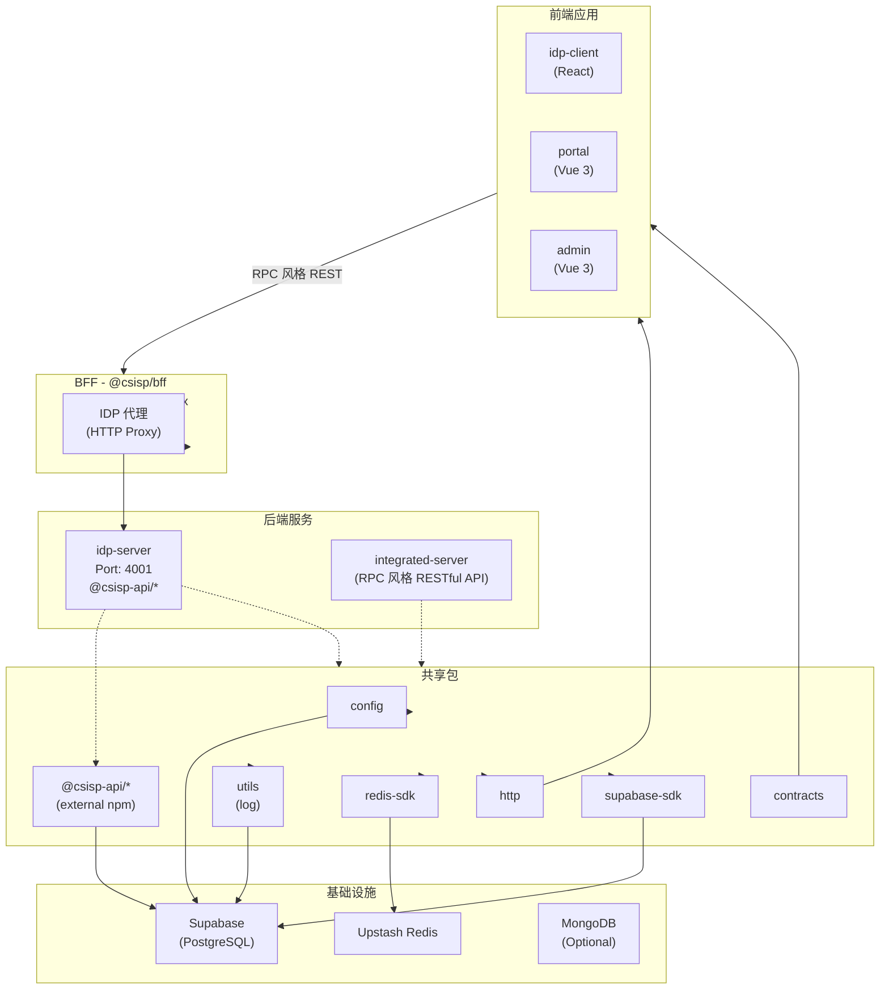

# CSISP 项目架构文档

> 本文档为 AI 提供项目上下文，包含架构概述、模块职责、依赖关系及运行方式。
> **注意**：本文档记录当前架构和实现细节。

## 1. 项目概览

### 1.1 基本信息

| 属性      | 值                                               |
| --------- | ------------------------------------------------ |
| 项目名称  | SCNU 计算机学院综合服务平台 (CSISP)              |
| 代码管理  | Monorepo (pnpm workspaces + Turbo)               |
| Node 版本 | ≥24.x                                            |
| 包管理器  | pnpm 10+                                         |
| 主要框架  | NestJS (后端), Vue 3 / React (前端), Vite (构建) |

### 1.2 目录结构

```
CSISP/
├── apps/
│   ├── backend/
│   │   ├── idp-server/        # 身份认证服务 (NestJS)
│   │   └── integrated-server/ # 主业务服务 (NestJS, RPC 风格 RESTful API)
│   ├── bff/                  # Backend-for-Frontend (NestJS, HTTP Proxy)
│   └── frontend/
│       ├── idp-client/      # IDP 登录页 (React + Ant Design)
│       ├── admin/           # 管理后台 (Vue 3 + Naive UI)
│       └── portal/         # 师生门户 (Vue 3 + Naive UI)
├── packages/               # 共享包
│   ├── config/             # 配置管理 (Zod)
│   ├── utils/              # 工具库 (Pino logger)
│   ├── redis-sdk/         # Upstash Redis 适配
│   ├── supabase-sdk/      # Supabase 客户端
│   ├── http/              # HTTP 客户端 (RPC 风格 REST)
│   └── contracts/         # API 契约定义
├── supabase/               # 数据库迁移 (PostgreSQL)
└── docs/                   # VitePress 文档
```

---

## 2. 应用服务

### 2.1 后端服务

#### @csisp/idp-server (身份认证服务)

| 属性   | 值                                                                           |
| ------ | ---------------------------------------------------------------------------- |
| 路径   | `apps/backend/idp-server`                                                    |
| 框架   | NestJS                                                                       |
| 端口   | 4001                                                                         |
| 依赖   | `@csisp-api/idp-server`, `@csisp/config`, `@csisp/redis-sdk`, `@csisp/utils` |
| 数据库 | Supabase (GoTrue) + Redis (会话)                                             |

**核心模块**:

- `modules/auth/` - 登录/注册/OTP/会话管理
- `modules/oidc/` - OIDC 协议实现
- `modules/health/` - 健康检查
- `infra/supabase/` - Supabase GoTrue 集成
- `infra/redis/` - 会话存储 (ExchangeStore, StepupStore)

**关键文件**:

- `src/main.ts` - 服务入口
- `src/modules/auth/auth.controller.ts` - 认证接口
- `src/modules/auth/auth.service.ts` - 认证逻辑
- `src/infra/supabase/gotrue.service.ts` - Supabase 集成

**说明**: 使用外部 npm 包 `@csisp-api/idp-server` 作为 IDP 接口定义。

---

#### @csisp/integrated-server (主业务服务)

| 属性     | 值                                                                         |
| -------- | -------------------------------------------------------------------------- |
| 路径     | `apps/backend/integrated-server`                                           |
| 框架     | NestJS                                                                     |
| 协议     | OpenAPI (RPC 风格 RESTful API)                                             |
| 命名规范 | `Domain.Action` (如 `health.ping`)                                         |
| 数据库   | MongoDB (Mongoose) / PostgreSQL (Supabase)                                 |
| 依赖     | `@csisp/config`, `@csisp/redis-sdk`, `@csisp/supabase-sdk`, `@csisp/utils` |

**核心模块**:

- `common/http/` - HTTP 基础设施
- `modules/health/` - 健康检查

---

### 2.2 BFF 层

#### @csisp/bff (Backend-for-Frontend)

| 属性     | 值                                                                         |
| -------- | -------------------------------------------------------------------------- |
| 路径     | `apps/bff`                                                                 |
| 框架     | NestJS                                                                     |
| 端口     | 4000                                                                       |
| API 前缀 | `/api`                                                                     |
| 依赖     | `@csisp/config`, `@csisp/redis-sdk`, `@csisp/supabase-sdk`, `@csisp/utils` |

**模块结构**:

```
modules/
├── idp-client/         # IDP 客户端代理模块
│   ├── auth/           # 代理 /api/idp/auth → IDP Server
│   ├── oidc/           # 代理 /api/idp/oidc → IDP Server
│   └── health/         # 健康检查
├── common/             # 公共模块
│   └── auth/           # 公共认证模块
```

**代理实现**: 已移除旧版 `http-proxy-middleware`。现基于 `@csisp-api/bff-idp-server` SDK，通过强类型接口显式转发调用，并引入 `nestjs-cls` (AsyncLocalStorage) 机制处理 Cookie 与会话上下文透传。

**基础设施**:

- `common/cors/` - 动态 CORS (可信源配置)
- `common/interceptors/logging.interceptor.ts` - 日志拦截器
- `common/filters/` - HTTP 异常过滤器
- `infra/upstream-proxy.module.ts` - 上游服务代理模块
- `infra/cls.module.ts` - AsyncLocalStorage 挂载
- `infra/redis.module.ts` - Redis 注入
- `infra/supabase.module.ts` - Supabase 注入

---

### 2.3 前端应用

#### @csisp/idp-client (IDP 登录页)

| 属性  | 值                         |
| ----- | -------------------------- |
| 路径  | `apps/frontend/idp-client` |
| 框架  | React 18 + Vite            |
| UI 库 | Ant Design                 |
| 路由  | React Router DOM           |
| 状态  | React Hooks                |

**关键文件**:

- `src/main.tsx` - 入口
- `src/App.tsx` - 根组件 (含 SessionGuard)
- `src/api/caller.ts` - API 调用封装
- `src/routes/SessionGuard.tsx` - 会话守卫
- `src/config/index.ts` - API 前缀配置 (`/api/idp`)

**通信方式**: RPC 风格的 REST 接口 over Fetch，使用 `@csisp/http` 包提供的 ky 封装工具

```typescript
// API 调用示例
import { call } from '@csisp/http';

const authCall = <T>(action: string, params?: unknown) =>
  call<T>('/api/idp', 'auth', action, params);

// 可用方法: register, login-internal, verify-otp, session, etc.
```

---

#### @csisp/portal (师生门户)

| 属性     | 值                     |
| -------- | ---------------------- |
| 路径     | `apps/frontend/portal` |
| 框架     | Vue 3 + Vite           |
| UI 库    | Naive UI               |
| 状态管理 | Pinia                  |
| 路由     | Vue Router             |
| 图表     | ECharts                |

**状态**: 基础框架已搭建 (stub)，待完善业务功能。

---

#### @csisp/admin (管理后台)

| 属性  | 值                    |
| ----- | --------------------- |
| 路径  | `apps/frontend/admin` |
| 框架  | Vue 3 + Vite          |
| UI 库 | Naive UI              |
| 图表  | ECharts               |

**状态**: 基础框架已搭建 (stub)，待完善业务功能。

---

## 3. 共享包

### 3.1 @csisp/config (配置管理)

| 导出 | 用途                      |
| ---- | ------------------------- |
| `.`  | 环境变量类型 + Zod 验证器 |

依赖 `@csisp/utils` (Pino logger)。

---

### 3.2 @csisp/utils (工具库)

| 导出 | 用途            |
| ---- | --------------- |
| `.`  | 日志工具 (Pino) |

**说明**: 未来计划将 logger 提取为独立子包，以支持日志审计扩展。

---

### 3.3 @csisp/redis-sdk (Redis 适配)

| 导出     | 用途                                    |
| -------- | --------------------------------------- |
| `.`      | 核心适配器 (RedisAdapter)               |
| `./nest` | NestJS 依赖注入 (RedisModule, REDIS_KV) |

**实现**: 基于 Upstash Redis，支持:

- 命名空间前缀管理
- 内存 fallback (未配置时)
- KV 操作 (set/get/del/exists/ttl/incr)

---

### 3.4 @csisp/supabase-sdk (Supabase 客户端)

| 导出 | 用途                |
| ---- | ------------------- |
| `.`  | Supabase 客户端封装 |

依赖 `@supabase/supabase-js`。

---

### 3.5 @csisp/contracts (API 契约定义)

| 导出 | 用途                     |
| ---- | ------------------------ |
| `.`  | 定义前端——BFF 之间的契约 |

用于定义前端与 BFF 之间的 API 契约，确保接口的一致性。

---

### 3.6 @csisp/http (HTTP 客户端)

| 导出 | 用途                        |
| ---- | --------------------------- |
| `.`  | 提供前端调用 BFF 接口的工具 |

基于 ky 封装的 HTTP 客户端，提供统一的请求处理、错误处理和追踪 ID 生成等功能。

---

## 4. 依赖关系图



---

## 5. 运行方式

### 5.1 环境准备

```bash
# Node 版本
nvm use 24

# 安装全局工具
npm i -g pnpm turbo @infisical/cli

# 安装依赖
pnpm i

# 登录 Infisical (环境变量)
pnpm infisical:login
```

### 5.2 构建

```bash
# 首次或更新依赖后构建
pnpm build

# 或仅构建特定项目
turbo build --filter=@csisp/idp-server
```

### 5.3 运行

```bash
# IDP 服务
pnpm dev:idp:server    # 端口 4001

# IDP 客户端
pnpm dev:idp:client    # 端口 5173 (Vite)

# BFF
pnpm dev:bff           # 端口 4000

# Portal / Admin
pnpm dev:portal
pnpm dev:admin
```

---

## 6. API 通信模式

### 6.1 当前模式 (浏览器 → BFF)

**RPC 风格** (REST 接口 + JSON Body):

```
POST /api/idp/{domain}/{action}
Content-Type: application/json

{
  "jsonrpc": "2.0",
  "id": 1700000000000,
  "params": { ... }
}
```

**示例** (idp-client):

```typescript
// 使用 @csisp/http 包提供的 call 方法
import { call } from '@csisp/http';

// /api/idp/auth/login-internal
const result = await call('/api/idp', 'auth', 'login-internal', {
  studentId: 'xxx',
  password: 'xxx',
});
```

### 6.2 BFF → 后端

**HTTP 代理**:

- BFF 层使用强类型 SDK (`@csisp-api/bff-idp-server`) 发起强类型的 REST API 调用。
- 通过 `nestjs-cls` 和 `AsyncLocalStorage` 自动透传客户端的 `Cookie`、`Authorization` 与 `x-trace-id`。
- 通过全局过滤器透传异常响应及 `Set-Cookie` 头。

### 6.3 接口管理 (@csisp-api)

项目采用 `@csisp-api` 自动生成的接口代码（采用"发双包"策略），这些包来自 csisp-api-sdk-registry 项目，通过 Apifox 维护接口，使用 openapi-typescript-generator 工具生成代码:

1. **idp-server (服务端)**: 使用 `@csisp-api/idp-server` 包（通过 `typescript-nestjs-server` 生成），提供带验证装饰器的 DTO 与 Controller 接口骨架。
2. **BFF (客户端)**: 使用另一个客户端 SDK 包（通过 `typescript-nestjs` 生成），基于 NestJS HttpModule 实现对后端的强类型调用。
3. **前端 (浏览器)**: 独立封装 fetch 等工具调用 BFF，不依赖上述 npm 包。

**注意**: 这些包仅限 HTTP 服务端——BFF 之间使用，未来可能会接入 gRPC，届时对于 gRPC 接口将不再使用这些包。

---

## 7. 数据库

### 7.1 Supabase

- **类型**: PostgreSQL + GoTrue
- **迁移**: `supabase/migrations/`
- **CLI**: 通过 `supabase/package.json` 脚本管理

**常用命令**:

```bash
cd supabase
pnpm run link:dev      # 链接开发项目
pnpm run db:pull:dev   # 拉取远端结构
pnpm run db:diff:dev   # 生成迁移
pnpm run db:reset:local # 重置本地
```

---

## 8. 关键文件索引

### 入口文件

| 应用              | 入口                                         |
| ----------------- | -------------------------------------------- |
| idp-server        | `apps/backend/idp-server/src/main.ts`        |
| integrated-server | `apps/backend/integrated-server/src/main.ts` |
| bff               | `apps/bff/src/main.ts`                       |
| idp-client        | `apps/frontend/idp-client/src/main.tsx`      |
| portal            | `apps/frontend/portal/src/main.ts`           |
| admin             | `apps/frontend/admin/src/main.ts`            |

### 配置文件

| 文件                  | 用途                                |
| --------------------- | ----------------------------------- |
| `turbo.json`          | Monorepo 构建任务                   |
| `pnpm-workspace.yaml` | Workspace 定义 + 版本目录 (Catalog) |
| `tsconfig.json`       | TypeScript 根配置                   |
| `eslint.config.ts`    | ESLint 配置                         |
| `.nvmrc`              | Node 版本 (24)                      |

---

## 9. 注意事项

1. **环境变量**: 通过 Infisical 管理，运行时需先登录 (`pnpm infisical:login`)
2. **换行符**: 项目统一使用 LF，Windows 需配置 Git (`core.autocrlf input`)
3. **依赖构建**: 修改 workspace 依赖后需重新 `pnpm build`
4. **API 风格**: 项目统一采用 RPC 风格的 REST 接口
