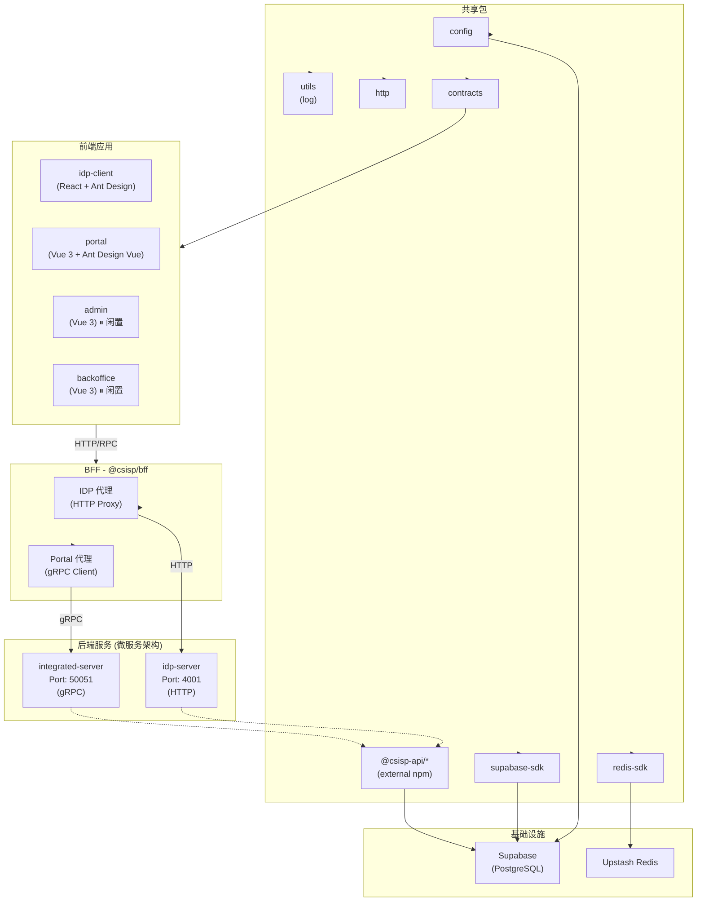

# CSISP 项目架构文档

> 本文档为 AI 提供项目上下文，包含架构概述、模块职责、依赖关系及运行方式。
> **注意**：本文档记录当前架构和实现细节。

## 1. 项目概览

### 1.1 基本信息

| 属性      | 值                                               |
| --------- | ------------------------------------------------ |
| 项目名称  | SCNU 计算机学院综合服务平台 (CSISP)              |
| 代码管理  | Monorepo (pnpm workspaces + Turbo)               |
| Node 版本 | ≥24.x                                            |
| 包管理器  | pnpm 10+                                         |
| 主要框架  | NestJS (后端), Vue 3 / React (前端), Vite (构建) |

### 1.2 目录结构

```
CSISP/
├── apps/
│   ├── backend/
│   │   ├── idp-server/        # 身份认证服务 (NestJS, RPC 风格 RESTful API)
│   │   └── integrated-server/ # 主业务服务 (NestJS, gRPC)
│   ├── bff/                  # Backend-for-Frontend (NestJS)
│   └── frontend/
│       ├── idp-client/      # IDP 登录页 (React + Ant Design)
│       ├── portal/          # web 前台 (Vue 3 + Ant Design Vue)
│       ├── admin/           # 管理中台 (Vue 3) ⏸ 闲置
│       └── backoffice/      # 开发后台 (Vue 3) ⏸ 闲置
├── packages/               # 共享包
│   ├── config/             # 配置管理 (Zod)
│   ├── utils/              # 工具库 (Pino logger)
│   ├── redis-sdk/         # Upstash Redis 适配
│   ├── supabase-sdk/      # Supabase 客户端
│   ├── http/              # HTTP 客户端 (RPC 风格 REST)
│   └── contracts/         # API 契约定义
├── supabase/               # 数据库迁移 (PostgreSQL)
└── docs/                   # VitePress 文档
```

---

## 2. 应用服务

### 2.1 后端服务

#### @csisp/idp-server (身份认证服务)

| 属性   | 值                                                                           |
| ------ | ---------------------------------------------------------------------------- |
| 路径   | `apps/backend/idp-server`                                                    |
| 框架   | NestJS                                                                       |
| 端口   | 4001                                                                         |
| 依赖   | `@csisp-api/idp-server`, `@csisp/config`, `@csisp/redis-sdk`, `@csisp/utils` |
| 数据库 | Supabase (GoTrue) + Redis (会话)                                             |

**核心模块**:

- `modules/auth/` - 登录/注册/OTP/会话管理
- `modules/oidc/` - OIDC 协议实现
- `modules/health/` - 健康检查
- `infra/supabase/` - Supabase GoTrue 集成
- `infra/redis/` - 会话存储 (ExchangeStore, StepupStore)

**关键文件**:

- `src/main.ts` - 服务入口
- `src/modules/auth/auth.controller.ts` - 认证接口
- `src/modules/auth/service/session.service.ts` - 会话管理服务
- `src/modules/auth/service/registration.service.ts` - 用户注册服务
- `src/modules/auth/service/login.service.ts` - 登录验证服务
- `src/modules/auth/service/otp.service.ts` - OTP 验证服务
- `src/infra/supabase/gotrue.service.ts` - Supabase 集成

**说明**: 使用外部 npm 包 `@csisp-api/idp-server` 作为 IDP 接口定义。

---

#### @csisp/integrated-server (主业务服务)

| 属性     | 值                                                                         |
| -------- | -------------------------------------------------------------------------- |
| 路径     | `apps/backend/integrated-server`                                           |
| 框架     | NestJS                                                                     |
| 协议     | gRPC + OpenAPI (RPC 风格 RESTful API)                                      |
| 命名规范 | `Domain.Action` (如 `health.ping`)                                         |
| 数据库   | MongoDB (Typegoose + Mongoose) / PostgreSQL (Supabase)                     |
| 依赖     | `@csisp/config`, `@csisp/redis-sdk`, `@csisp/supabase-sdk`, `@csisp/utils` |

**核心模块**:

- `common/http/` - HTTP 基础设施
- `modules/health/` - 健康检查

---

### 2.2 BFF 层

#### @csisp/bff (Backend-for-Frontend)

| 属性     | 值                                                                         |
| -------- | -------------------------------------------------------------------------- |
| 路径     | `apps/bff`                                                                 |
| 框架     | NestJS                                                                     |
| 端口     | 4000                                                                       |
| API 前缀 | `/api`                                                                     |
| 依赖     | `@csisp/config`, `@csisp/redis-sdk`, `@csisp/supabase-sdk`, `@csisp/utils` |

**模块结构**:

```
modules/
├── idp-client/              # IDP 客户端代理模块
│   ├── auth/                # 代理 /api/idp/auth → IDP Server
│   └── oidc/                # 代理 /api/idp/oidc → IDP Server
├── portal/                  # Portal 代理模块
│   └── demo/                # Portal Demo 示例模块
├── admin/                   # Admin 代理模块 (预留)
│   └── .gitkeep
├── backoffice/              # Backoffice 代理模块 (预留)
│   └── .gitkeep
└── common/                  # 公共模块
    └── auth/                # 公共认证模块
```

**说明**:

- BFF 层采用按业务域划分的模块结构

**代理实现**: 现基于 `@csisp-api/bff-idp-server` SDK，通过强类型接口显式转发调用，并引入 `nestjs-cls` (AsyncLocalStorage) 机制处理 Cookie 与会话上下文透传。

**基础设施**:

- `common/cors/` - 动态 CORS (可信源配置)
- `common/interceptors/logging.interceptor.ts` - 日志拦截器
- `common/filters/` - HTTP 异常过滤器
- `infra/upstream-proxy.module.ts` - 上游服务代理模块
- `infra/cls.module.ts` - AsyncLocalStorage 挂载
- `infra/redis.module.ts` - Redis 注入
- `infra/supabase.module.ts` - Supabase 注入

---

### 2.3 前端应用

#### @csisp/idp-client (IDP 登录页)

| 属性  | 值                         |
| ----- | -------------------------- |
| 路径  | `apps/frontend/idp-client` |
| 框架  | React 18 + Vite            |
| UI 库 | Ant Design                 |
| 路由  | React Router DOM           |
| 状态  | React Hooks                |

**关键文件**:

- `src/main.tsx` - 入口
- `src/App.tsx` - 根组件 (含 SessionGuard)
- `src/api/caller.ts` - API 调用封装
- `src/routes/SessionGuard.tsx` - 会话守卫
- `src/config/index.ts` - API 前缀配置 (`/api/idp`)

**通信方式**: RPC 风格的 REST 接口 over Fetch，使用 `@csisp/http` 包提供的 ky 封装工具

```typescript
// API 调用示例
import { call } from '@csisp/http';

const authCall = <T>(action: string, params?: unknown) =>
  call<T>('/api/idp', 'auth', action, params);

// 可用方法: register, login-internal, verify-otp, session, etc.
```

---

#### @csisp/portal (web 前台)

| 属性     | 值                     |
| -------- | ---------------------- |
| 路径     | `apps/frontend/portal` |
| 框架     | Vue 3 + Vite           |
| UI 库    | Ant Design Vue         |
| 状态管理 | Pinia                  |
| 路由     | Vue Router             |
| 图表     | ECharts                |

**通信方式**: RPC 风格的 REST 接口 over Fetch，使用 `@csisp/http` 包提供的 ky 封装工具

**API 调用示例**:

```typescript
// 创建 domain call 函数
import { PORTAL_PATH_PREFIX, type PortalDemoAction } from '@csisp/contracts';
import { createDomainCall } from '@/api/caller';

export const portalDemoCall = createDomainCall<PortalDemoAction>(
  PORTAL_PATH_PREFIX, // '/api/portal'
  'demo' // domain
);

// 组件中使用
const res = await portalDemoCall<GetDemoInfoResult>('get-demo-info', {
  demoId: 'test-001',
  withExtra: false,
});
```

**API 文件结构**:

```
src/api/
├── caller.ts              # createDomainCall 工厂函数
├── index.ts               # 统一导出入口
└── portal/                # portal 业务域
    └── demo.ts            # domain 调用文件
```

**URL 构建规则**: `call` 函数的 URL 拼接逻辑为 `${pathPrefix}/${domain}/${action}`

**状态**: 基础框架已搭建，已接入 gRPC 接口，后续将逐步接入业务功能。

---

#### @csisp/admin (管理后台)

| 属性  | 值                    |
| ----- | --------------------- |
| 路径  | `apps/frontend/admin` |
| 框架  | Vue 3 + Vite          |
| UI 库 | Naive UI              |
| 图表  | ECharts               |

**状态**: 基础框架已搭建 (stub)，待完善业务功能。

---

## 3. 共享包

### 3.1 @csisp/config (配置管理)

| 导出 | 用途                      |
| ---- | ------------------------- |
| `.`  | 环境变量类型 + Zod 验证器 |

依赖 `@csisp/utils` (Pino logger)。

---

### 3.2 @csisp/utils (工具库)

| 导出 | 用途            |
| ---- | --------------- |
| `.`  | 日志工具 (Pino) |

**说明**: 未来计划将 logger 提取为独立子包，以支持日志审计扩展。

---

### 3.3 @csisp/redis-sdk (Redis 适配)

| 导出     | 用途                                    |
| -------- | --------------------------------------- |
| `.`      | 核心适配器 (RedisAdapter)               |
| `./nest` | NestJS 依赖注入 (RedisModule, REDIS_KV) |

**实现**: 基于 Upstash Redis，支持:

- 命名空间前缀管理
- 内存 fallback (未配置时)
- KV 操作 (set/get/del/exists/ttl/incr)

---

### 3.4 @csisp/supabase-sdk (Supabase 客户端)

| 导出 | 用途                |
| ---- | ------------------- |
| `.`  | Supabase 客户端封装 |

依赖 `@supabase/supabase-js`。

---

### 3.5 @csisp/contracts (API 契约定义)

| 导出 | 用途                     |
| ---- | ------------------------ |
| `.`  | 定义前端——BFF 之间的契约 |

用于定义前端与 BFF 之间的 API 契约，确保接口的一致性。

**依赖**:

- `@ts-rest/core` - ts-rest 契约定义核心库
- `zod` - 运行时验证
- `@csisp-api/bff-idp-server` - IDP 接口契约

**类型生成流程**:

1. 在 `packages/contracts/src/{domain}/` 下编写 `.contract.ts` 契约文件
2. 运行 `pnpm -F @csisp/contracts build` 执行生成脚本
3. 脚本自动扫描所有 `.contract.ts` 文件，生成对应的 `.contract.types.generated.ts` 文件
4. 生成的文件包含 Zod Schema 推导出的 TypeScript 类型（如 `GetDemoInfoParams`、`GetDemoInfoResult`）

**注意事项**:

- 生成文件包含 `AUTO-GENERATED FILE. DO NOT EDIT.` 头部注释
- 修改 `.contract.ts` 后必须重新运行 build
- 前端从 `@csisp/contracts` 导入使用，不直接引用生成文件

---

### 3.6 @csisp/http (HTTP 客户端)

| 导出 | 用途                        |
| ---- | --------------------------- |
| `.`  | 提供前端调用 BFF 接口的工具 |

**实现**:

- 基于 ky (Fetch 封装) 的 HTTP 客户端
- 提供 `call` 函数用于 RPC 风格的 REST 调用
- URL 构建逻辑: `${prefix}/${domain}/${action}`
- 自动生成追踪 ID (x-trace-id)
- 统一错误处理和响应拦截

---

## 4. 依赖关系图



---

## 5. 运行方式

### 5.1 环境准备

```bash
# Node 版本
nvm use 24

# 安装全局工具
npm i -g pnpm turbo @infisical/cli

# 安装依赖
pnpm i

# 登录 Infisical (环境变量)
pnpm infisical:login
```

### 5.2 构建

```bash
# 首次或更新依赖后构建
pnpm build

# 或仅构建特定项目
turbo build --filter=@csisp/idp-server
```

### 5.3 运行

```bash
# IDP 服务
pnpm dev:idp:server    # 端口 4001

# IDP 客户端
pnpm dev:idp:client    # 端口 5173 (Vite)

# BFF
pnpm dev:bff           # 端口 4000

# Portal / Admin
pnpm dev:portal
pnpm dev:admin
```

### 5.4 开发环境代理配置

前端应用在开发模式下通过 Vite proxy 转发 API 请求到 BFF:

| 前端应用   | 端口 | 代理规则                             | 目标 |
| ---------- | ---- | ------------------------------------ | ---- |
| idp-client | 5173 | `/api/idp` → `http://127.0.0.1:4000` | BFF  |
| portal     | 5273 | `/api` → `http://127.0.0.1:4000`     | BFF  |

**Portal Vite 配置示例**:

```typescript
// apps/frontend/portal/vite.config.ts
export default defineConfig(({ command }) => {
  if (command === 'serve') {
    return {
      server: {
        port: 5273,
        proxy: {
          '/api': {
            target: 'http://127.0.0.1:4000',
            changeOrigin: true,
          },
        },
      },
    };
  }
});
```

---

## 6. API 通信模式

### 6.1 当前模式 (浏览器 → BFF)

**RPC 风格** (REST 接口 + JSON Body):

```
POST /api/idp/{domain}/{action}
Content-Type: application/json

{
  "jsonrpc": "2.0",
  "id": 1700000000000,
  "params": { ... }
}
```

**示例** (idp-client):

```typescript
// 使用 @csisp/http 包提供的 call 方法
import { call } from '@csisp/http';

// /api/idp/auth/login-internal
const result = await call('/api/idp', 'auth', 'login-internal', {
  studentId: 'xxx',
  password: 'xxx',
});
```

### 6.2 BFF → 后端服务 (HTTP 与 gRPC)

**HTTP 代理**:

- BFF 层使用强类型 SDK (`@csisp-api/bff-idp-server`) 发起强类型的 REST API 调用。
- 通过 `nestjs-cls` 和 `AsyncLocalStorage` 自动透传客户端的 `Cookie`、`Authorization` 与 `x-trace-id`。
- 通过全局过滤器透传异常响应及 `Set-Cookie` 头。

**gRPC 代理**:

- BFF 层使用 `@nestjs/microservices` 的 `ClientGrpc` 调用 integrated-server 的 gRPC 服务。
- 通过 `nestjs-cls` 和 `AsyncLocalStorage` 透传客户端会话上下文。
- 通过 `firstValueFrom` 将 RxJS Observable 转换为 Promise 返回。

### 6.3 接口管理 (@csisp-api)

项目采用微服务架构，后端同时维护 HTTP 和 gRPC 两种协议的服务端:

1. **HTTP 服务端** (以 idp-server 为例): 使用 `@csisp-api/idp-server` 等包（通过 `openapi-generator-cli` 生成），提供带验证装饰器的 DTO 与 Controller 接口骨架。
2. **gRPC 服务端** (以 integrated-server 为例): 使用 `@csisp-api/integrated-server` 包（通过 `ts-proto` 生成），提供 gRPC Service 定义。
3. **BFF (客户端)**: 使用对应的客户端 SDK 包，通过不同协议实现对后端的强类型调用:
   - idp-server: `@csisp-api/bff-idp-server`
   - integrated-server: `@csisp-api/bff-integrated-server`
4. **前端 (浏览器)**: 独立封装 fetch 等工具调用 BFF，通过 `@csisp/contracts` 包进行类型安全的 API 调用。

**SDK 更新流程**: 接口文档更新后，开发者在 `csisp-api-sdk-registry` 中手动触发代码生成，导出新版本 SDK 包到本项目使用。SDK 采用标准的三位版本号策略（主版本号.次版本号.修订号）。

---

### 6.4 gRPC 通信模式 (以 BFF ↔ Integrated-Server 为例)

#### 架构概览

项目采用 gRPC 实现 BFF 与 Integrated-Server 之间的高性能通信，完整链路如下:

```
浏览器前端 → (HTTP/RPC) → BFF (端口 4000) → (gRPC) → Integrated-Server (端口 50051)
```

#### 微服务架构说明

本项目采用微服务架构，后端同时存在多种通信协议的服务端:

| 服务端            | 协议 | 端口  | BFF 调用方式                                     |
| ----------------- | ---- | ----- | ------------------------------------------------ |
| idp-server        | HTTP | 4001  | HTTP SDK (`@csisp-api/bff-idp-server`)           |
| integrated-server | gRPC | 50051 | gRPC Client (`@csisp-api/bff-integrated-server`) |

两种协议的服务端会长期并存，BFF 层会根据目标服务选择合适的通信方式。

#### Proto 文件管理

- **存储位置**: `csisp-api-sdk-registry` 项目（独立仓库）
- **代码生成工具**:
  - **HTTP 服务端**: 通过 `openapi-generator-cli` 生成
  - **gRPC 服务端**: 通过 `ts-proto` 生成
- **生成的包**:
  - `@csisp-api/integrated-server` - gRPC 服务端接口定义
  - `@csisp-api/bff-integrated-server` - gRPC 客户端接口定义
- **更新流程**: 接口文档更新后，开发者手动触发代码生成，导出新版本 SDK 包到本项目使用
- **版本管理**: 采用标准的三位版本号策略（如 `0.1.2`）

#### Integrated-Server gRPC 服务注册

```typescript
// apps/backend/integrated-server/src/main.ts
import { NestFactory } from '@nestjs/core';
import { Transport } from '@nestjs/microservices';

const app = await NestFactory.createMicroservice(AppModule, {
  transport: Transport.GRPC,
  options: {
    package: INTEGRATED_SERVER_PACKAGE_NAME,
    url: '0.0.0.0:50051',
    packageDefinition: GrpcPackageDefinition,
  },
});
```

**依赖项**: `@grpc/grpc-js`, `@nestjs/microservices`

#### BFF gRPC 客户端配置

```typescript
// apps/bff/src/infra/grpc-client.module.ts
import { ClientsModule, Transport } from '@nestjs/microservices';

@Module({
  imports: [
    ClientsModule.register([
      {
        name: INTEGRATED_CLIENT,
        transport: Transport.GRPC,
        options: {
          package: INTEGRATED_SERVER_PACKAGE_NAME,
          url: config.upstream.integratedServerUrl,
          packageDefinition: GrpcPackageDefinition,
        },
      },
    ]),
  ],
})
export class GrpcClientModule {}
```

#### BFF Controller 示例

```typescript
// apps/bff/src/modules/portal/demo/demo.controller.ts
@Controller(PORTAL_DEMO_CONTROLLER_PREFIX)
export class PortalDemoController {
  private demoService: DemoClient;

  constructor(
    @Inject(INTEGRATED_CLIENT)
    private readonly grpcClient: ClientGrpc
  ) {
    this.demoService =
      this.grpcClient.getService<DemoClient>(DEMO_SERVICE_NAME);
  }

  @Post(PORTAL_DEMO_ACTION.GET_DEMO_INFO)
  async getDemoInfo(
    @Body() params: GetDemoInfoParams
  ): Promise<GetDemoInfoResponse> {
    const request: GetDemoInfoRequest = {
      demoId: params.demoId,
      withExtra: params.withExtra,
    };
    return firstValueFrom(this.demoService.getDemoInfo(request));
  }
}
```

#### 通信流程说明

1. **前端请求**: 浏览器发送 POST `/api/portal/demo/get-demo-info` 到 BFF
2. **BFF 处理**: BFF Controller 接收请求，通过 Zod 验证参数
3. **gRPC 转发**: BFF 使用 `ClientGrpc` 调用 Integrated-Server 的 gRPC 服务
4. **后端响应**: Integrated-Server 处理业务逻辑后返回 gRPC 响应
5. **BFF 返回**: BFF 将 gRPC 响应转换为 HTTP 响应返回给前端

---

### 6.5 前端 API 文件结构规范

#### 统一目录结构

所有前端应用（idp-client、portal 等）遵循以下 API 文件结构:

```
src/api/
├── caller.ts              # createDomainCall 工厂函数
├── index.ts               # 统一导出入口
└── {app}/                 # 应用级目录（如 idp-client、portal）
    ├── auth.ts            # domain 文件
    ├── demo.ts            # domain 文件
    └── ...                # 其他 domain 文件
```

#### createDomainCall 工厂函数

```typescript
// apps/frontend/{app}/src/api/caller.ts
import { call } from '@csisp/http';

export function createDomainCall<TAction extends string>(
  pathPrefix: string,
  domain: string
) {
  return function <T>(action: TAction, params?: unknown): Promise<T> {
    return call<T>(pathPrefix, domain, action, params ?? {}) as Promise<T>;
  };
}
```

**URL 构建逻辑**: `${pathPrefix}/${domain}/${action}`

#### Domain 文件编写规范

每个 domain 文件（如 `auth.ts`、`demo.ts`）应包含:

1. **导入**: 从 `@csisp/contracts` 导入路径前缀和 Action 类型
2. **类型重新导出**: 使用 `export type { ... } from '@csisp/contracts'` 重新导出类型
3. **Call 函数**: 使用 `createDomainCall` 创建类型安全的调用函数

```typescript
// 示例: apps/frontend/portal/src/api/portal/demo.ts
import { PORTAL_PATH_PREFIX, type PortalDemoAction } from '@csisp/contracts';
import { createDomainCall } from '../caller';

export type {
  GetDemoInfoParams,
  GetDemoInfoResult,
  PortalDemoAction,
} from '@csisp/contracts';

export const portalDemoCall = createDomainCall<PortalDemoAction>(
  PORTAL_PATH_PREFIX,
  'demo'
);
```

#### 导出规范

- ✅ **正确**: `api/index.ts` 直接导出各个 domain 文件
- ❌ **错误**: 创建中间聚合文件（如 `api/portal/index.ts`）

```typescript
// apps/frontend/portal/src/api/index.ts
export * from './caller';
export * from './portal/demo'; // 直接导出，不需中间层
```

#### 类型生成流程

1. **契约定义**: 在 `@csisp/contracts` 中编写 `.contract.ts` 文件
2. **运行生成脚本**: `pnpm -F @csisp/contracts build`
3. **生成结果**: 自动创建 `*.contract.types.generated.ts` 文件
4. **前端使用**: 从 `@csisp/contracts` 导入生成的类型

---

## 7. 数据库

### 7.1 Supabase

- **类型**: PostgreSQL + GoTrue
- **迁移**: `supabase/migrations/`
- **CLI**: 通过 `supabase/package.json` 脚本管理

**常用命令**:

```bash
cd supabase
pnpm run link:dev      # 链接开发项目
pnpm run db:pull:dev   # 拉取远端结构
pnpm run db:diff:dev   # 生成迁移
pnpm run db:reset:local # 重置本地
```

### 7.2 MongoDB

- **类型**: 文档数据库
- **ORM**: Typegoose (Mongoose 的 TypeScript 封装)
- **模型定义**: 使用装饰器定义（代码优先）
- **位置**: `packages/dal/src/types/mongo.types.ts` 和 `packages/dal/src/repositories/mongo/`

**核心依赖**:

- `@typegoose/typegoose` - TypeScript 装饰器支持
- `@m8a/nestjs-typegoose` - NestJS 集成模块
- `mongoose` - MongoDB ODM

**使用流程**:

1. 在 `packages/dal/src/types/mongo.types.ts` 中使用装饰器定义模型
2. 在 `packages/dal/src/repositories/mongo/` 中创建对应的 Repository
3. 在 `MongoDalModule` 中通过 `TypegooseModule.forFeature()` 注册模型
4. 在应用服务中通过依赖注入使用 Repository

**示例模型定义**:

```typescript
import { prop, modelOptions } from '@typegoose/typegoose';

@modelOptions({
  schemaOptions: {
    collection: 'demo',
    timestamps: true,
  },
})
export class Demo {
  @prop({ required: true, type: String })
  public demo!: string;
}
```

---

## 8. 关键文件索引

### 入口文件

| 应用              | 入口                                         |
| ----------------- | -------------------------------------------- |
| idp-server        | `apps/backend/idp-server/src/main.ts`        |
| integrated-server | `apps/backend/integrated-server/src/main.ts` |
| bff               | `apps/bff/src/main.ts`                       |
| idp-client        | `apps/frontend/idp-client/src/main.tsx`      |
| portal            | `apps/frontend/portal/src/main.ts`           |
| admin             | `apps/frontend/admin/src/main.ts`            |

### 配置文件

| 文件                  | 用途                                |
| --------------------- | ----------------------------------- |
| `turbo.json`          | Monorepo 构建任务                   |
| `pnpm-workspace.yaml` | Workspace 定义 + 版本目录 (Catalog) |
| `tsconfig.json`       | TypeScript 根配置                   |
| `eslint.config.ts`    | ESLint 配置                         |
| `.nvmrc`              | Node 版本 (24)                      |

---

## 9. 注意事项

1. **环境变量**: 通过 Infisical 管理，运行时需先登录 (`pnpm infisical:login`)
2. **换行符**: 项目统一使用 LF，Windows 需配置 Git (`core.autocrlf input`)
3. **依赖构建**: 修改 workspace 依赖后需重新 `pnpm build`
4. **API 风格**: 项目统一采用 RPC 风格的 REST 接口

---

## 10. 微服务架构

### 10.1 架构概述

本项目采用微服务架构，后端服务使用不同的通信协议:

| 服务端            | 协议 | 适用场景                 | 端口  |
| ----------------- | ---- | ------------------------ | ----- |
| idp-server        | HTTP | RESTful API、身份认证    | 4001  |
| integrated-server | gRPC | 高性能内部通信、业务逻辑 | 50051 |

两种协议的服务端会长期并存，根据业务场景选择合适的通信方式。

### 10.2 BFF 层角色

BFF (Backend-for-Frontend) 作为前端与后端服务之间的适配层:

- 统一接收前端的 HTTP/RPC 请求
- 根据目标服务选择合适的通信协议（HTTP 或 gRPC）
- 处理协议转换、会话透传、异常转发等
- 为前端提供统一的 API 接口

### 10.3 代码生成策略

项目采用统一的代码生成策略管理接口定义:

| 协议 | 生成工具                | 服务端包                       | BFF 客户端包                       |
| ---- | ----------------------- | ------------------------------ | ---------------------------------- |
| HTTP | `openapi-generator-cli` | `@csisp-api/idp-server`        | `@csisp-api/bff-idp-server`        |
| gRPC | `ts-proto`              | `@csisp-api/integrated-server` | `@csisp-api/bff-integrated-server` |

**更新流程**:

1. 在 `csisp-api-sdk-registry` 项目中更新接口文档（OpenAPI 或 proto）
2. 开发者手动触发代码生成工具
3. 导出生成新版本的 SDK 包
4. 在本项目中更新 package.json 中的包版本号

**版本管理**: 采用标准的三位版本号策略（主版本号.次版本号.修订号）

---

## 11. 开发规范与最佳实践

### 11.1 前端 API 开发流程

1. 在 `@csisp/contracts` 中定义接口契约（`.contract.ts`）
2. 运行 `pnpm -F @csisp/contracts build` 生成类型
3. 在前端 `api/{app}/` 目录下创建 domain 文件
4. 使用 `createDomainCall` 创建类型安全的调用函数
5. 在组件中导入并调用 API

### 11.2 BFF 模块开发流程

**HTTP 代理模块**:

1. 在 `@csisp-api/bff-idp-server` 中确认接口定义
2. 创建 BFF Controller 并注册到对应模块
3. 使用 Zod 进行请求体验证
4. 通过 HTTP SDK 调用后端服务

**gRPC 代理模块**:

1. 在 `@csisp-api/bff-integrated-server` 中确认 gRPC 服务定义
2. 创建 BFF Controller 并注册到对应模块
3. 使用 Zod 进行请求体验证
4. 通过 `ClientGrpc` 调用后端 gRPC 服务

### 11.3 后端服务开发流程

**HTTP 服务端**:

1. 在 `csisp-api-sdk-registry` 中定义 OpenAPI 规范
2. 运行 `openapi-generator-cli` 生成服务端包
3. 在对应服务端应用中实现 Controller 逻辑
4. 注册路由到 NestJS 模块

**gRPC 服务端**:

1. 在 `csisp-api-sdk-registry` 中定义 proto 文件
2. 运行 `ts-proto` 生成服务端包
3. 在对应服务端应用中实现 gRPC Service
4. 注册服务到 `GrpcPackageDefinition`

### 11.4 命名规范

| 类别            | 规范                  | 示例                                           |
| --------------- | --------------------- | ---------------------------------------------- |
| API Action      | snake-case            | `get-demo-info`, `login-internal`              |
| Domain          | 小写单词              | `auth`, `demo`, `health`                       |
| 路径前缀        | 常量定义              | `PORTAL_PATH_PREFIX`, `IDP_CLIENT_PATH_PREFIX` |
| TypeScript Type | PascalCase            | `GetDemoInfoParams`, `PortalDemoAction`        |
| 文件命名        | PascalCase (Vue 组件) | `DemoPage.vue`, `UserProfile.vue`              |
| 文件命名        | kebab-case (普通文件) | `caller.ts`, `demo.contract.ts`                |

---

## 12. 环境配置

### 12.1 Infisical 环境变量

项目使用 Infisical 管理所有环境变量，不硬编码敏感配置。

**运行命令前缀**:

```bash
infisical run -- [command]              # 默认环境
infisical run --env=staging -- [command] # staging 环境
```

**常用命令**:

```bash
pnpm infisical:login                    # 登录 Infisical
pnpm dev:portal                         # 开发模式（自动加载环境变量）
pnpm stag:bff                           # staging 环境运行 BFF
```

### 12.2 端口分配

| 服务              | 端口   | 协议 | 状态      |
| ----------------- | ------ | ---- | --------- |
| BFF               | 4000   | HTTP | ✅ 运行中 |
| IDP Server        | 4001   | HTTP | ✅ 运行中 |
| Integrated Server | 50051  | gRPC | ✅ 运行中 |
| Portal (Vite)     | 5273   | HTTP | ✅ 运行中 |
| IDP Client (Vite) | 5173   | HTTP | ✅ 运行中 |
| Admin (Vite)      | (待定) | HTTP | ⏸ 闲置    |
| Backoffice (Vite) | (待定) | HTTP | ⏸ 闲置    |
