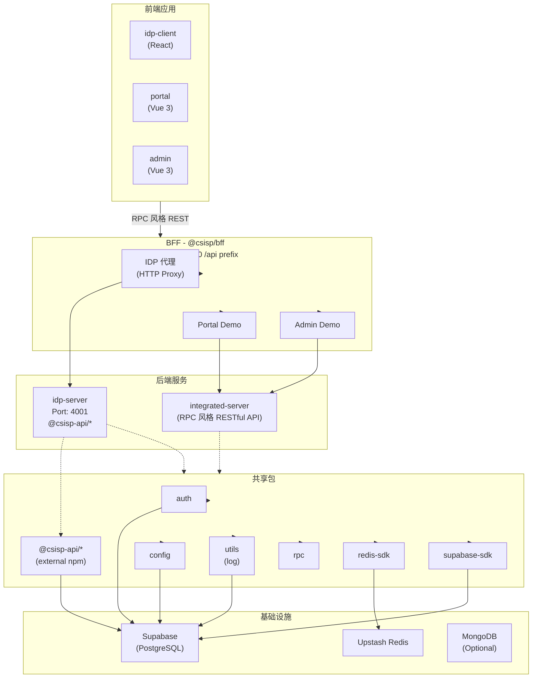

# CSISP 项目架构文档

> 本文档为 AI 提供项目上下文，包含架构概述、模块职责、依赖关系及运行方式。
> **注意**：本文档记录了未来的重构计划，AI 使用时需注意这些待办事项可能尚未完成。

## 1. 项目概览

### 1.1 基本信息

| 属性      | 值                                               |
| --------- | ------------------------------------------------ |
| 项目名称  | SCNU 计算机学院综合服务平台 (CSISP)              |
| 代码管理  | Monorepo (pnpm workspaces + Turbo)               |
| Node 版本 | ≥24.x                                            |
| 包管理器  | pnpm 10+                                         |
| 主要框架  | NestJS (后端), Vue 3 / React (前端), Vite (构建) |

### 1.2 目录结构

```
CSISP/
├── apps/
│   ├── backend/
│   │   ├── idp-server/        # 身份认证服务 (NestJS)
│   │   └── integrated-server/ # 主业务服务 (NestJS, RPC 风格 RESTful API)
│   ├── bff/                  # Backend-for-Frontend (NestJS, HTTP Proxy)
│   └── frontend/
│       ├── idp-client/      # IDP 登录页 (React + Ant Design)
│       ├── admin/           # 管理后台 (Vue 3 + Naive UI)
│       └── portal/         # 师生门户 (Vue 3 + Naive UI)
├── packages/               # 共享包
│   ├── auth/               # 统一认证 SDK
│   ├── config/             # 配置管理 (Zod)
│   ├── utils/              # 工具库 (Pino logger)
│   ├── redis-sdk/         # Upstash Redis 适配
│   ├── supabase-sdk/      # Supabase 客户端
│   └── rpc/               # RPC 框架 (Thrift + RPC 风格 RESTful API)
├── supabase/               # 数据库迁移 (PostgreSQL)
└── docs/                   # VitePress 文档
```

---

## 2. 应用服务

### 2.1 后端服务

#### @csisp/idp-server (身份认证服务)

| 属性   | 值                                                                                               |
| ------ | ------------------------------------------------------------------------------------------------ |
| 路径   | `apps/backend/idp-server`                                                                        |
| 框架   | NestJS                                                                                           |
| 端口   | 4001                                                                                             |
| 依赖   | `@csisp-api/idp-server` (npm), `@csisp/config`, `@csisp/redis-sdk`, `@csisp/rpc`, `@csisp/utils` |
| 数据库 | Supabase (GoTrue) + Redis (会话)                                                                 |

**核心模块**:

- `modules/auth/` - 登录/注册/OTP/会话管理
- `modules/oidc/` - OIDC 协议实现
- `modules/health/` - 健康检查
- `infra/supabase/` - Supabase GoTrue 集成
- `infra/redis/` - 会话存储 (ExchangeStore, StepupStore)

**关键文件**:

- `src/main.ts` - 服务入口
- `src/modules/auth/auth.controller.ts` - 认证接口
- `src/modules/auth/auth.service.ts` - 认证逻辑
- `src/infra/supabase/gotrue.service.ts` - Supabase 集成

**说明**: 使用外部 npm 包 `@csisp-api/idp-server` (v0.1.2) 作为 IDP 接口定义，正在逐步将手写接口替换为该包的复用代码。

---

#### @csisp/integrated-server (主业务服务)

| 属性     | 值                                                                                        |
| -------- | ----------------------------------------------------------------------------------------- |
| 路径     | `apps/backend/integrated-server`                                                          |
| 框架     | NestJS                                                                                    |
| 协议     | OpenAPI (RPC 风格 RESTful API)                                                            |
| 命名规范 | `Domain.Action` (如 `health.ping`)                                                        |
| 数据库   | MongoDB (Mongoose) / PostgreSQL (Sequelize)                                               |
| 依赖     | `@csisp/auth`, `@csisp/config`, `@csisp/redis-sdk`, `@csisp/supabase-sdk`, `@csisp/utils` |

**核心模块**:

- `common/rpc/` - HTTP 基础设施
- `modules/health/` - 健康检查

---

### 2.2 BFF 层

#### @csisp/bff (Backend-for-Frontend)

| 属性     | 值                                                                                       |
| -------- | ---------------------------------------------------------------------------------------- |
| 路径     | `apps/bff`                                                                               |
| 框架     | NestJS                                                                                   |
| 端口     | 4000                                                                                     |
| API 前缀 | `/api`                                                                                   |
| 依赖     | `@csisp/config`, `@csisp/redis-sdk`, `@csisp/rpc`, `@csisp/supabase-sdk`, `@csisp/utils` |

**模块结构**:

```
modules/
├── idp/              # IDP 代理模块
│   ├── auth/         # 代理 /api/idp/auth → IDP Server
│   ├── oidc/         # 代理 /api/idp/oidc → IDP Server
│   └── health/       # 健康检查
├── portal/demo/      # Portal 示例模块
├── admin/demo/       # Admin 示例模块
└── backoffice/demo/ # Backoffice 示例模块
```

**代理实现**: 使用 `http-proxy-middleware` 将请求转发到上游服务:

```typescript
// common/proxy/http-proxy.ts
buildJsonProxy({
  target: `${config.upstream.idpBaseUrl}/api/idp/auth`,
  stripPrefix: 'api/idp/auth',
});
```

**基础设施**:

- `common/cors/` - 动态 CORS (可信源配置)
- `common/interceptors/logging.interceptor.ts` - 日志拦截器
- `infra/redis.module.ts` - Redis 注入
- `infra/supabase.module.ts` - Supabase 注入

---

### 2.3 前端应用

#### @csisp/idp-client (IDP 登录页)

| 属性  | 值                         |
| ----- | -------------------------- |
| 路径  | `apps/frontend/idp-client` |
| 框架  | React 18 + Vite            |
| UI 库 | Ant Design                 |
| 路由  | React Router DOM           |
| 状态  | React Hooks                |

**关键文件**:

- `src/main.tsx` - 入口
- `src/App.tsx` - 根组件 (含 SessionGuard)
- `src/api/rpc.ts` - RPC 客户端封装
- `src/routes/SessionGuard.tsx` - 会话守卫
- `src/config/index.ts` - API 前缀配置 (`/api/idp`)

**通信方式**: RPC 风格的 REST 接口 over Fetch

```typescript
// API 调用示例
const authCall = <T>(action: string, params?: unknown) =>
  call<T>('/api/idp', 'auth', action, params);

// 可用方法: register, login-internal, verify-otp, session, etc.
```

---

#### @csisp/portal (师生门户)

| 属性     | 值                     |
| -------- | ---------------------- |
| 路径     | `apps/frontend/portal` |
| 框架     | Vue 3 + Vite           |
| UI 库    | Naive UI               |
| 状态管理 | Pinia                  |
| 路由     | Vue Router             |
| 图表     | ECharts                |

**状态**: 基础框架已搭建 (stub)，待完善业务功能。

---

#### @csisp/admin (管理后台)

| 属性  | 值                    |
| ----- | --------------------- |
| 路径  | `apps/frontend/admin` |
| 框架  | Vue 3 + Vite          |
| UI 库 | Naive UI              |
| 图表  | ECharts               |

**状态**: 基础框架已搭建 (stub)，待完善业务功能。

---

## 3. 共享包

### 3.1 @csisp/auth (统一认证 SDK)

| 导出        | 用途                                               |
| ----------- | -------------------------------------------------- |
| `.`         | 主入口                                             |
| `./browser` | 浏览器端工具 (PKCE 生成, State 生成)               |
| `./server`  | 服务端工具 (IdpClient, SessionManager, verifyAuth) |
| `./core`    | 通用常量 (Cookie 名称, TTL)                        |
| `./react`   | React 组件 (AuthProvider, useAuth, AuthGuard)      |

**核心功能**:

- OIDC/PKCE 流程支持
- JWT 签发与验证
- 会话管理 (可插拔存储)
- React 身份状态管理

---

### 3.2 @csisp/config (配置管理)

| 导出 | 用途                      |
| ---- | ------------------------- |
| `.`  | 环境变量类型 + Zod 验证器 |

依赖 `@csisp/utils` (Pino logger)。

---

### 3.3 @csisp/utils (工具库)

| 导出 | 用途            |
| ---- | --------------- |
| `.`  | 日志工具 (Pino) |

**说明**: 未来计划将 logger 提取为独立子包，以支持日志审计扩展。

---

### 3.4 @csisp/redis-sdk (Redis 适配)

| 导出     | 用途                                    |
| -------- | --------------------------------------- |
| `.`      | 核心适配器 (RedisAdapter)               |
| `./nest` | NestJS 依赖注入 (RedisModule, REDIS_KV) |

**实现**: 基于 Upstash Redis，支持:

- 命名空间前缀管理
- 内存 fallback (未配置时)
- KV 操作 (set/get/del/exists/ttl/incr)

---

### 3.5 @csisp/supabase-sdk (Supabase 客户端)

| 导出 | 用途                |
| ---- | ------------------- |
| `.`  | Supabase 客户端封装 |

依赖 `@supabase/supabase-js`。

---

### 3.6 @csisp/rpc (RPC 框架)（未来将被移除）

| 导出              | 用途                             |
| ----------------- | -------------------------------- |
| `./core`          | JSON-RPC 2.0 类型定义            |
| `./constants`     | RPC 协议枚举                     |
| `./client-fetch`  | HTTP Fetch 客户端                |
| `./server-nest`   | NestJS 集成 (中间件, 异常过滤器) |
| `./server-node`   | Node.js 工具                     |
| `./thrift-client` | Thrift 客户端                    |
| `./thrift-server` | Thrift 服务端                    |

**支持协议**:

- JSON-RPC 2.0 (现代)
- Thrift (遗留)

**说明**: 未来计划移除 rpc 子包，重构为 HTTP 封装用于浏览器-BFF 调用。

---

## 4. 依赖关系图



---

## 5. 运行方式

### 5.1 环境准备

```bash
# Node 版本
nvm use 24

# 安装全局工具
npm i -g pnpm turbo @infisical/cli

# 安装依赖
pnpm i

# 登录 Infisical (环境变量)
pnpm infisical:login
```

### 5.2 构建

```bash
# 首次或更新依赖后构建
pnpm build

# 或仅构建特定项目
turbo build --filter=@csisp/idp-server
```

### 5.3 运行

```bash
# IDP 服务
pnpm dev:idp:server    # 端口 4001

# IDP 客户端
pnpm dev:idp:client    # 端口 5173 (Vite)

# BFF
pnpm dev:bff           # 端口 4000

# Portal / Admin
pnpm dev:portal
pnpm dev:admin
```

---

## 6. API 通信模式

### 6.1 当前模式 (浏览器 → BFF)

**RPC 风格** (REST 接口 + JSON Body):

```
POST /api/idp/{domain}/{action}
Content-Type: application/json

{
  "jsonrpc": "2.0",
  "id": 1700000000000,
  "params": { ... }
}
```

**示例** (idp-client):

```typescript
// /api/idp/auth/login-internal
await fetch('/api/idp/auth/login-internal', {
  method: 'POST',
  body: JSON.stringify({
    jsonrpc: '2.0',
    id: Date.now(),
    params: { studentId: 'xxx', password: 'xxx' },
  }),
});
```

### 6.2 BFF → 后端

**HTTP 代理**:

- BFF 使用 `http-proxy-middleware` 转发请求到后端服务
- IDP 模块代理到 `IDP_SERVER_URL/api/idp/*`

### 6.3 演进计划 (@csisp-api)

正在将手写接口替换为 `@csisp-api` 自动生成的接口代码（采用“发双包”策略）:

1. **idp-server (服务端)**: 使用 `@csisp-api/idp-server` 包（通过 `typescript-nestjs-server` 生成），提供带验证装饰器的 DTO 与 Controller 接口骨架。
2. **BFF (客户端)**: 使用另一个客户端 SDK 包（通过 `typescript-nestjs` 生成），基于 NestJS HttpModule 实现对后端的强类型调用。
3. **前端 (浏览器)**: 独立封装 fetch 等工具调用 BFF，不依赖上述 npm 包。

---

## 7. 数据库

### 7.1 Supabase

- **类型**: PostgreSQL + GoTrue
- **迁移**: `supabase/migrations/`
- **CLI**: 通过 `supabase/package.json` 脚本管理

**常用命令**:

```bash
cd supabase
pnpm run link:dev      # 链接开发项目
pnpm run db:pull:dev   # 拉取远端结构
pnpm run db:diff:dev   # 生成迁移
pnpm run db:reset:local # 重置本地
```

---

## 8. TODO (未来计划)

> 以下内容为待办事项，AI 在处理任务时需注意这些变化可能尚未完成。

### 8.1 大重构

| 序号 | 任务           | 说明                                                                |
| ---- | -------------- | ------------------------------------------------------------------- |
| 1    | 移除 rpc 子包  | 移除 `@csisp/rpc` 包中不再需要的代码                                |
| 2    | 重构 http 子包 | 重新封装 HTTP 工具，用于浏览器-BFF 间调用                           |
| 3    | 重构 auth 子包 | 完全重构 `@csisp/auth`，专注 ESM 构建，为前端提供开箱即用的登录组件 |
| 4    | 提取 logger    | 从 utils 中将 logger 组件提取为独立子包，方便后续扩展日志审计功能   |

### 8.2 当前待办

| 序号 | 任务                         | 说明                                                                            |
| ---- | ---------------------------- | ------------------------------------------------------------------------------- |
| 1    | ~~完善 idp-server 接口改造~~ | [已完成] 移除 JSON-RPC 相关描述，重构代码实现逻辑                               |
| 2    | ~~清理 OpenAPI 数据模型~~    | [已完成] 清理直到与现有 idp-server 代码完全贴合                                 |
| 3    | ~~清理未使用接口与旧逻辑~~   | [已完成] 移除手写实现中已由 Supabase 替代的旧代码                               |
| 4    | 限制 idp-server 使用范围     | idp-server 代码仅供 idp-client 使用                                             |
| 5    | [TODO] 桥接 Request 类型     | 处理 nestjs-server 生成代码里的 Request 类型与 Express Request 的桥接问题       |
| 6    | [TODO] BFF 接入 idp SDK      | 在 BFF 层接入 `@csisp-api/bff-idp-server`，实现对 idp-server 的强类型 HTTP 调用 |

---

## 9. 关键文件索引

### 入口文件

| 应用              | 入口                                         |
| ----------------- | -------------------------------------------- |
| idp-server        | `apps/backend/idp-server/src/main.ts`        |
| integrated-server | `apps/backend/integrated-server/src/main.ts` |
| bff               | `apps/bff/src/main.ts`                       |
| idp-client        | `apps/frontend/idp-client/src/main.tsx`      |
| portal            | `apps/frontend/portal/src/main.ts`           |
| admin             | `apps/frontend/admin/src/main.ts`            |

### 配置文件

| 文件                  | 用途                                |
| --------------------- | ----------------------------------- |
| `turbo.json`          | Monorepo 构建任务                   |
| `pnpm-workspace.yaml` | Workspace 定义 + 版本目录 (Catalog) |
| `tsconfig.json`       | TypeScript 根配置                   |
| `eslint.config.ts`    | ESLint 配置                         |
| `.nvmrc`              | Node 版本 (24)                      |

---

## 10. 注意事项

1. **环境变量**: 通过 Infisical 管理，运行时需先登录 (`pnpm infisical:login`)
2. **换行符**: 项目统一使用 LF，Windows 需配置 Git (`core.autocrlf input`)
3. **依赖构建**: 修改 workspace 依赖后需重新 `pnpm build`
4. **API 演进**: 当前处于 RPC → REST 过渡期，部分代码可能有两种风格的混合

---

_本文档最后更新: 2026-04-10_
