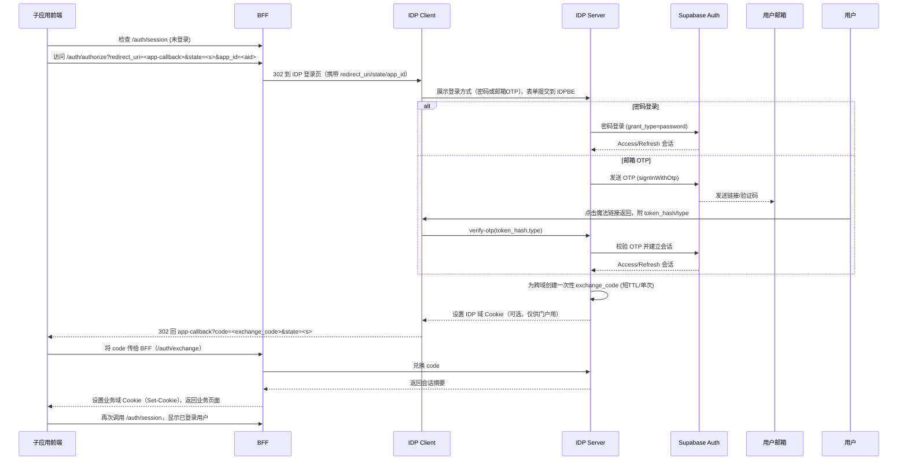
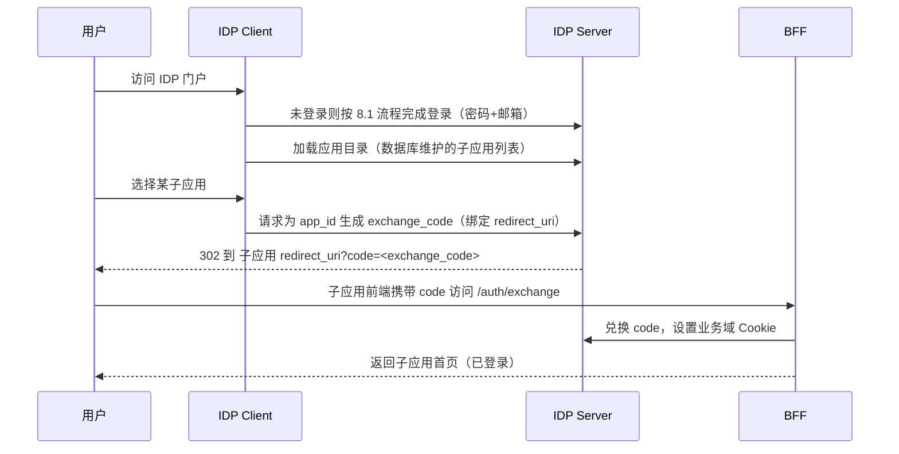

# 鉴权系统重构计划（Supabase 接入 + Auth 子包重构）

本计划将现有自建 OIDC/IDP 鉴权体系演进为以 Supabase Auth（GoTrue）为核心的统一鉴权方案，同时重构 `packages/auth` 为清晰的分层与框架适配包。目标是在不破坏现有业务架构（保留 idp-client/idp-server SSO 入口、保留 apps 目录结构）的前提下，逐步用 Supabase 的会话、MFA、OAuth/SSO 与 RLS 替代自研能力，并提供平滑迁移与兼容期策略。

---

## 11. “密码 → 邮箱”两步校验（Step-up）实现细节（IDP 策略）

目标：在 Supabase 将“密码登录”和“邮箱 OTP/魔法链接”视为并列方式的前提下，于 IDP 层实现业务级的二步确认：只有在完成邮箱验证后才允许为应用生成 exchange_code。

状态机（IDP 侧）：

- PENDING_PASSWORD：用户提交密码正确后进入此状态；IDP 可持有 Supabase 会话（IDP 域），但不允许生成 exchange_code。
- PENDING_EMAIL_OTP：IDP 向邮箱发送 OTP/魔法链接；等待用户完成 verify-otp。
- VERIFIED：邮箱验证通过；允许生成 exchange_code 并回跳/兑换。
- ABORTED/EXPIRED：超时或取消，需重新发起流程。

实现要点：

- 密码校验：由 idp-server 调用 Supabase 密码登录接口（返回 Access/Refresh）；会话仅保留在 IDP 域（HttpOnly Cookie），不在业务域落 Cookie。
- 邮箱发送：调用 Supabase 的 signInWithOtp（类型 email 或 magic link）发送验证码/链接。
- 验证通过：idp-server 调用 verifyOtp，标记用户会话为 VERIFIED。
- 生成 exchange_code：仅当状态为 VERIFIED 时才允许创建；否则拒绝（AUTH_STEP_UP_REQUIRED）。
- 状态存储：使用 Redis 维护会话状态（key 建议为 supabase 会话 id 或 user id + device），TTL 与 OTP 时效对齐；完成后清理。
- 安全：
  - 密码成功后如果未在指定时间内完成邮箱验证，状态过期（回到未登录），避免会话长期悬挂。
  - OTP 尽量采用魔法链接或短码并在服务器验证；不要在浏览器暴露 Access/Refresh。

备注：

- 该方案不改动 Supabase 内部状态机，而是通过“是否允许生成 exchange_code”来控制何时让业务域获得登录态，从而实现“密码+邮箱”的二步校验。

---

## 12. idp-server 改造清单（IDL → 接口 → 存储/安全）

### 12.1 IDL（Thrift）新增/调整（BFF ↔ IDP，服务端-服务端）

- 服务：AuthService（/thrift/idp/AuthService）
  - method RedeemExchangeCode(code: string) → { ok: bool, userId: uuid, email: string, claims: map<string,string> }
  - method GetSessionInfo(sessionId: string) → { userId: uuid, email: string, stepUpVerified: bool }（可选）
  - method Logout(userId: uuid) → { ok: bool }（可选）
- 约束：Thrift 层不传 Access/Refresh Token；先在 infra/idl 定义再 idl:gen。

### 12.2 JSON-RPC（浏览器 ↔ IDP，idp-client ↔ idp-server）

- 路由前缀：/api/idp/auth/\*
  - login（密码登录，内部使用）
  - sendOtp（发送邮箱 OTP/魔法链接）
  - verifyOtp（校验 token_hash 并建立会话，标记 VERIFIED）
  - createExchangeCode（仅 VERIFIED 时允许）

### 12.3 控制器与模块改造（apps/idp/server）

- modules/auth：新增/改造 controller/service/dto，统一错误码；封装 Supabase 与 Redis 状态机
- modules/oidc：保留兼容期，逐步收敛到 Supabase JWT 校验
- infra/supabase：统一 Server SDK 与 JWT 校验秘钥注入
- infra/redis：新增 step-up 状态与 exchange_code 存储（TTL、单次消费）
- common/guards：配合 Supabase JWT 校验
- thrift controller：新增 AuthService 控制器（兑换/查询/登出）

### 12.4 数据与安全

- Redis keys：`stepup:{sessionId}`、`xchg:{code}`
- TTL：step-up 与 OTP 对齐（5~10m），exchange_code ≤ 60s
- 单次消费、防重放、绑定 redirect_uri 与 app_id；必要时校验 UA/IP

### 12.5 DB 触发器（注册后自动同步到 app_users）

推荐使用数据库触发器在用户创建后自动写入应用用户表，确保每个 `auth.users` 都有对应的 `public.app_users` 记录。

1. 建表（以 auth.users.id 作为主键/外键）

```sql
create table if not exists public.app_users (
  id uuid primary key references auth.users(id) on delete cascade,
  email text,
  display_name text,
  role text default 'viewer',
  created_at timestamptz default now(),
  metadata jsonb
);

create index if not exists app_users_role_idx on public.app_users(role);
```

2. 启用 RLS 与基础策略（按需扩展 RBAC/多租户）

```sql
alter table public.app_users enable row level security;

create policy app_users_owner_select on public.app_users
  for select to authenticated
  using (id = (select auth.uid()));

create policy app_users_owner_modify on public.app_users
  for update, delete to authenticated
  using (id = (select auth.uid()))
  with check (id = (select auth.uid()));

create policy app_users_owner_insert on public.app_users
  for insert to authenticated
  with check (id = (select auth.uid()));
```

3. SECURITY DEFINER 函数与触发器（在 auth.users 上 AFTER INSERT）

```sql
create or replace function public.handle_new_user()
returns trigger
language plpgsql
security definer
set search_path = public
as $$
begin
  insert into public.app_users (id, email, display_name, metadata)
  values (
    new.id,
    new.email,
    coalesce(new.raw_user_meta_data->>'display_name', split_part(new.email, '@', 1)),
    new.raw_user_meta_data
  )
  on conflict (id) do nothing;
  return new;
end;
$$;

drop trigger if exists on_auth_user_created on auth.users;
create trigger on_auth_user_created
after insert on auth.users
for each row execute function public.handle_new_user();
```

可选：同步邮箱变更（如果需要将 auth.users.email 更新反映到 app_users）

```sql
create or replace function public.handle_user_email_update()
returns trigger
language plpgsql
security definer
set search_path = public
as $$
begin
  update public.app_users
     set email = new.email
   where id = new.id;
  return new;
end;
$$;

drop trigger if exists on_auth_user_updated on auth.users;
create trigger on_auth_user_updated
after update of email on auth.users
for each row execute function public.handle_user_email_update();
```

4. 注意事项

- 函数为 SECURITY DEFINER，执行权限取决于函数所有者；建议由 `postgres`/`supabase_admin` 创建并最小化函数逻辑。
- 生产前在 SQL 编辑器或迁移流水线中执行上述脚本；如受限于权限或需扩展业务流程，可选择 12.2 的 Webhook/Edge Function 方案配合。
- 回滚：`drop trigger ... on auth.users; drop function public.handle_new_user(); drop function public.handle_user_email_update(); drop table public.app_users;`（按需选择）。

---

## 0. 目标与范围

- 目标
  - 在不牺牲安全性的前提下，最大化复用 Supabase Auth 能力（登录、MFA、SSO、会话管理、JWT）与数据库 RLS。
  - 保留现有 “前端 → idp-client → idp-server（SSO 门户）” 登录入口与体验。
  - 将授权边界下沉到数据库（RLS + SECURITY DEFINER RPC）与最小必要的服务端 Guard，减少自建状态与黑名单维护成本。
  - 重构 `@csisp/auth` 为“面向外部应用的 SDK”，与 idp 内部实现解耦。
- 非目标
  - 不在本期实现自研 Koa 适配（历史栈，已废弃）。
  - 不在本期统一所有服务的 Token 格式为 RS256；优先使用 Supabase 项目 JWT（HS256），仅保留必要的兼容层。

---

## 1. 架构总览

- 身份源与会话（Supabase Auth / GoTrue）
  - 使用 Supabase 提供的邮箱/手机号/密码、OTP、多因子认证；如需“学号登录”，将学号作为 `user_metadata.student_id` 并以邮箱/手机号为主要登录入口（或配置外部 OIDC 作为 Provider）。
  - 不在浏览器直接集成 supabase-js；所有认证操作由 idp-server 代表执行，并由 idp-server 设置 HttpOnly/Secure Cookie（Access/Refresh）；后端通过项目 JWT 密钥校验 Supabase JWT。
- SSO 与门户
  - 保留 `apps/idp/client` 与 `apps/idp/server`。前端业务应用重定向至 idp-client 完成登录与 MFA；idp-client 仅负责表单与回调参数收集，提交给 idp-server 完成认证并设置会话 Cookie。
  - 对于跨域 SSO，采用“单次会话转移”端点（短期一次性 exchange_code → 目标应用兑换 Supabase 会话）。
- 授权与数据访问
  - 数据访问统一经 PostgREST/Storage/Realtime 或 SECURITY DEFINER RPC；启用 RLS 并以 `auth.uid()`/`auth.jwt()` 做行级授权。
  - 非 DB 资源的服务端路由继续用 Nest Guard 校验 Supabase JWT 与最小权限集。

---

## 1.1 已确认的策略与边界

- 认证方式：仅启用“密码登录 + 邮箱 OTP”，暂不启用其他方式与 MFA 类型，后续按需开启。
- 域名策略：当前前端部署在 `*.onrender.com`，不具备统一 apex 域控制；跨域 SSO 采用一次性 `exchange_code` 会话转移方案。
- 用户模型：以 Supabase `auth.users` 作为身份源；业务 User 表（如 `app.users`）保留并通过 `user_id uuid` 外键关联 `auth.users(id)` 实现扩展与联结。
- 浏览器端不直接依赖 supabase-js；所有认证流程由 idp-server 代理执行，前端通过自有 HTTP 接口交互。

---

## 2. 环境与前置条件

- 建立 Supabase 项目并启用 Auth、Storage、Edge Functions。
- 从 Infisical 管理以下变量并按环境注入：
  - SUPABASE_URL、SUPABASE_ANON_KEY（前端）
  - SUPABASE_SERVICE_ROLE_KEY（后端管理/任务）
  - SUPABASE_JWT_SECRET（项目 JWT 验证）
  - AUTH_COOKIE_DOMAIN（如采用跨子域共享 Cookie）
- 统一域名策略：
  - 推荐各前端与 idp-client 共享同一顶级域（如 `*.csisp.local`），以便使用 Auth Helpers 的安全 Cookie 实现天然 SSO。

---

## 3. 任务 A：IDP 系统重构为基于 Supabase 的统一鉴权

### A1. 登录与会话（idp-client）

- 不在浏览器集成 supabase-js。idp-client 仅负责表单与回调参数转发，所有认证在 idp-server 完成：
  - 密码登录：idp-client 将 email/phone + password POST 至 idp-server `/auth/login`；idp-server 调 Supabase 密码登录接口，成功后设置 HttpOnly Cookie 并 302 回 `redirect_uri`。
  - 邮箱 OTP：idp-client POST `/auth/send-otp` 触发邮件；魔法链接回跳至 idp-client 携带 `token_hash/type`，立即 POST `/auth/verify-otp` 给 idp-server 完成校验与会话建立，再 302 回 `redirect_uri`。
  - OAuth 暂不启用；MFA 暂不启用（仅密码 + 邮箱 OTP）。
- MFA
  - 由业务策略决定启用与否；当前阶段不启用。未来启用时，idp-server 决定 enroll/verify 流程，前端仅做引导。

### A2. 用户模型与外部 IdP（idp-server）

- 用户主键为 Supabase `auth.users.id`；学号等存于 `user_metadata` 或建应用侧表（与 `auth.users` 外键关联）。
- 若需继续使用现有企业/校园 IdP：
  - 将其配置为 Supabase 的 OIDC/SAML Provider，或
  - 在 idp-client 先完成外部 OIDC，再使用 `signInWithIdToken` 与 Supabase 建立本地会话（Token Exchange）。
- 管理端（Admin 操作）
  - 使用 `SUPABASE_SERVICE_ROLE_KEY` 通过 supabase-js Server SDK 进行用户创建、禁用、角色调整。

### A3. SSO 与会话转移

- 当前域名条件下采用跨顶级域“单次会话转移”
  - idp-client 登录成功 → 调用 idp-server 创建一次性 `exchange_code`（短 TTL，单次可用），服务端以 `service_role` 读取当前用户会话摘要并暂存在 KV（Redis）。
  - 业务应用后端以 `exchange_code` 向 idp-server 兑换 `access_token`/`refresh_token`（或设置对应 Cookie），随后销毁 `exchange_code`。
  - 安全性：TLS 强制、短 TTL、单次使用、绑定 `redirect_uri` 与 UA/IP 指纹可选。

### A4. 服务端鉴权与授权（业务服务与 BFF）

- Nest Guard（替换现有 RS256 校验逻辑）：
  - 使用 `SUPABASE_JWT_SECRET` 校验 HS256 JWT。
  - 解析 `sub`（user id）、`email`、`app_metadata/roles`、租户信息等；在 `Request.user` 暴露。
  - 对非 DB 资源进行最小权限检查（角色/租户）。
- 数据访问
  - 所有直接表访问迁移为 PostgREST/`supabase-js` 或 SECURITY DEFINER RPC。
  - 开启 RLS，默认拒绝；按 `auth.uid()` 与成员关系表授予行级访问。
  - 关键写入通过 RPC 执行，函数内进行参数校验与字段白名单控制。

### A5. RLS 与 Schema 最佳实践（要点）

- 每个业务表：
  - 启用 RLS，新增 `policy` 基于 `auth.uid()`/成员关系表。
  - 为策略列（如 `user_id`、`org_id`）建立索引，必要时使用部分索引。
- 写路径：
  - 采用 SECURITY DEFINER RPC，对外仅暴露 RPC，表策略默认只读。
- 即时禁用/撤销：
  - 在 `users` 或 `memberships` 表引入 `disabled` 字段并纳入策略条件；一旦禁用，所有查询立刻拒绝（无需等待 Access Token 过期）。

### A6. 迁移与兼容期

- 第一阶段：双轨校验
  - 后端 Guard 同时支持老的 RS256 与 Supabase JWT（通过 `kid/iss` 或 header 路由不同验证器）。
- 第二阶段：数据面迁移
  - 逐路由将表访问改为 RPC/`supabase-js`；上线 RLS 策略。
- 第三阶段：关闭旧链路
  - 下线自建会话与 PKCE/Token 交换代码，保留必要的向后兼容提示与指标监控。

---

## 4. 任务 B：Auth 子包结构重构（仅面向外部应用）

### B1. 目标结构（嵌套多包，顶层不膨胀）

```
packages/
  auth/
    core/        (pkg: @csisp/auth-core,    private)
    browser/     (pkg: @csisp/auth-browser, private)
    node/        (pkg: @csisp/auth-node,    private)
    nest/        (pkg: @csisp/auth-nest,    public)
    react/       (pkg: @csisp/auth-react,   public)
    vue/         (pkg: @csisp/auth-vue,     public)
```

- 发布包：`@csisp/auth-nest`、`@csisp/auth-react`、`@csisp/auth-vue`
- 私有包：`@csisp/auth-core`、`@csisp/auth-node`、`@csisp/auth-browser`
- 移除：Koa 适配（历史遗留）

### B2. 职责与 API（新包映射）

- @csisp/auth-core（private）
  - 常量/类型/纯函数（无 Node/DOM，来自现有 `src/core/*`）
- @csisp/auth-browser（private）
  - 不内置 supabase-js。仅保留必要的浏览器端通用小工具（如 URL 参数解析）；现有 PKCE/State 如需临时兼容保留，需标注弃用并计划删除。
- @csisp/auth-node（private）
  - Supabase JWT 校验（HS256，读取 `SUPABASE_JWT_SECRET`）
  - 最小会话抽象与用户载荷解析
  - 可选的 Exchange Code 服务端工具（见 A3）
- @csisp/auth-nest（public）
  - `SupabaseAuthGuard`、`CurrentUser` 装饰器、模块化注册（注入项目配置）
  - 与 `@csisp/auth-node` 集成
- @csisp/auth-react（public）
  - 不内置 supabase-js；提供 `AuthProvider`/`useAuth`/`AuthGuard`，通过调用 idp-server 的 `/auth/*` HTTP 接口（见下文协议）获取会话与用户。
  - SSR 友好：依赖服务端设置的 Cookie；不在客户端持久化敏感令牌。
- @csisp/auth-vue（public）
  - `useAuth` composable、路由守卫 `createAuthGuard`；同样仅通过 idp-server 的 `/auth/*` HTTP 接口工作，API 语义与 React 保持一致。

### B3. 工作区与构建规范

- pnpm workspace globs：`"packages/*"`, `"packages/auth/*"`；私有包 `"private": true"`
- 构建与类型：
  - 每包独立 tsconfig 与产物（node: NodeNext/ES2022；前端: ES2022），产出独立 d.ts
  - `sideEffects: false`，React/Vue 包仅声明 peerDependencies
- Lint/边界：
  - 使用 eslint boundaries 禁止 `react/vue/browser → node` 的反向依赖
  - CI 增加前端依赖扫描，禁止引入 Node 内建模块与服务端库
- 文档与模板：
  - 示例强制使用子包导入；弃用顶层 `@csisp/auth` 入口（保留短期 re-export 可选）

### B4. 应用侧替换清单（最低集）

- backend-integrated / 业务服务
  - `@csisp/auth/server` → `@csisp/auth-nest`（Guard/模块）
  - 若仅需校验：`@csisp/auth-node`（私有依赖，由 `@csisp/auth-nest` 间接提供）
- idp/client 与其他前端
  - 不再直接使用 `@supabase/supabase-js`；通过 `@csisp/auth-react`/`@csisp/auth-vue` 调用 idp-server `/auth/*`。
- idp/server
  - 旧 JWT 签发/校验逻辑迁至废弃；采用 `@csisp/auth-node` 的 Supabase JWT 校验；Admin 操作直接用 supabase-js（service role）

---

## 4.1 对外 HTTP 协议约束（重定向 SSO 模型，经由 BFF 代理）

在“子应用统一重定向到 IDP 完成登录”的模式下，业务前端只与 BFF 提供的最小接口交互，BFF 代理到 idp-server：

- 外部公开接口（BFF 暴露给业务前端，最小集）：
  - GET `/auth/authorize`
    - 入参（query）：`redirect_uri`、`state`（可选）、`app_id`（可选）
    - 行为：302 到 IDP 登录页（idp-client），并带回上述参数
  - GET `/auth/session`
    - 出参：`{ authenticated: boolean, user?: { id, email, ... }, claims?: {...} }`
  - POST `/auth/logout`
    - 入参：`{ redirect_uri?: string }` 或空
    - 行为：清 Cookie（当前域），可选 302
  - POST `/auth/exchange`
    - 仅 BFF 与 idp-server 交互，用于跨域会话转移
    - 入参：`{ code: string }`
    - 行为：BFF 向 idp-server 兑换，并在业务域设置会话 Cookie，返回 `{ ok: true }`

- IDP 内部接口（仅 idp-client ↔ idp-server 间使用，不对业务应用开放）：
  - POST `/idp/auth/login`（密码登录）
  - POST `/idp/auth/send-otp`（发送邮箱 OTP/魔法链接）
  - POST `/idp/auth/verify-otp`（校验 token_hash 并建立会话）
  - 以上接口由 idp-client 调用，idp-server 实际对接 Supabase Auth；对外仅通过 `/auth/authorize` 入口与回跳实现全链路。

错误码规范建议：

React/Vue 适配层只需：未登录则跳转到 `/auth/authorize?redirect_uri=...`，已登录则放行；登出调用 `/auth/logout`。
前端适配（React/Vue）仅依赖这些接口完成登录、状态判定与守卫跳转。

---

## 8. 登录流程（重定向 SSO 模式，经由 BFF 代理）

### 8.1 完整流程（密码 + 邮箱 OTP，跨域会话交换，经由 BFF）



### 8.2 步骤与数据

- 触发授权（AppFE）
  - 请求：GET BFF `/auth/authorize?redirect_uri=<app-callback>&state=<opaque>&app_id=<app>`
  - 目的：统一入口，IDP 能够记录来源与回跳地址
- IDP 登录（IDPFE ↔ IDPBE）
  - 密码：`/idp/auth/login`，参数 `{ email|phone, password }`
  - 邮箱 OTP：`/idp/auth/send-otp` → 邮件 → `verify-otp({ token_hash, type })`
  - 会话：IDPBE 与 Supabase 建立会话（Access/Refresh），不暴露给浏览器脚本（仅 HttpOnly Cookie）
- 会话交换（IDPBE → AppBE）
  - 生成 `exchange_code`：绑定 `redirect_uri`、app_id、用户标识，TTL 极短，单次使用
  - 回跳：302 到 `redirect_uri?code=<exchange_code>&state=<s>`
  - 兑换：BFF POST `/auth/exchange` `{ code }`，由 BFF 在本域设置会话 Cookie
- 完成登录（AppFE）
  - 调用 BFF `/auth/session` 获取 `{ authenticated: true, user }`，进入业务

### 8.3 失败与安全控制

- 失败分支：密码错误、OTP 过期/无效、账户被禁用、频率限制；IDP 返回错误页并允许重新发起
- 安全要点：
  - `exchange_code`：短 TTL（建议 ≤60s）、一次性、绑定 redirect_uri，必要时校验 UA/IP 指纹
  - Cookie：HttpOnly/Secure/SameSite；不同域分别设置本域 Cookie
  - RLS：即刻禁用通过策略条件生效；不依赖 Access Token 立即撤销

---

## 9. 关于“密码 + 邮箱”两步校验与魔法链接

- Supabase 原生提供“密码登录”和“邮箱 OTP/魔法链接登录”两种并列方式；默认任一成功即可建立会话。
- 若业务需要“先密码、再邮箱验证”的两步校验（step-up），可在 IDP 侧以策略实现：
  - 步骤1：密码正确后，不在业务域设置会话 Cookie（或立即销毁初始会话），转而触发邮箱 OTP/魔法链接发送；
  - 步骤2：只有完成 `/idp/auth/verify-otp`（邮箱验证）后，才生成 `exchange_code` 并允许回跳与兑换，从而建立最终业务会话；
  - 这样可在不更改 Supabase 状态机的前提下实现“密码 + 邮箱”的二次确认。
- 魔法链接（Magic Link）说明：
  - 一种通过邮件发送的一次性登录链接，链接内包含 `token_hash/type`；
  - 用户点击后回到 IDP 页面，提交给 `/idp/auth/verify-otp` 校验，即可完成无密码登录或作为第二步验证；
  - 与输入验证码（OTP）本质等价，只是体验为“一键点击”。

---

## 10. 门户优先登录模式（直接访问 IDP）

在用户直接访问 IDP 门户的场景下，登录完成后可在门户内选择子应用进行单点登录。子应用列表由数据库维护（如 `idp.apps` 表，包含名称、描述、回调地址、app_id 等）。



说明：

- 子应用目录结构与管理由 IDP 存储维护（含回调域与 app_id）；安全上，exchange_code 与回调严格绑定。
- 该模式与“从子应用发起 authorize”的模式复用相同的兑换与 Cookie 逻辑，便于统一实现与审计。

---

## 5. 安全与合规

- 秘钥管理：所有 Supabase 密钥通过 Infisical 注入；严禁日志/代码泄露。
- Cookie 策略：`HttpOnly`、`Secure`、`SameSite`（跨子域设定 `Domain`），避免 LocalStorage 持久化会话。
- 监控与审计：开启数据库审计日志、Auth Hook/Edge Functions 记录关键事件；对兑换端点（A3）做异常风控。

---

## 6. 阶段性里程碑与验收

- M1（接入 PoC）
  - 完成“服务器代理认证”链路：idp-client 表单 → idp-server 调 Supabase 完成密码/邮箱 OTP 登录与登出，设置 HttpOnly 会话 Cookie
  - 完成后端 `SupabaseAuthGuard` 与最小 RLS 策略 demo
- M2（双轨上线）
  - Guard 同时接受旧 JWT 与 Supabase JWT；1\~2 条业务链路迁移为 RPC + RLS
  - 完成一次性会话转移端点与业务侧集成
- M3（全面迁移）
  - 表级访问全部切换到 RPC/`supabase-js`；RLS 全量启用
  - 清理旧 PKCE/自研会话/黑名单代码；文档化新流程与模板

---

## 7. 参考实现与文档

- Supabase React Quickstart：`supabase.auth.getClaims()`、`verifyOtp`、`onAuthStateChange` 等最佳实践
- Postgres/RLS 最佳实践：RLS 默认拒绝、策略列索引、SECURITY DEFINER RPC、减少复杂策略子查询
- 现有代码参考：
  - JWT/会话（待替换）：`packages/auth/src/server/jwt.ts`、`session.ts`
  - Nest 集成（将迁移）：`packages/auth/src/server/nestjs.ts` → `@csisp/auth-nest`
  - React 适配（将迁移）：`packages/auth/src/react/*` → `@csisp/auth-react`
  - Browser 工具（将替换）：`packages/auth/src/browser/*` → `@supabase/supabase-js`

---

以上计划为落地手册级别的任务拆解，建议以 changesets 管理按包的版本演进；上线前在 Staging 环境完成 RLS 与 RPC 的回归、回滚预案与密钥轮换演练。
