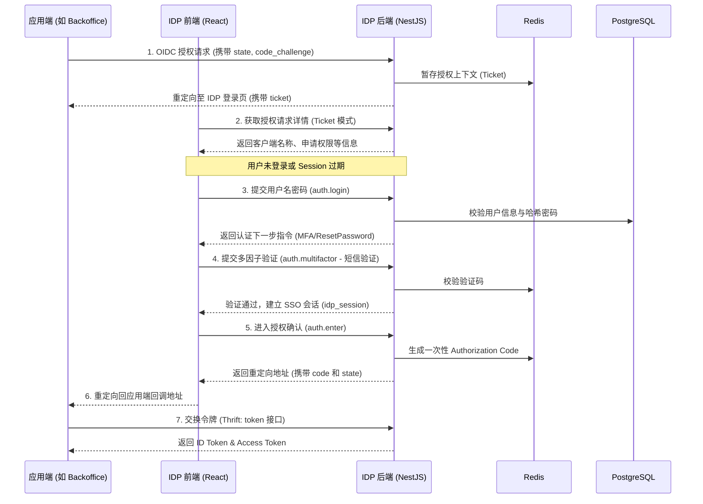

# CSISP Identity Provider (IDP)

本项目是 CSISP 系统的统一身份认证中心（Identity Provider），基于 OIDC (OpenID Connect) 协议提供身份鉴权、多因子认证（MFA）及单点登录（SSO）能力。

## 核心技术栈

- **后端**: NestJS (Node.js 框架)
- **数据库**: PostgreSQL (使用 Sequelize ORM)
- **缓存**: Redis (用于存储 OIDC 授权请求态、Session 及验证码)
- **协议**:
  - 对外（应用端）: OIDC (Thrift RPC / JSON-RPC)
  - 内部（前后端）: JSON-RPC 2.0
- **安全性**: RSA 非对称加密 (Token 签名)、scrypt (密码哈希)、PKCE (授权码保护)

---

## 登录与授权流程

IDP 采用了 OIDC 授权码模式（Authorization Code Flow），并强制启用 PKCE。以下是完整的交互逻辑：



---

## 模块说明

### 服务端 (`server/`)

- **`oidc/`**: OIDC 协议实现核心。处理授权申请、令牌颁发、JWKS 公钥分发及用户信息查询。
- **`auth/`**: 业务认证逻辑。包含登录分流（首次登录重置密码）、多因子认证（SMS 验证码）、会话管理。
- **`infra/`**: 基础设施封装。
  - `crypto/`: 包含密码哈希校验和 RSA 密钥管理。
  - `postgres/`: 数据库模型定义与 Sequelize 配置。
  - `sms/`: 模拟短信发送服务。

### 客户端 (`client/`)

- 基于 React + Vite 的单页应用，提供沉浸式的登录、验证码校验、改密等交互界面。
- 样式采用 SCSS 模块化开发，适配移动端。

---

## 关键细节设计

1. **Ticket 机制**: 在 OIDC 授权跳转过程中，IDP 使用一个短时票据（Ticket）来关联授权上下文，避免在 URL 中暴露过多原始 OIDC 参数，并能防止参数篡改。
2. **多因子认证 (MFA)**: 系统支持动态 MFA 策略。根据用户配置，认证流程可以在“密码验证”后灵活插入“短信验证”、“邮件验证”等步骤。
3. **SSO 会话**: 成功认证后，IDP 会下发 `idp_session` (HttpOnly Cookie)。当用户访问其他接入子系统时，IDP 可识别此会话实现免密登录。
4. **全链路追踪**: 集成了统一的 Logger 中间件，支持通过 Trace ID 串联前端请求与后端 RPC 调用。

---

## 开发指南

### 环境准备

- 依赖 PostgreSQL 14+ 和 Redis 6+。
- 运行根目录初始化脚本以同步数据库模型。

### 启动命令

```bash
# 进入目录
cd apps/idp

# 安装依赖 (建议在根目录执行 pnpm install)
pnpm install

# 启动服务端
pnpm -F @csisp/idp-server dev

# 启动前端
pnpm -F @csisp/idp-client dev
```
