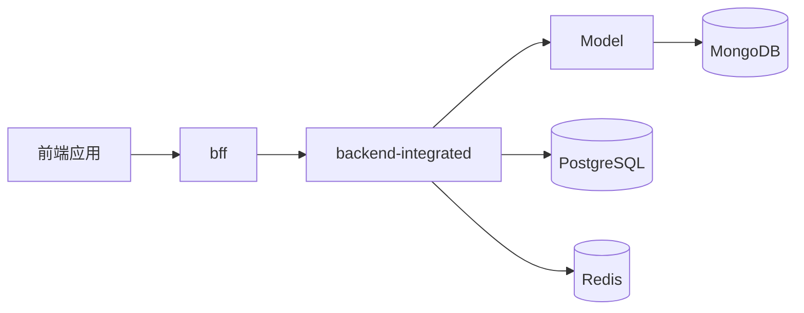

# MongoDB 数据库说明文档

> 描述 CSISP 项目中 MongoDB 相关的环境、集合模型、读写与缓存约定、与 PostgreSQL/Redis 的边界关系，以及在 backend-integrated 中的使用方式。

---

## 1. 概览

- **数据库类型**：MongoDB 6
- **使用场景**：内容文档（公告/作业）的“标题 + 富文本正文 + 附件”，以及未来的内容版本与浏览事件等文档型数据
- **连接方式**：通过 Mongoose 由 backend-integrated 访问，不允许业务代码直接操作原生驱动
- **边界关系**：
  - 内容文档与灵活结构 → MongoDB（集合 `content`，由 Mongoose 管理）
  - 强关系与权限（课程/班级/用户归属、阅读状态权威） → PostgreSQL
  - 短 TTL 缓存 → Redis（Cache-Aside）

整体数据流（内容域）：



---

## 2. 环境与连接配置

### 2.1 环境变量

根 `.env` 中与 MongoDB 相关的变量（示例）：

- `MONGODB_URI`：连接串，例如 `mongodb://localhost:27017`
- `MONGODB_DB`：数据库名，例如 `csisp`

### 2.2 本地基础设施

- 通过 `infra/database/docker-compose.db.yml` 启动 `mongo` 服务（端口 27017，持久化卷 `mongo_data`，健康检查 `mongosh ping`）
- 推荐通过 `infra/database/scripts/init_[os].[ext]` 一键启动 Postgres/Redis/Mongo，并使用 `@csisp/infra-database` 完成 PostgreSQL 迁移与基础种子
- 内容域示例数据与索引可通过以下命令初始化：

```bash
pnpm -F @csisp/infra-database db:seed:mongo
```

- Development 环境建议与 Postgres/Redis 一同启动：`postgres + redis + mongo`

### 2.3 连接初始化（backend-integrated）

- 在 `AppModule` 中使用：

```ts
MongooseModule.forRoot(process.env.MONGODB_URI, {
  dbName: process.env.MONGODB_DB,
});
```

- 在内容模块中注入模型：

```ts
MongooseModule.forFeature([{ name: 'Content', schema: ContentSchema }]);
```

---

## 3. 集合与模型

### 3.1 `content`（公告/作业统一内容文档）

- 字段：
  - `type`: `'announcement'|'homework'`
  - `title`: 标题（字符串）
  - `richBody`: 富文本正文（字符串；HTML/Markdown 渲染）
  - `attachments`: `[{ name, path, size?, type? }]`（附件元数据）
  - `authorId`: 作者（发布者）ID（引用 PostgreSQL `user.id`）
  - `scope`: `{ courseId?, classId? }`（归属范围；引用 PostgreSQL `course.id`/`class.id`）
  - `status`: 文档状态，默认 `'published'`
  - `createdAt/updatedAt`: 时间戳（Mongoose `timestamps` 管理）

- 索引：
  - `type + createdAt`（类型 + 时间倒序分页）
  - `scope.courseId + createdAt`（课程维度列表）
  - `scope.classId + createdAt`（班级维度列表）

### 3.2 可选集合（后续增强）

- `content_version`：内容版本历史（`postId + version` 唯一）
- `content_view_event`：浏览事件（`postId + viewedAt`、`userId + viewedAt` + TTL）

> 以上集合为可选增强，当前实现聚焦在统一内容集合 `content`。

---

## 4. backend-integrated 中的使用约定

### 4.1 模型注入与 Service 使用

- 在 `content.module.ts` 中注入 `Model<Content>`；在 `ContentService` 中以模型完成 CRUD 与分页
- 与 Postgres 联动：在创建/删除前，通过 `@InjectModel(User/Course/Class)` 对 `authorId/courseId/classId` 做存在性与权限校验

示例（伪代码）：

```ts
// 注入模型
constructor(@InjectModel('Content') private readonly contentModel: Model<ContentDocument>) {}

// 分页与过滤
const q: any = {}
if (type) q.type = type
if (courseId) q['scope.courseId'] = courseId
if (classId) q['scope.classId'] = classId
const docs = await this.contentModel.find(q).sort({ createdAt: -1 }).skip((page-1)*size).limit(size)
```

### 4.2 DTO 与校验

- 控制器层通过 DTO + `ValidationPipe` 做入参校验与转换：
  - `CreateContentDto`：`type/title/richBody/attachments/authorId/scope/status`
  - `ListContentsQueryDto`：`type/courseId/classId/page/size`
- DTO 与 `@csisp/types` 对齐；Service 层逻辑不变，返回结构保持一致

### 4.3 缓存约定（Redis）

- 列表缓存：`csisp:be:content:list:type=<type>|course=<courseId>|class=<classId>|page=<p>|size=<s>`（TTL 120s）
- 详情缓存：`csisp:be:content:detail:<contentId>`（TTL 300s）
- 写/删后精确失效对应键；读路径遵循 Cache-Aside

---

## 5. 权限与一致性

### 5.1 权限与归属校验

- 在 Service 层通过 Postgres 校验：
  - `authorId` 是否存在且角色合法（如学生干部/课代表）
  - `courseId/classId` 是否存在且归属关系正确

### 5.2 最终一致（可选 Outbox）

- 如需审计/异步联动：
  - 在 Postgres 事务内写入出站事件 `domain_events`
  - 后台 Worker 幂等写入 Mongo（唯一索引防重复），失败重试与告警

---

## 6. 健康检查

- 路由：`GET /api/health/db/mongo`
- 返回：`{ code: 200, message: 'Mongo 连接正常', readyState, latency }`

---

## 7. 与前端/BFF 的关系

- BFF 不直连 Mongo；统一调用后端 REST 路由：`/api/contents`
- 前端复用统一“内容组件”展示公告/作业，参数与返回 DTO 与 `@csisp/types` 对齐

---

## 8. 索引与性能建议

- 针对高频过滤字段建立复合索引（见 3.1）
- 避免过大文档；附件数组项校验并限制大小；必要时拆分子文档
- 分页统一 `page/size` 上限；禁止无约束的全表扫描

---

## 9. 注意事项

1. 内容域为唯一来源：公告/作业的正文与附件仅写入 Mongo，不再写入 Postgres
2. 任何与强关系相关的校验（用户/课程/班级归属、阅读状态权威）仍由 Postgres 承担
3. 不在业务代码中使用原生驱动或裸命令，统一通过 Mongoose Model 访问集合
4. 生产环境需监控连接池、慢查询、索引命中率与 TTL 清理；异常时降级为“仅 Postgres 权限校验 + Mongo 读写”路径
