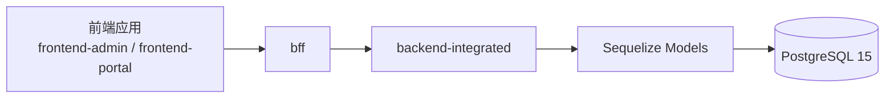
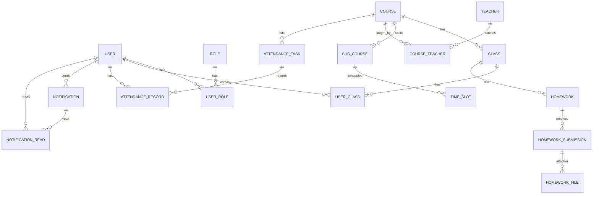

# PostgreSQL 数据库说明文档

> 描述 CSISP 项目中 PostgreSQL 相关的环境、schema 来源、核心表与与 backend-integrated 的关系，作为数据库层的唯一权威说明。

---

## 1. 概览

- **数据库类型**：PostgreSQL 15
- **使用场景**：所有结构化业务数据（用户、课程、班级、子课程、时间段、考勤、作业、作业附件、通知等）
- **连接方式**：通过 Sequelize 由 backend-integrated 与 BFF 间接访问，不允许业务代码直接写 SQL
- **schema 来源**：`infra/database/src/migrations/` 中的 TypeScript 迁移（由 @csisp/infra-database 执行）

整体数据流：



---

## 2. 环境与连接配置

### 2.1 环境变量

根 `.env` 中与 PostgreSQL 相关的变量（示例）：

- `DB_HOST`：数据库主机名（本地开发通常为 `localhost` 或 docker 服务名 `postgres`）
- `DB_PORT`：数据库端口（默认为 `5433`，与 `infra/database` 中映射保持一致）
- `DB_NAME`：应用使用的数据库名，例如 `csisp`
- `DB_USER`：应用连接用户名，例如 `admin` 或 `postgres`
- `DB_PASSWORD`：应用连接用户密码

在容器初始化阶段（由 `infra/database` 中的脚本使用）还可能涉及：

- `POSTGRES_DB`
- `POSTGRES_USER`
- `POSTGRES_PASSWORD`

### 2.2 迁移与种子

所有表结构与基础种子数据不在 backend-integrated 内部重复定义，而是统一由 `infra/database/src/migrations` 维护，并通过 `@csisp/infra-database` 执行：

- **迁移**：`infra/database/src/migrations/*-create-*.ts`
- **基础种子**：`infra/database/src/migrations/*-seed-base-*.ts`

推荐使用方式（在仓库根目录）：

```bash
# 启动数据库基础设施并执行 PostgreSQL 迁移 + 基础种子
bash infra/database/scripts/init_[os].[ext]
```

### 2.1 内容数据归属说明

- 公告与作业的“标题/富文本/附件”统一存储于 MongoDB 的 `content` 集合，不再写入 PostgreSQL。
- PostgreSQL 继续承载课程/班级/用户等强关系与权限校验、阅读状态等权威数据。

backend-integrated 在运行时只负责：

- 通过 `SequelizePostgresModule` 使用 `@nestjs/sequelize` 创建 Sequelize 连接；
- 加载 `apps/backend-integrated/src/infra/postgres/models/*.model.ts` 中的 `sequelize-typescript` 模型类并注册到连接；
- 通过 `@InjectModel(ModelClass)` 将模型注入各业务 Service。

---

## 3. 核心表与关系概览

### 3.1 ER 概览

> 仅列出主要实体与关系，详细字段以 `infra/database/src/migrations` 中的迁移文件为准。



### 3.2 用户与角色

- `user`
  - 基础字段：`id`、`username`、`password`（哈希）、`real_name`、`student_id`、`enrollment_year`、`major`、`status` 等
  - 与业务类型 `User`（`@csisp/types`）一一对应
- `role`
  - 预置角色：`admin` / `student` / `teacher` / `course_rep` / `student_cadre` 等
- `user_role`
  - 多对多关联表：一个用户可绑定多个角色

### 3.3 课程、班级与时间结构

- `course`
  - 描述课程基本信息：`course_name`、`course_code`、`academic_year`、`semester`、`available_majors` 等
  - 对应前后端课程列表与详情接口
- `class`
  - 班级实体，挂在 `course` 下，含 `class_name`、`class_code`、`teacher_id`、`max_students` 等
- `user_class`
  - 用户与班级多对多关系，用于学生选课/分班
- `sub_course`
  - 子课程实体，用于将课程按教师/时间拆分
- `time_slot`
  - 时间段：`sub_course_id`、`weekday`、`start_time`、`end_time`、`location`

### 3.4 考勤

- `attendance_task`
  - 考勤任务（通常与班级/课程绑定），包含时间窗口、状态等
- `attendance_record`
  - 学生打卡记录：`task_id` + `user_id` 唯一；状态字段通常取 `normal/late/absent/leave` 等枚举值

### 3.5 作业与附件

- `homework`
  - 按班级维度布置作业：`class_id`、`title`、`content`、`deadline` 等
- `homework_submission`
  - 学生提交记录：`homework_id` + `user_id` 唯一，含 `submit_time`、`status`、评分相关字段等
- `homework_file`
  - 提交附件：`submission_id` 外键，记录 `file_name`、`file_path`、`file_size`、`file_type` 等元数据

### 3.6 通知

- `notification`
  - 通知实体：`sender_id`、`title`、`content`、`created_at`、`status` 等
- `notification_read`
  - 阅读记录：`notification_id` + `user_id` 作为主键，包含 `read_time`

---

## 4. backend-integrated 中的使用约定

### 4.1 模型注入与 ORM 访问

backend-integrated 通过 `SequelizePostgresModule` 统一管理 PostgreSQL 连接与模型注册：

- 连接配置位于 `apps/backend-integrated/src/infra/postgres/sequelize.module.ts`
- 模型定义位于 `apps/backend-integrated/src/infra/postgres/models/*.model.ts`
- 各领域 Service 通过 `@InjectModel` 注入强类型模型

示例（以 UserService 为例）：

```ts
import { Injectable } from '@nestjs/common';
import { InjectModel } from '@nestjs/sequelize';
import { User } from '@infra/postgres/models/user.model';

@Injectable()
export class UserService {
  constructor(@InjectModel(User) private readonly userModel: typeof User) {}

  async findByUsername(username: string) {
    return this.userModel.findOne({ where: { username } });
  }
}
```

### 4.2 命名与类型对齐

- 数据库字段使用 `snake_case`：如 `real_name`、`student_id`、`enrollment_year`。
- `sequelize-typescript` 模型通过 `field` 属性完成字段映射，例如：

```ts
@Table({ tableName: 'user', underscored: true, timestamps: true })
export class User extends Model {
  @Column({ field: 'real_name' })
  realName!: string;

  @Column({ field: 'student_id' })
  studentId!: string;

  @Column({ field: 'enrollment_year' })
  enrollmentYear!: number;
}
```

- DTO 与前端字段统一使用 `camelCase`，字段形状与模型保持一致。
- Service 层直接在模型实例上读写 `realName`、`studentId`、`enrollmentYear` 等属性，只在需要裁剪字段或组合视图时构造响应 DTO。

### 4.3 索引与性能

索引定义位于 `infra/database/src/migrations` 的迁移中，主要遵循：

- 常用查询条件字段建立单列索引：
  - 用户：`username`、`email`、`student_id`、`status`
  - 课程：`course_code`、`academic_year`、`semester`
- 热点统计场景建立复合索引：
  - 考勤记录：`(task_id, user_id)`
  - 作业提交：`(homework_id, user_id)`

backend-integrated 中应遵循：

- 分页查询使用 `findAndCountAll` 或 `count + findAll`，并利用已有索引字段
- 避免在高频接口中做全表扫描或复杂的 `LIKE '%xxx%'` 组合查询

---

## 5. 注意事项

1. 所有表的新增/修改必须通过 `infra/database/src/migrations` 的迁移完成，不允许直接在生产库修改结构。
2. 当修改字段或添加新表时：
   - 同步更新：
     - 迁移文件
     - `@csisp/types` 中对应类型
     - backend-integrated 中 Service 层映射与业务逻辑
   - 如影响 BFF/前端，需同步更新相关接口文档。
3. 禁止在业务代码中编写原生 SQL，统一通过 Sequelize 模型访问。
