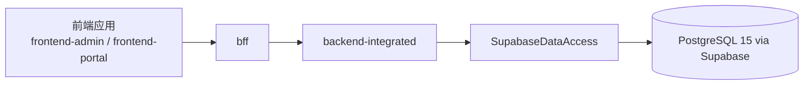
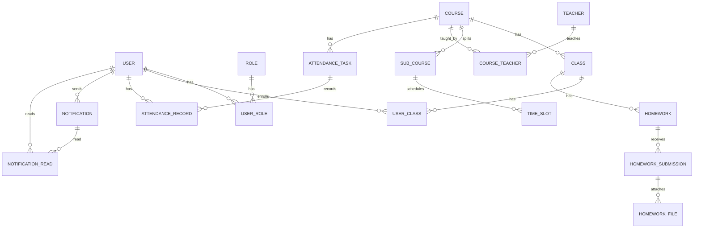

# PostgreSQL 数据库说明文档

> 描述 CSISP 项目中 PostgreSQL 相关的环境、schema 来源、核心表与与 backend-integrated 的关系，作为数据库层的唯一权威说明。

---

## 1. 概览

- **数据库类型**：PostgreSQL 15
- **使用场景**：所有结构化业务数据（用户、课程、班级、子课程、时间段、考勤、作业、作业附件、通知等）
- **连接方式**：通过 supabase-js（由 packages/supabase-sdk 暴露的 SupabaseDataAccess）访问；不允许业务代码直接写裸 SQL
- **schema 来源**：`/supabase/migrations/`（Supabase CLI 管理，唯一事实来源）

整体数据流：


```mermaid
flowchart LR
  FE[前端应用
frontend-admin / frontend-portal] --> BFF[bff]
  BFF --> BE[backend-integrated]
  BE --> DA[SupabaseDataAccess]
  DA --> PG[(PostgreSQL 15 via Supabase)]
```

---

## 2. 环境与连接配置

### 2.1 环境变量（Infisical）

根环境通过 Infisical 注入，示例（dev）：

- `SUPABASE_URL`：项目 URL
- `SUPABASE_SERVICE_ROLE_KEY`：服务端写路径密钥（仅服务端）
- `SUPABASE_ANON_KEY`：用户态受 RLS 访问的 anon key

### 2.2 迁移

所有表结构统一由 `/supabase/migrations` 维护并受 Supabase CLI 管理：

```bash
# 连接并拉取（需已配置 SUPABASE_*）
pnpm -C supabase run link:stag
pnpm -C supabase run db:pull:stag

# 本地重置验证（如需）
pnpm -C supabase run db:reset:dev
```

### 2.1 内容数据归属说明

- 公告与作业的“标题/富文本/附件”统一存储于 MongoDB 的 `content` 集合，不再写入 PostgreSQL。
- PostgreSQL 继续承载课程/班级/用户等强关系与权限校验、阅读状态等权威数据。

backend-integrated 在运行时只负责：

- 通过 `@csisp/supabase-sdk` 注册 `SupabaseModule`，同时获得服务端与用户态客户端；
- Service 层通过 `SupabaseDataAccess.service()`（服务端、RPC 写入）与 `SupabaseDataAccess.user(jwt)`（RLS 读取）访问数据库；
- 写路径通过 SECURITY DEFINER RPC 保证原子性与审计。

---

## 3. 核心表与关系概览

### 3.1 ER 概览

> 仅列出主要实体与关系，详细字段以 `infra/database/src/migrations` 中的迁移文件为准。


```mermaid
erDiagram
  USER ||--o{ USER_ROLE : has
  ROLE ||--o{ USER_ROLE : has
  USER ||--o{ USER_CLASS : enrolls
  "CLASS" ||--o{ USER_CLASS : has

  COURSE ||--o{ "CLASS" : has
  COURSE ||--o{ SUB_COURSE : splits
  SUB_COURSE ||--o{ TIME_SLOT : schedules

  TEACHER ||--o{ COURSE_TEACHER : teaches
  COURSE ||--o{ COURSE_TEACHER : taught_by

  COURSE ||--o{ ATTENDANCE_TASK : has
  ATTENDANCE_TASK ||--o{ ATTENDANCE_RECORD : records
  USER ||--o{ ATTENDANCE_RECORD : has

  "CLASS" ||--o{ HOMEWORK : has
  HOMEWORK ||--o{ HOMEWORK_SUBMISSION : receives
  HOMEWORK_SUBMISSION ||--o{ HOMEWORK_FILE : attaches

  USER ||--o{ NOTIFICATION : sends
  NOTIFICATION ||--o{ NOTIFICATION_READ : read
  USER ||--o{ NOTIFICATION_READ : reads
```

### 3.2 用户与角色

- `user`
  - 基础字段：`id`、`username`、`password`（哈希）、`real_name`、`student_id`、`enrollment_year`、`major`、`status` 等
  - 与业务类型 `User`（`@csisp/types`）一一对应
- `role`
  - 预置角色：`admin` / `student` / `teacher` / `course_rep` / `student_cadre` 等
- `user_role`
  - 多对多关联表：一个用户可绑定多个角色

### 3.3 课程、班级与时间结构

- `course`
  - 描述课程基本信息：`course_name`、`course_code`、`academic_year`、`semester`、`available_majors` 等
  - 对应前后端课程列表与详情接口
- `class`
  - 班级实体，挂在 `course` 下，含 `class_name`、`class_code`、`teacher_id`、`max_students` 等
- `user_class`
  - 用户与班级多对多关系，用于学生选课/分班
- `sub_course`
  - 子课程实体，用于将课程按教师/时间拆分
- `time_slot`
  - 时间段：`sub_course_id`、`weekday`、`start_time`、`end_time`、`location`

### 3.4 考勤

- `attendance_task`
  - 考勤任务（通常与班级/课程绑定），包含时间窗口、状态等
- `attendance_record`
  - 学生打卡记录：`task_id` + `user_id` 唯一；状态字段通常取 `normal/late/absent/leave` 等枚举值

### 3.5 作业与附件

- `homework`
  - 按班级维度布置作业：`class_id`、`title`、`content`、`deadline` 等
- `homework_submission`
  - 学生提交记录：`homework_id` + `user_id` 唯一，含 `submit_time`、`status`、评分相关字段等
- `homework_file`
  - 提交附件：`submission_id` 外键，记录 `file_name`、`file_path`、`file_size`、`file_type` 等元数据

### 3.6 通知

- `notification`
  - 通知实体：`sender_id`、`title`、`content`、`created_at`、`status` 等
- `notification_read`
  - 阅读记录：`notification_id` + `user_id` 作为主键，包含 `read_time`

---

## 4. backend-integrated 中的使用约定

### 4.1 模型注入与 ORM 访问

backend-integrated 通过 `SequelizePostgresModule` 统一管理 PostgreSQL 连接与模型注册：

- 连接配置位于 `apps/backend-integrated/src/infra/postgres/sequelize.module.ts`
- 模型定义位于 `apps/backend-integrated/src/infra/postgres/models/*.model.ts`
- 各领域 Service 通过 `@InjectModel` 注入强类型模型

示例（以 UserService 为例）：

```ts
import { Injectable } from '@nestjs/common';
import { InjectModel } from '@nestjs/sequelize';
import { User } from '@infra/postgres/models/user.model';

@Injectable()
export class UserService {
  constructor(@InjectModel(User) private readonly userModel: typeof User) {}

  async findByUsername(username: string) {
    return this.userModel.findOne({ where: { username } });
  }
}
```

### 4.2 命名与类型对齐

- 数据库字段使用 `snake_case`：如 `real_name`、`student_id`、`enrollment_year`。
- `sequelize-typescript` 模型通过 `field` 属性完成字段映射，例如：

```ts
@Table({ tableName: 'user', underscored: true, timestamps: true })
export class User extends Model {
  @Column({ field: 'real_name' })
  realName!: string;

  @Column({ field: 'student_id' })
  studentId!: string;

  @Column({ field: 'enrollment_year' })
  enrollmentYear!: number;
}
```

- DTO 与前端字段统一使用 `camelCase`，字段形状与模型保持一致。
- Service 层直接在模型实例上读写 `realName`、`studentId`、`enrollmentYear` 等属性，只在需要裁剪字段或组合视图时构造响应 DTO。

### 4.3 索引与性能

索引定义位于 `/supabase/migrations` 的迁移中，主要遵循：

- 常用查询条件字段建立单列索引：
  - 用户：`username`、`email`、`student_id`、`status`
  - 课程：`course_code`、`academic_year`、`semester`
- 热点统计场景建立复合索引：
  - 考勤记录：`(task_id, user_id)`
  - 作业提交：`(homework_id, user_id)`

backend-integrated 中应遵循：

- 分页查询使用 `.range()` 或基于主键/索引列的 keyset pagination
- 避免在高频接口中做全表扫描或复杂的 `LIKE '%xxx%'` 组合查询

---

## 5. 注意事项

1. 所有表的新增/修改必须通过 `/supabase/migrations` 的迁移完成，不允许直接在生产库修改结构。
2. 当修改字段或添加新表时：
   - 同步更新：
     - Supabase 迁移文件
     - `@csisp/types` 中对应类型
     - backend-integrated 中 Service 层与 RPC 调用参数
   - 如影响 BFF/前端，需同步更新相关接口文档。
3. 禁止在业务代码中编写原生 SQL，统一通过 supabase-js（表/视图/RPC）访问。
