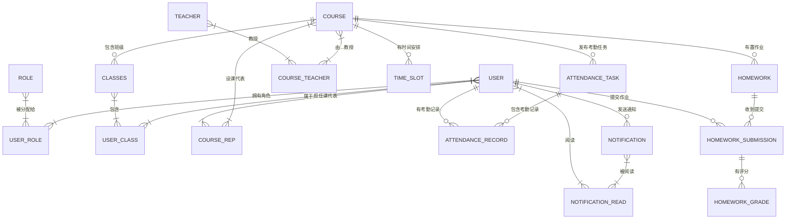

# 计算机学院综合服务平台(CSISP)数据库设计文档

## 1. 文档概述

### 1.1 文档目的

本文档基于CSISP业务需求、总体架构和技术架构文档，设计了一套完整的数据库解决方案。该方案采用PostgreSQL作为数据库，Sequelize作为ORM框架，严格遵循业务流程和技术规范，确保系统的高可用性、可扩展性和安全性。

### 1.2 技术选型

| 技术/工具     | 版本 | 用途                          |
| ------------- | ---- | ----------------------------- |
| PostgreSQL    | 15   | 关系型数据库                  |
| Sequelize     | 6.x  | ORM框架（Node.js/TypeScript） |
| Sequelize CLI | 6.x  | 数据库建模与代码生成工具      |

---

## 2. 数据库设计原则

1. **业务驱动**：严格遵循业务文档中的业务流程和数据模型
2. **规范化设计**：符合第三范式(3NF)，减少数据冗余
3. **安全性**：实现角色权限控制、数据加密存储
4. **性能优化**：合理设计索引，优化查询性能
5. **可扩展性**：支持业务规模增长和功能扩展
6. **并发支持**：利用PostgreSQL的MVCC特性支持多用户并发访问

---

## 3. 实体-关系图(ERD)



---

## 4. 数据表设计

### 4.1 核心数据表SQL定义

```sql
-- 创建用户表
CREATE TABLE IF NOT EXISTS "user" (
    "id" SERIAL PRIMARY KEY,
    "username" VARCHAR(255) UNIQUE NOT NULL,
    "password" VARCHAR(255) NOT NULL,
    "real_name" VARCHAR(255) NOT NULL,
    "email" VARCHAR(255) UNIQUE NOT NULL,
    "phone" VARCHAR(20) UNIQUE NOT NULL,
    "status" INT DEFAULT 1,
    "created_at" TIMESTAMP WITH TIME ZONE DEFAULT CURRENT_TIMESTAMP,
    "updated_at" TIMESTAMP WITH TIME ZONE DEFAULT CURRENT_TIMESTAMP
);

-- 创建角色表
CREATE TABLE IF NOT EXISTS "role" (
    "id" SERIAL PRIMARY KEY,
    "name" VARCHAR(50) UNIQUE NOT NULL,
    "description" TEXT,
    "created_at" TIMESTAMP WITH TIME ZONE DEFAULT CURRENT_TIMESTAMP,
    "updated_at" TIMESTAMP WITH TIME ZONE DEFAULT CURRENT_TIMESTAMP
);

-- 创建用户角色关联表(N-M)
CREATE TABLE IF NOT EXISTS "user_role" (
    "user_id" INT NOT NULL REFERENCES "user"("id") ON DELETE CASCADE,
    "role_id" INT NOT NULL REFERENCES "role"("id") ON DELETE CASCADE,
    PRIMARY KEY ("user_id", "role_id")
);

-- 创建课程表
CREATE TABLE IF NOT EXISTS "course" (
    "id" SERIAL PRIMARY KEY,
    "course_name" VARCHAR(255) NOT NULL,
    "course_code" VARCHAR(50) UNIQUE NOT NULL,
    "status" INT DEFAULT 1,
    "created_at" TIMESTAMP WITH TIME ZONE DEFAULT CURRENT_TIMESTAMP,
    "updated_at" TIMESTAMP WITH TIME ZONE DEFAULT CURRENT_TIMESTAMP
);

-- 创建教师表
CREATE TABLE IF NOT EXISTS "teacher" (
    "id" SERIAL PRIMARY KEY,
    "real_name" VARCHAR(255) NOT NULL,
    "email" VARCHAR(255) UNIQUE NOT NULL,
    "phone" VARCHAR(20) UNIQUE NOT NULL,
    "department" VARCHAR(255) NOT NULL,
    "status" INT DEFAULT 1,
    "created_at" TIMESTAMP WITH TIME ZONE DEFAULT CURRENT_TIMESTAMP,
    "updated_at" TIMESTAMP WITH TIME ZONE DEFAULT CURRENT_TIMESTAMP
);

-- 创建课程教师关联表(N-M)
CREATE TABLE IF NOT EXISTS "course_teacher" (
    "course_id" INT NOT NULL REFERENCES "course"("id") ON DELETE CASCADE,
    "teacher_id" INT NOT NULL REFERENCES "teacher"("id") ON DELETE CASCADE,
    PRIMARY KEY ("course_id", "teacher_id")
);

-- 创建班级表
CREATE TABLE IF NOT EXISTS "class" (
    "id" SERIAL PRIMARY KEY,
    "course_id" INT NOT NULL REFERENCES "course"("id") ON DELETE CASCADE,
    "class_name" VARCHAR(255) NOT NULL,
    "status" INT DEFAULT 1,
    "created_at" TIMESTAMP WITH TIME ZONE DEFAULT CURRENT_TIMESTAMP,
    "updated_at" TIMESTAMP WITH TIME ZONE DEFAULT CURRENT_TIMESTAMP,
    UNIQUE ("course_id", "class_name")
);

-- 创建用户班级关联表(N-M)
CREATE TABLE IF NOT EXISTS "user_class" (
    "user_id" INT NOT NULL REFERENCES "user"("id") ON DELETE CASCADE,
    "class_id" INT NOT NULL REFERENCES "class"("id") ON DELETE CASCADE,
    PRIMARY KEY ("user_id", "class_id")
);

-- 创建课代表表
CREATE TABLE IF NOT EXISTS "course_rep" (
    "user_id" INT NOT NULL REFERENCES "user"("id") ON DELETE CASCADE,
    "course_id" INT NOT NULL REFERENCES "course"("id") ON DELETE CASCADE,
    PRIMARY KEY ("user_id", "course_id")
);

-- 创建时间槽表
CREATE TABLE IF NOT EXISTS "time_slot" (
    "id" SERIAL PRIMARY KEY,
    "course_id" INT NOT NULL REFERENCES "course"("id") ON DELETE CASCADE,
    "week_day" INT NOT NULL CHECK ("week_day" BETWEEN 1 AND 7),
    "start_time" TIME NOT NULL,
    "end_time" TIME NOT NULL CHECK ("end_time" > "start_time"),
    "location" VARCHAR(255),
    "created_at" TIMESTAMP WITH TIME ZONE DEFAULT CURRENT_TIMESTAMP,
    "updated_at" TIMESTAMP WITH TIME ZONE DEFAULT CURRENT_TIMESTAMP
);

-- 创建考勤任务表
CREATE TABLE IF NOT EXISTS "attendance_task" (
    "id" SERIAL PRIMARY KEY,
    "course_id" INT NOT NULL REFERENCES "course"("id") ON DELETE CASCADE,
    "start_time" TIMESTAMP WITH TIME ZONE NOT NULL,
    "end_time" TIMESTAMP WITH TIME ZONE NOT NULL CHECK ("end_time" > "start_time"),
    "status" INT DEFAULT 1,
    "created_at" TIMESTAMP WITH TIME ZONE DEFAULT CURRENT_TIMESTAMP,
    "updated_at" TIMESTAMP WITH TIME ZONE DEFAULT CURRENT_TIMESTAMP
);

-- 创建考勤记录表
CREATE TABLE IF NOT EXISTS "attendance_record" (
    "id" SERIAL PRIMARY KEY,
    "task_id" INT NOT NULL REFERENCES "attendance_task"("id") ON DELETE CASCADE,
    "user_id" INT NOT NULL REFERENCES "user"("id") ON DELETE CASCADE,
    "checkin_time" TIMESTAMP WITH TIME ZONE NOT NULL,
    "status" VARCHAR(50) NOT NULL DEFAULT 'present',
    "ip_address" VARCHAR(50),
    "device_info" TEXT,
    "created_at" TIMESTAMP WITH TIME ZONE DEFAULT CURRENT_TIMESTAMP,
    "updated_at" TIMESTAMP WITH TIME ZONE DEFAULT CURRENT_TIMESTAMP,
    UNIQUE ("task_id", "user_id")
);

-- 创建作业表
CREATE TABLE IF NOT EXISTS "homework" (
    "id" SERIAL PRIMARY KEY,
    "course_id" INT NOT NULL REFERENCES "course"("id") ON DELETE CASCADE,
    "title" VARCHAR(255) NOT NULL,
    "content" TEXT NOT NULL,
    "deadline" TIMESTAMP WITH TIME ZONE NOT NULL,
    "status" INT DEFAULT 1,
    "created_at" TIMESTAMP WITH TIME ZONE DEFAULT CURRENT_TIMESTAMP,
    "updated_at" TIMESTAMP WITH TIME ZONE DEFAULT CURRENT_TIMESTAMP
);

-- 创建作业提交表
CREATE TABLE IF NOT EXISTS "homework_submission" (
    "id" SERIAL PRIMARY KEY,
    "homework_id" INT NOT NULL REFERENCES "homework"("id") ON DELETE CASCADE,
    "user_id" INT NOT NULL REFERENCES "user"("id") ON DELETE CASCADE,
    "file_path" VARCHAR(255) NOT NULL,
    "submit_time" TIMESTAMP WITH TIME ZONE NOT NULL,
    "status" INT DEFAULT 1,
    "created_at" TIMESTAMP WITH TIME ZONE DEFAULT CURRENT_TIMESTAMP,
    "updated_at" TIMESTAMP WITH TIME ZONE DEFAULT CURRENT_TIMESTAMP,
    UNIQUE ("homework_id", "user_id")
);

-- 创建作业评分表
CREATE TABLE IF NOT EXISTS "homework_grade" (
    "id" SERIAL PRIMARY KEY,
    "submission_id" INT NOT NULL UNIQUE REFERENCES "homework_submission"("id") ON DELETE CASCADE,
    "score" INT NOT NULL CHECK ("score" BETWEEN 0 AND 100),
    "comment" TEXT,
    "grade_time" TIMESTAMP WITH TIME ZONE NOT NULL,
    "created_at" TIMESTAMP WITH TIME ZONE DEFAULT CURRENT_TIMESTAMP,
    "updated_at" TIMESTAMP WITH TIME ZONE DEFAULT CURRENT_TIMESTAMP
);

-- 创建通知表
CREATE TABLE IF NOT EXISTS "notification" (
    "id" SERIAL PRIMARY KEY,
    "sender_id" INT NOT NULL REFERENCES "user"("id") ON DELETE CASCADE,
    "title" VARCHAR(255) NOT NULL,
    "content" TEXT NOT NULL,
    "read_count" INT DEFAULT 0,
    "status" INT DEFAULT 1,
    "created_at" TIMESTAMP WITH TIME ZONE DEFAULT CURRENT_TIMESTAMP,
    "updated_at" TIMESTAMP WITH TIME ZONE DEFAULT CURRENT_TIMESTAMP
);

-- 创建通知阅读关联表(N-M)
CREATE TABLE IF NOT EXISTS "notification_read" (
    "notification_id" INT NOT NULL REFERENCES "notification"("id") ON DELETE CASCADE,
    "user_id" INT NOT NULL REFERENCES "user"("id") ON DELETE CASCADE,
    "read_time" TIMESTAMP WITH TIME ZONE NOT NULL DEFAULT CURRENT_TIMESTAMP,
    PRIMARY KEY ("notification_id", "user_id")
);
```

---

## 5. 数据操作示例

### 5.1 基本数据操作(CRUD)

#### 5.1.1 插入数据

```sql
-- 插入角色
INSERT INTO "role" ("name", "description") VALUES ('student', '学生角色');
INSERT INTO "role" ("name", "description") VALUES ('admin', '管理员角色');

-- 插入用户
INSERT INTO "user" ("username", "password", "real_name", "email", "phone")
VALUES ('admin001', '$2b$12$...bcrypt_hash...', '管理员', 'admin@cs.edu.cn', '13800138000');

-- 分配角色
INSERT INTO "user_role" ("user_id", "role_id") VALUES (1, 2);
```

#### 5.1.2 查询数据

```sql
-- 查询所有课程
SELECT * FROM "course";

-- 查询特定课程的所有学生
SELECT u.real_name, u.email
FROM "user" u
JOIN "user_role" ur ON u.id = ur.user_id
JOIN "role" r ON ur.role_id = r.id
JOIN "user_class" uc ON u.id = uc.user_id
JOIN "class" c ON uc.class_id = c.id
WHERE r.name = 'student' AND c.course_id = 1;
```

#### 5.1.3 更新数据

```sql
-- 更新用户信息
UPDATE "user" SET "phone" = '13900139000' WHERE "id" = 1;
```

#### 5.1.4 删除数据

```sql
-- 删除作业
DELETE FROM "homework" WHERE "id" = 5;
```

### 5.2 跨数据表操作(JOIN)

```sql
-- 示例：查询课程CS101的考勤情况
SELECT
    c.course_name,
    cl.class_name,
    u.real_name,
    at.start_time,
    ar.checkin_time,
    ar.status
FROM "attendance_task" at
JOIN "course" c ON at.course_id = c.id
JOIN "class" cl ON c.id = cl.course_id
JOIN "user_class" uc ON cl.id = uc.class_id
JOIN "user" u ON uc.user_id = u.id
LEFT JOIN "attendance_record" ar ON at.id = ar.task_id AND u.id = ar.user_id
WHERE c.course_code = 'CS101' AND at.start_time::DATE = CURRENT_DATE;
```

---

## 6. 事务支持

```sql
-- 示例：创建课程并分配教师(原子操作)
BEGIN;

-- 插入新课程
INSERT INTO "course" ("course_name", "course_code") VALUES ('数据结构', 'CS201') RETURNING "id" INTO course_id;

-- 分配教师
INSERT INTO "course_teacher" ("course_id", "teacher_id") VALUES (course_id, 1);

-- 提交事务
COMMIT;

-- 若失败则回滚
-- ROLLBACK;
```

---

## 7. 索引设计

```sql
-- 课程表：按课程代码查询
CREATE INDEX idx_course_course_code ON "course"("course_code");

-- 班级表：按课程ID查询
CREATE INDEX idx_class_course_id ON "class"("course_id");

-- 考勤任务表：按课程ID和时间查询
CREATE INDEX idx_attendance_task_course_id ON "attendance_task"("course_id");
CREATE INDEX idx_attendance_task_time ON "attendance_task"("start_time", "end_time");

-- 考勤记录表：按任务ID和用户ID查询
CREATE INDEX idx_attendance_record_task_id ON "attendance_record"("task_id");
CREATE INDEX idx_attendance_record_user_id ON "attendance_record"("user_id");

-- 作业表：按截止日期查询
CREATE INDEX idx_homework_deadline ON "homework"("deadline");

-- 作业提交表：按作业ID和用户ID查询
CREATE INDEX idx_homework_submission_homework_id ON "homework_submission"("homework_id");
CREATE INDEX idx_homework_submission_user_id ON "homework_submission"("user_id");
```

---

## 8. 多用户并发与性能

### 8.1 并发控制

PostgreSQL采用**MVCC(Multi-Version Concurrency Control)** 实现并发控制，允许：

- 多个用户同时读取数据
- 写入操作不会阻塞读取操作
- 读取操作不会阻塞写入操作

### 8.2 连接池配置(Sequelize)

```typescript
// config/database.ts
import { Sequelize } from 'sequelize'

export const sequelize = new Sequelize(
  process.env.DB_NAME || 'csisp',
  process.env.DB_USER || 'postgres',
  process.env.DB_PASSWORD || 'password',
  {
    host: process.env.DB_HOST || 'localhost',
    port: parseInt(process.env.DB_PORT || '5432'),
    dialect: 'postgres',
    pool: {
      max: 20, // 最大连接数
      min: 0, // 最小连接数
      acquire: 30000, // 连接超时时间(ms)
      idle: 10000, // 连接闲置时间(ms)
    },
  }
)
```

### 8.3 性能监控

- 使用PostgreSQL的`pg_stat_statements`插件监控查询性能
- 定期分析查询计划并优化慢查询
- 监控连接池使用情况

---

## 9. ORM建模与代码生成

### 9.1 Sequelize CLI初始化

```bash
# 初始化项目结构
npx sequelize-cli init
```

### 9.2 生成模型

```bash
# 生成User模型
npx sequelize-cli model:generate --name User --attributes username:string,password:string,real_name:string,email:string,phone:string,status:integer

# 生成Course模型
npx sequelize-cli model:generate --name Course --attributes course_name:string,course_code:string,status:integer
```

### 9.3 生成迁移脚本

```bash
npx sequelize-cli db:migrate
```

### 9.4 Sequelize模型示例(TypeScript)

```typescript
// models/user.ts
import { DataTypes, Model, Optional } from 'sequelize'
import { sequelize } from '../config/database'
import { Role } from './role'
import { Class } from './class'
import { AttendanceRecord } from './attendance-record'
import { HomeworkSubmission } from './homework-submission'

interface UserAttributes {
  id: number
  username: string
  password: string
  real_name: string
  email: string
  phone: string
  status?: number
  createdAt?: Date
  updatedAt?: Date
}

interface UserCreationAttributes
  extends Optional<UserAttributes, 'id' | 'status' | 'createdAt' | 'updatedAt'> {}

export class User extends Model<UserAttributes, UserCreationAttributes> implements UserAttributes {
  public id!: number
  public username!: string
  public password!: string
  public real_name!: string
  public email!: string
  public phone!: string
  public status!: number

  public readonly createdAt!: Date
  public readonly updatedAt!: Date

  // 关联定义
  public static associate(models: any) {
    User.belongsToMany(models.Role, { through: 'user_role' })
    User.belongsToMany(models.Class, { through: 'user_class' })
    User.hasMany(models.AttendanceRecord)
    User.hasMany(models.HomeworkSubmission)
    User.hasMany(models.Notification, { as: 'Sender' })
    User.belongsToMany(models.Notification, { through: 'notification_read' })
    User.belongsToMany(models.Course, { through: 'course_rep' })
  }
}

User.init(
  {
    id: {
      type: DataTypes.INTEGER,
      autoIncrement: true,
      primaryKey: true,
    },
    username: {
      type: DataTypes.STRING,
      allowNull: false,
      unique: true,
    },
    password: {
      type: DataTypes.STRING,
      allowNull: false,
    },
    real_name: {
      type: DataTypes.STRING,
      allowNull: false,
    },
    email: {
      type: DataTypes.STRING,
      allowNull: false,
      unique: true,
    },
    phone: {
      type: DataTypes.STRING,
      allowNull: false,
      unique: true,
    },
    status: {
      type: DataTypes.INTEGER,
      defaultValue: 1,
    },
  },
  {
    sequelize,
    tableName: 'user',
    timestamps: true,
    createdAt: 'created_at',
    updatedAt: 'updated_at',
  }
)
```

---

## 10. 总结

本数据库设计严格遵循业务文档和技术架构规范，实现了：

1. **完整的业务数据模型**：覆盖了用户管理、课程管理、考勤管理、作业管理和通知管理等所有核心功能
2. **规范的数据库设计**：采用第三范式，减少数据冗余
3. **强大的事务支持**：确保复杂操作的原子性
4. **优化的查询性能**：合理的索引设计
5. **高效的并发处理**：基于PostgreSQL的MVCC和连接池技术
6. **便捷的代码生成**：使用Sequelize CLI实现自动化ORM建模

数据库设计可直接用于CSISP系统的开发和部署，满足系统的性能、安全和可扩展性需求。

---

**文档版本**: 1.0
**发布日期**: 2025-06-12
**更新日期**: 2025-06-12
**设计人**: 技术架构组
