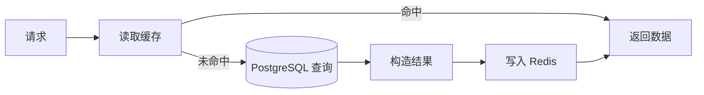

# Redis 数据库说明文档

> 描述 CSISP 项目中 Redis 的角色、接入方式、键命名规范与缓存策略，适用于 backend-integrated 与 BFF。

---

## 1. 概览

- **类型**：Redis 7.x（单实例）
- **用途**：缓存、限流、简单状态存储（不做权威数据源）
- **访问方式**：统一通过 `@csisp/redis` 封装，backend-integrated 再经 `@infra/redis` 使用
- **部署方式**：本地通过 `infra/database/docker-compose.db.yml` 启动，与 PostgreSQL 一起运行

Redis 只承载“加速”和“辅助”角色：任何持久业务数据仍以 PostgreSQL 为准。

---

## 2. 环境与连接

### 2.1 环境变量

根 `.env` 中主要变量（示例）：

- `REDIS_HOST`：Redis 主机名（例如 `localhost` 或 docker 服务名 `redis`）
- `REDIS_PORT`：Redis 端口（通常为 `6379`）
- `REDIS_DB`：数据库索引（整数，默认 `0`）
- `REDIS_PASSWORD`：密码（如有启用权限控制）
- `REDIS_NAMESPACE`：命名空间前缀，默认 `csisp`
- `REDIS_ENABLED`：`true/false`，控制应用是否启用 Redis

### 2.2 客户端封装

Redis 访问统一通过 `packages/redis` 暴露：

```ts
// packages/redis/src/index.ts（简化）
import { createClient, type RedisClientType } from 'redis';

let client: RedisClientType | undefined;

export async function connect(/* options? */) {
  /* 初始化单例客户端 */
}
export function getClient(): RedisClientType {
  /* 返回当前客户端 */
}
export async function get(key: string): Promise<string | null> {
  /* ... */
}
export async function set(
  key: string,
  value: string,
  ttlSeconds?: number
): Promise<void> {
  /* ... */
}
export async function del(key: string | string[]): Promise<void> {
  /* ... */
}
// 以及 ttl/publish/subscribe/healthCheck 等
```

- backend-integrated：
  - 在 `main.ts` 中根据 `REDIS_ENABLED` 调用 `connect()`；
  - 业务中通过 `@infra/redis` 导入 `get/set/del` 等；
- BFF：
  - 当前主要通过 HTTP 调用后端，Redis 使用场景较少或为后续扩展预留。

---

## 3. 命名空间与键规范

### 3.1 命名空间

`@csisp/redis` 内部使用 `REDIS_NAMESPACE` 作为全局前缀，例如：

- `REDIS_NAMESPACE=csisp` 时：
  - 最终键格式一般形如：`csisp:be:attendance:stats:student:123`

不同系统通过第二级前缀区分：

- BFF：`csisp:bff:*`
- Backend：`csisp:be:*`

### 3.2 常见键示例

> 具体前缀在 backend-integrated / BFF 的 Service 中实现，以下为约定示例。

- **考勤统计（后端）**：
  - 学生整体统计：`csisp:be:attendance:stats:student:${userId}`
  - 学生在某班级统计：`csisp:be:attendance:stats:student:${userId}:class:${classId}`
  - 班级统计：`csisp:be:attendance:stats:class:${classId}`

- **作业统计与摘要（后端）**：
  - 学生作业 summary（可选 class）：
    - `csisp:be:homework:submissions:student:${userId}`
    - `csisp:be:homework:submissions:student:${userId}:class:${classId}`

- **仪表盘统计（后端）**：
  - 总览卡片：`csisp:be:dashboard:stats`
  - 用户增长：`csisp:be:dashboard:user-growth`
  - 课程分布：`csisp:be:dashboard:course-distribution`
  - 最近活动：`csisp:be:dashboard:recent-activities`

键结构推荐形式：

```text
<namespace>:<系统代号>:<domain>:<entity>[:<scope>...]
```

例如：

- `csisp:be:attendance:stats:student:42:class:101`
- `csisp:be:homework:list:class:101:page=1|size=20`

---

## 4. 缓存策略

### 4.1 Cache-Aside 模式

所有缓存读写遵循典型的 Cache-Aside：



实现示例（类型省略）：

```ts
import { get, set, del } from '@infra/redis';

async function getStudentAttendanceStats(userId: number, classId?: number) {
  const keyBase = classId
    ? `csisp:be:attendance:stats:student:${userId}:class:${classId}`
    : `csisp:be:attendance:stats:student:${userId}`;

  if (process.env.REDIS_ENABLED === 'true') {
    const cached = await get(keyBase);
    if (cached) return JSON.parse(cached);
  }

  // 未命中：查询数据库并聚合
  const stats = await computeStatsFromDatabase(userId, classId);

  if (process.env.REDIS_ENABLED === 'true') {
    await set(keyBase, JSON.stringify(stats), 60); // TTL 60 秒
  }

  return stats;
}
```

### 4.2 TTL 建议

结合技术架构文档中的约定：

- 详情/分布：约 300 秒
- 列表：约 120 秒
- 统计/活跃数据：约 30–60 秒

实际 TTL 由各 Service 按需要设定。

### 4.3 失效策略

遵循“精确失效，不做粗暴 flush”：

- 写操作（插入/更新/删除）完成后：
  - 删除与该资源直接相关的 key
  - 根据业务情况选择是否尝试删除常用列表缓存（例如常用页）

示例（考勤打卡后失效统计缓存）：

```ts
if (process.env.REDIS_ENABLED === 'true') {
  const taskReloaded = await this.taskModel.findByPk(taskId);
  const classId = taskReloaded?.classId;

  await del(`csisp:be:attendance:stats:student:${userId}`);
  if (classId) {
    await del(`csisp:be:attendance:stats:student:${userId}:class:${classId}`);
    await del(`csisp:be:attendance:stats:class:${classId}`);
  }
}
```

---

## 5. backend-integrated 中的接入约定

### 5.1 初始化

在 `apps/backend-integrated/src/main.ts` 中：

```ts
import { connect as connectRedis } from '@infra/redis';

async function bootstrap() {
  if (process.env.REDIS_ENABLED === 'true') {
    await connectRedis({});
  }

  const app = await NestFactory.create(AppModule);
  // ... 省略中间件与路由配置
  await app.listen(process.env.BACKEND_INTEGRATED_PORT || 3100);
}
```

- 若 `REDIS_ENABLED=false` 或连接失败，业务逻辑仍需可以在“无缓存模式”下正常运行。

### 5.2 业务使用方式

Service 中统一从 `@infra/redis` 导入基础操作：

```ts
import { get, set, del } from '@infra/redis';

@Injectable()
export class DashboardService {
  async getStats() {
    const cacheKey = 'csisp:be:dashboard:stats';

    if (process.env.REDIS_ENABLED === 'true') {
      const cached = await get(cacheKey);
      if (cached) return JSON.parse(cached);
    }

    const stats = await this.computeStatsFromDatabase();

    if (process.env.REDIS_ENABLED === 'true') {
      await set(cacheKey, JSON.stringify(stats), 60);
    }

    return stats;
  }
}
```

BFF 若未来需要直接使用 Redis（例如缓存聚合结果），也应通过 `@csisp/redis` 或自身的 infra 封装接入，遵循同样的键命名规范。

---

## 6. 限流与健康检查

### 6.1 限流（可选）

若 `RateLimitInterceptor` 使用 Redis 作为计数存储，建议 key 格式：

- `csisp:be:ratelimit:ip:${ip}`
- `csisp:be:ratelimit:user:${userId}`

计数与过期逻辑示例：

```ts
const key = `csisp:be:ratelimit:ip:${ip}`;
const countStr = await get(key);
const count = countStr ? Number(countStr) : 0;

if (count >= max) {
  throw new TooManyRequestsException('请求过于频繁');
}

await set(key, String(count + 1), windowSeconds);
```

### 6.2 健康检查

`@csisp/redis` 提供 `healthCheck()` 帮助后端快速检查连接状态，backend-integrated 的 Health 模块可以：

- 在 `/api/health/db` 或 `/api/health/app` 返回 Redis 的健康信息摘要（命中率可选）。

---

## 7. 注意事项

1. Redis 中的数据一律视为“缓存”或“辅助状态”，不得依赖其进行强一致业务逻辑判断（如最终状态判断）。
2. 对于安全敏感信息（密码、token 原文等）不得直接存入 Redis。
3. 调整键前缀或结构时，需要同步更新：
   - backend-integrated 中使用这些键的 Service；
   - 相关文档（本文件 + 架构/后端设计文档）。
4. 若未来接入 Redis 集群或多实例，需要在 `@csisp/redis` 层新增对路由/分片的支持，业务层不应直接操作底层客户端。
