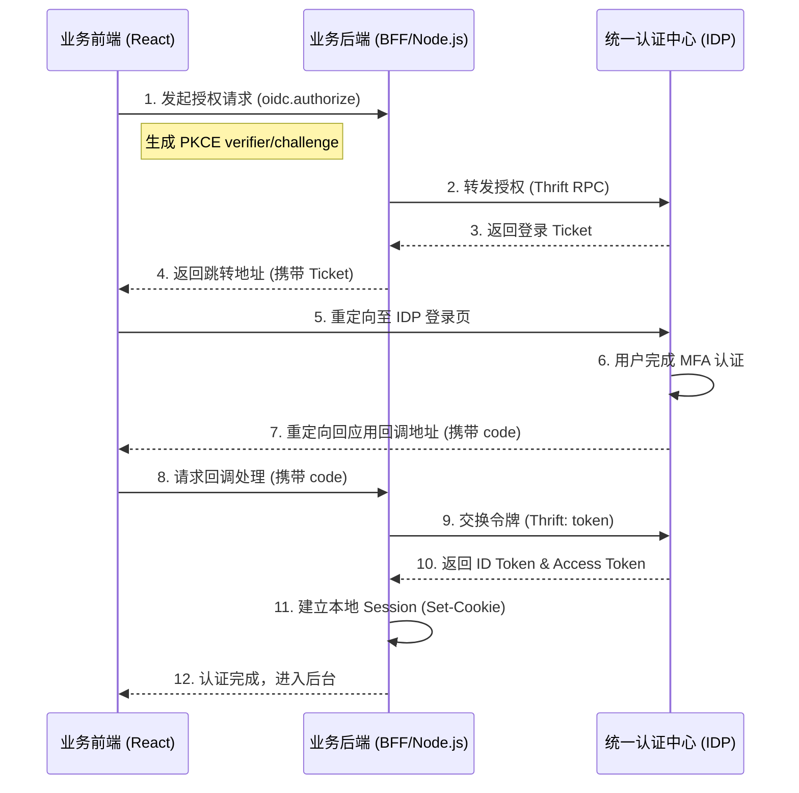

# 身份认证与鉴权

CSISP 系统采用基于 **OIDC (OpenID Connect)** 协议的统一身份认证架构。通过自研的 IDP（Identity Provider）和多端 SDK，实现了安全、标准且易于集成的全链路鉴权体系。

## 1. 核心协议与流程

系统强制启用 **PKCE (Proof Key for Code Exchange)** 扩展，以防止授权码劫持攻击。

### 交互时序图

::: details 查看认证流程图



:::

## 2. 关键机制

### Ticket 机制

在跳转 IDP 时，系统不直接在 URL 中传递复杂的 OIDC 参数，而是通过 BFF 向 IDP 申请一个短时 **Ticket**。Ticket 关联了授权上下文，有效防止了参数篡改和 URL 过长的问题。

### PKCE 保护

前端 SDK 在发起登录时会自动生成 `code_verifier` 和 `code_challenge`。`verifier` 会通过 BFF 安全地存储在 HttpOnly Cookie 中，确保只有发起请求的客户端才能完成最后的令牌交换。

## 3. 前端 SDK 集成 (`@csisp/auth/react`)

### 配置 AuthProvider

在应用的根布局中包裹 `AuthProvider`：

```tsx
import { AuthProvider } from '@csisp/auth/react';
import { authConfig } from '@/src/client/config/auth';

export default function RootLayout({ children }) {
  return (
    <AuthProvider
      clientId='your-app-id'
      apiPrefix='/api/your-app'
      loginUrl={authConfig.idpLoginUrl}
      redirectUri='http://localhost:3000/api/auth/callback'
    >
      {children}
    </AuthProvider>
  );
}
```

### 使用 useAuth 钩子

在组件中快速获取用户信息或执行登入登出：

```tsx
const { user, isAuthenticated, login, logout } = useAuth();

if (!isAuthenticated) {
  return <button onClick={login}>跳转登录</button>;
}

return <div>当前用户：{user.preferred_username}</div>;
```

### 路由保护 AuthGuard

使用 `AuthGuard` 包裹受保护的路由区域：

```tsx
export default function AdminLayout({ children }) {
  return (
    <AuthGuard>
      <Layout>{children}</Layout>
    </AuthGuard>
  );
}
```

## 4. 后端 SDK 集成 (`@csisp/auth/server`)

### IdpClient (Thrift RPC)

后端通过 `IdpClient` 与 IDP 进行强类型通信：

```typescript
import { IdpClient } from '@csisp/auth/server';

const idpClient = new IdpClient({ url: 'http://idp-thrift:9090' });

// 交换令牌并解码用户信息
const { user, tokens } = await idpClient.exchangeAndDecodeUser({
  code,
  verifier,
  client_id: 'your-app-id',
  redirect_uri: '...',
});
```

### 认证中间件 (Koa)

在路由中集成 `koaAuth` 进行身份拦截：

```typescript
import { koaAuth } from '@csisp/auth/server';

router.use(
  koaAuth({
    required: true,
    excludePaths: ['/api/public'],
    roles: ['admin'], // 可选：进行角色校验
  })
);
```

## 5. 接入清单 (Checklist)

1. **IDL 定义**: 在 `infra/idl` 中确保 `idp.thrift` 已定义。
2. **后端路由**:
   - 实现 `oidc.authorize` 处理器，调用 `idpClient.getAuthorizationUrl`。
   - 实现 `oidc.logout` 处理器，调用 `idpClient.revokeToken`。
   - 实现 `oidc.userinfo` 处理器，返回当前 Session 用户。
3. **回调路由**: 实现 `/api/auth/callback` 接口，完成 Code 换 Token 并设置本地 Session Cookie。
4. **前端配置**: 在根节点配置 `AuthProvider` 并使用 `AuthGuard` 保护私有路由。

::: tip 提示
建议将 `clientId` 和 `apiPrefix` 等配置项统一存放在环境变量（如 `NEXT_PUBLIC_API_PREFIX`）中。
:::
