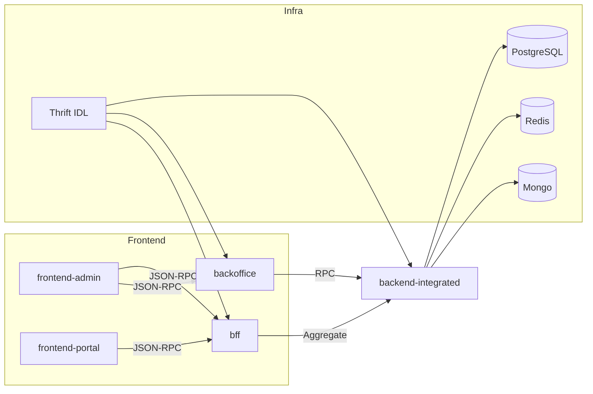

# 架构设计 Draft

## 写作目标与读者

- 面向开发者与 Vibe Coding，系统化说明 CSISP 的分层架构、技术栈选型、核心模块、数据流与安全策略
- 与“入门指南/模块详解/基础设施与基建”形成自然导读与交叉链接

## 板块文档结构

- 总体架构：[路径](/src/架构设计/总体架构)
- 技术栈选型：[路径](/src/架构设计/技术栈选型)
- 核心模块设计：[路径](/src/架构设计/核心模块设计)
- 数据流与交互：[路径](/src/架构设计/数据流与交互)
- 安全架构：[路径](/src/架构设计/安全架构)

## 总体架构（大纲）

- 分层说明：应用层（frontend-admin/portal）、聚合层（bff）、后台（backoffice）、后端集成（backend-integrated）、基础设施（PostgreSQL/Redis/Mongo/IDL）
- 边界与协作：JSON-RPC 契约、BFF 编排、错误映射与限流、跨项目类型共享
- 环境与部署：当前仅 dev，本地 Docker + Thrift；预发布/生产在“入门指南/TODO”维护
- 关键决策：单一接口范式（OpenRPC/JSON-RPC）、Monorepo 协作模式、统一代码风格与校验

### 架构导读（Mermaid）



## 技术栈选型（大纲）

- 语言与框架：TypeScript、NestJS、Koa、Next.js App Router、Vue3+Vite
- 数据与缓存：PostgreSQL（只读为主）、Redis（缓存与限流）、Mongo（内容/日志/i18n）
- 契约与类型：Thrift IDL 生成流程、packages/types 共享策略
- 取舍与理由：开发效率、类型一致性、调试友好性、生态与维护成本

## 核心模块设计（大纲）

- 简述当前实现（最简化）：
  - auth/user/logger/db/i18n 等模块以最小可用形态提供能力，优先保障开发与联调
  - 配置读取与限流参数、日志与追踪遵循统一入口，但尚未细化到完整治理
  - JSON-RPC 约定与错误码头部规范以专题页说明为准
- 后续将补充完整设计与最佳实践（记录于“架构设计/TODO”）

## 数据流与交互（大纲）

- 端到端流程：frontend → bff/backoffice → backend-integrated → 数据库/缓存
- 请求/响应示意：JSON-RPC 请求体/响应体的字段说明（静态示例在模块详解中承载）
- 缓存与一致性：Redis 命名空间、TTL 策略与失效策略；只读数据库约束
- 事件与日志：关键操作的审计与埋点；统一日志格式与检索入口

### 路由约定与 method 映射

- 所有接口采用 URL 约定进行 method 标识：`/api/[project?]/[subproject?]/:domain/:action`
  - `project`：`backoffice` / `bff` /（`backend-integrated` 无前缀，仅 `/api`）
  - `subproject`：仅在 `bff` 存在，用于区分前端来源，例如 `portal` 或 `admin`
  - `domain.action`：标识具体的 method（如 `user.getUser`）
- 示例：
  - Portal 前端通过 BFF 请求：`POST /api/bff/portal/user/getUser`
  - Backoffice 仅服务其 Next 客户端，接口不对外开放：`POST /api/backoffice/db/status`
  - Backend-integrated 统一前缀：`POST /api/user/getProfile`

### 静态示例（请求与响应）

- 请求（不使用 `method` 字段，method 由 URL 路由标识）：

```json
{
  "jsonrpc": "2.0",
  "params": { "userId": "u_12345" },
  "id": "req-001"
}
```

- 响应：

```json
{
  "jsonrpc": "2.0",
  "result": {
    "userId": "u_12345",
    "name": "Alice",
    "roles": ["admin"]
  },
  "id": "req-001"
}
```

## 安全架构（大纲）

- 简述当前实现：
  - backend-integrated：JWT 守卫与角色守卫、基础速率限制拦截器
  - bff：中间件层统一错误包装、限流与鉴权、中间件链路日志与追踪
  - backoffice：路由级权限控制、会话/令牌校验、统一响应校验
  - 前端：路由守卫与会话校验、基础可访问性与性能监控
- 后续将进行完整重构与优化（记录于“架构设计/TODO”）

> [!TIP]
> backoffice 的错误码头部约定、JSON-RPC 路由与响应规范将在其专题页进行详细讲解：  
> /src/模块详解/backoffice/JSON-RPC路由与响应规范

## 展示与格式规范

- Frontmatter：统一 `title`、`description`、`editLink: true`、`outline: deep`
- 介绍性语气，分点精炼；使用站内链接，不使用 file://
- 仅在必要处使用简化 Mermaid，复杂示例与代码分组在“模块详解”或“基建”承载
- 不使用页面 TOC（目录）

## 内容来源与引用

- apps/\*：backoffice、bff、backend-integrated 源码结构与模块实现
- infra/\*：database 脚本（迁移/初始化/种子）、idl 的生成流程
- packages/\*：types 与 utils 的共享策略与组织结构
- docs/.vitepress/config.ts：导航与侧边栏的组织，用于说明信息架构

## 交付标准

- 五篇页面结构完整、内容连贯，链接与关键词可检索
- Frontmatter 与标题层级统一；与导航与侧边栏顺序一致
- 无断链；与“入门指南/模块详解/基础设施与基建”形成自然导读
