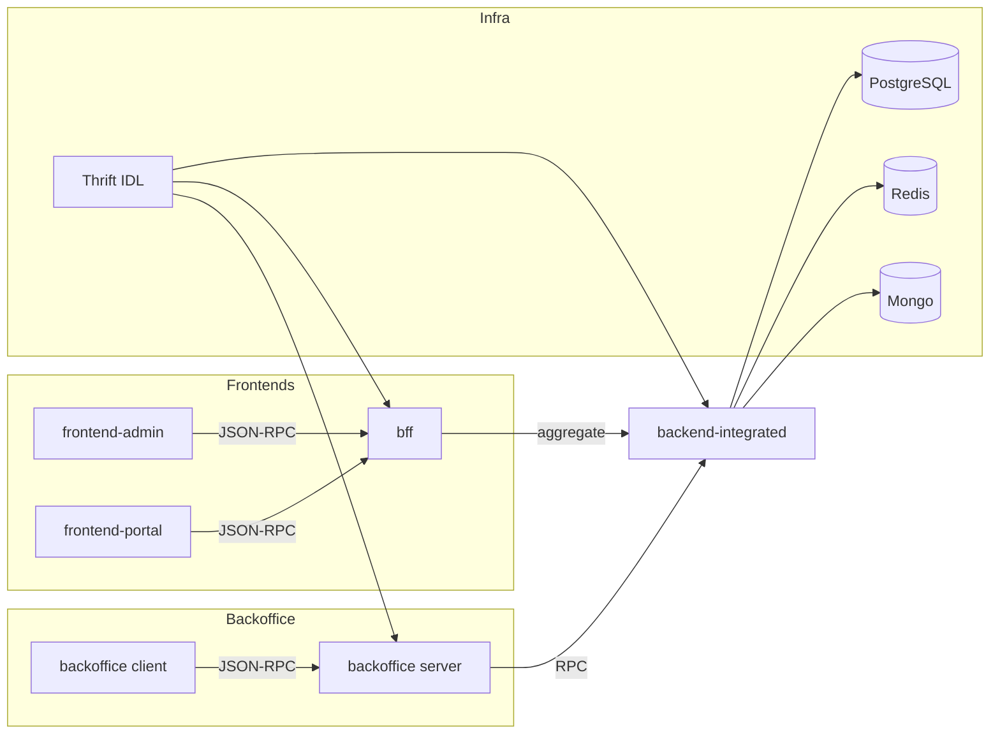

# 总体架构

> [!NOTE]
> CSISP 采用 Monorepo 协作模式与统一的 OpenRPC/JSON-RPC 接口范式。所有接口的 `method` 由 URL 路由标识。

## 分层与职责

- 前端应用：`frontend-admin`、`frontend-portal`，分别面向中台与门户场景
- 聚合编排：`bff`，对前端请求进行聚合、编排与错误映射
- 后台系统：`backoffice`，Next.js 全栈项目，提供后台管理与内部接口
- 后端集成：`backend-integrated`，核心业务逻辑与数据访问
- 基础设施：PostgreSQL（只读为主）、Redis（缓存与限流）、Mongo（内容/日志/i18n）、Thrift IDL（契约与类型生成）

## 接口与路由约定

- 路由统一采用：`/api/[project]/[subproject?]/:domain/:action`
  - `project`：`backoffice` / `bff` /（`backend-integrated` 无前缀，仅 `/api`）
  - `subproject`：仅在 `bff` 存在，用于区分前端来源（如 `portal` 或 `admin`）
  - `domain.action`：标识具体的 method（如 `user.getUser`）
- 示例：
  - `POST /api/bff/portal/user/getUser`
  - `POST /api/backoffice/db/status`
  - `POST /api/user/getProfile`

## 数据流示意

上述流程中，`frontend-admin` 与 `frontend-portal` 的请求统一进入 `bff`，由其按 `subproject/domain/action` 进行路由与聚合，再转发至 `backend-integrated` 执行业务逻辑；`backoffice` 作为独立的 Next 全栈应用，其客户端直接调用 `backoffice` 服务端，由服务端再与 `backend-integrated` 进行内部 RPC 交互。数据层面由 `backend-integrated` 统一访问 PostgreSQL / Redis / Mongo；IDL 类型通过 Thrift 在多项目间共享。

## 关键设计决策

- 单一接口范式：统一采用 OpenRPC/JSON-RPC，method 由路由标识
- 类型与契约共享：Thrift IDL 生成类型，复用于 `bff/backoffice/backend-integrated` 等项目
- 只读数据库约束：核心查询走 PostgreSQL，写操作受控，配合 Redis 缓存与限流
- Monorepo 协作：apps / packages / infra / docs 的分层组织与脚本协同（`dev:infra`、`dev:*`）

在实践中，读者可结合“入门指南”的环境与启动说明，以及各子项目的“架构与目录”章节进行交叉阅读，以便从总览快速定位到具体实现。

## 当前状态与约束

- 当前仅提供本地 `dev` 环境：Docker 提供数据库与缓存，`dev:infra` 生成 IDL 与初始化数据
- backoffice 的错误码头部约定与路由规范由专题页详细说明：[JSON-RPC 路由与响应规范](/src/模块详解/backoffice/JSON-RPC路由与响应规范)
